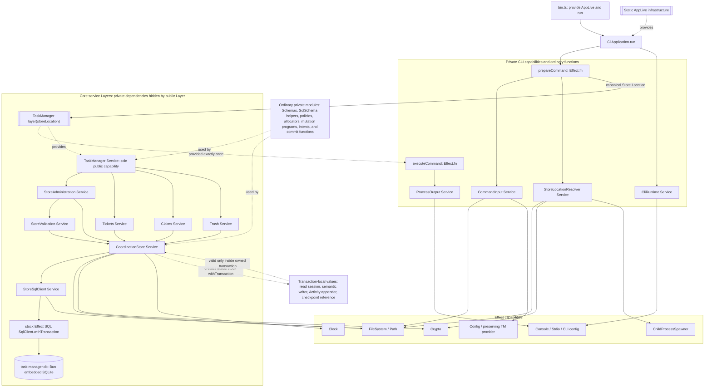

# Approval View

## Change Summary

- The public Layer now provides FileSystem, Path, Crypto, Clock, Reactivity, checkpoint defaults, and every private service internally; package-private test composition does not widen public requirements.
- Initialization now creates and verifies absent Store directories before scoped artifact creation while preserving pre-existing permissions.
- Human completion now has one mandatory, precisely ordered `getTicketDetails` pre-read and the exact adapter confirmation error before one `completeTicket` call.
- Claim reservations now permit extra valid tombstones, validate missing reservations for current or durable-Activity Claim IDs, and resample collisions for at most 16 attempts.
- Real-process CLI evidence is bound to the complete FR1.80 grammar.
- Added an individual-obligation verification ledger and explicit stable-control-plane, disposable-Store, skill-isolation, and cutover evidence.
- Removed every reference to the retired database engine.
- Stakeholder decision status: accepted for incorporation; final whole-pack approval remains pending the completed reconciliation review.

- Previous snapshot SHA-256: a687cec06893e31bddeaa1d75fdcba9dcd96127044a9955604ac60547ff6c15a
- Replaced the imprecise bare debug boolean declaration with exact `Flag.atMost(1)` occurrence retention and bounded zero/one result semantics.
- Prohibited `Flag.withFallbackConfig` so parser-owned Config evaluation cannot violate help/version/completion or parse-failure bypass.
- Split static composition from runtime resources: AppLive provides a resource-free `DebugTelemetrySessionFactory` before parsing, and `CliApplication.run` conditionally acquires the enabled command-scoped session after activation.
- Preserved exact Exit/Cause transparency, transport/privacy/finalization behavior, transaction classification, and the public 15-method/one-field architecture.

## Architecture and Runtime Model

- Lean V1 remains two packages with one-way `CLI -> public core` dependency and exactly one public `TaskManager` capability.
- The root debug parameter is a bounded RC 111 occurrence parser, not an intrinsically duplicate-detecting bare boolean.
- AppLive owns static assembly and provides only a resource-free private debug-session factory before parsing.
- CliApplication.run owns conditional acquisition and command-scoped lifetime of the enabled telemetry session after successful selection and activation.
- Disabled, help, version, completion, and parse-failure paths allocate no telemetry/network resource and never read `TM_DEBUG`.

### Visual Evidence

- Source: /Volumes/Code/personal/task-manager-next/specs/lean-v1/technical-design.md :: High-Level Service and Layer Composition

### Review Notes

- Inspect exact `Flag.atMost(1)` result handling and the explicit ban on parser fallback Config first.
- Distinguish resource-free AppLive factory provision from enabled command-scoped acquisition by CliApplication.run.
- Confirm all retained Exit/Cause, privacy, endpoint, finalization, transaction, and public-core constraints remain unchanged.

## Boundaries, Interfaces, and Data Flow

| Focus | Design decision | Boundary consequence |
| --- | --- | --- |
| Parser | `Flag.boolean("debug").pipe(Flag.atMost(1))` | Zero means absent, one means explicit boolean, repeated/mixed maps to DuplicateOption. |
| Environment | No `Flag.withFallbackConfig` | Help/version/completion/parse failure bypass `TM_DEBUG`; explicit false suppresses it. |
| Static composition | AppLive provides resource-free `DebugTelemetrySessionFactory` | Providing AppLive before parsing allocates no telemetry resource. |
| Runtime acquisition | CliApplication.run invokes factory only after activation | Enabled resources are command-scoped; disabled and early exits acquire nothing. |
| Observation | Total untraced observer returns exact original Exit/Cause | Delegate failure cannot combine or reconstruct product behavior. |
| Transport/privacy | Fixed numeric-loopback endpoints behind final-byte allowlist | No ambient OTEL destination, raw Cause, payload, SQL, path, or credential leakage. |
| Finalization | Product completes before one traces-plus-logs deadline | Telemetry loss is silent and cannot delay beyond 250 ms total. |

## Implementation Seams and Operational Hand-Offs

- Effect CLI occurrence parser -> activation boundary
  - Retain the bounded zero/one result; project duplicates before any environment fallback.
- Selected command -> lazy `TM_DEBUG` resolver
  - Evaluate only when no explicit boolean exists; never use `Flag.withFallbackConfig`.
- AppLive -> DebugTelemetrySessionFactory
  - Provide the private factory before parsing without constructing queue, timer, projector, HttpClient, exporter, or network resource.
- CliApplication.run -> enabled command session
  - Invoke factory only after selection/activation and scope the acquired session to the command.
- Public observer -> rendering/publication -> telemetry finalizer
  - Preserve exact Exit/Cause and product bytes, then run one combined bounded finalizer after product completion.

## Major Risks and Tradeoffs

- [ ] RC 111 `Flag.atMost` result and duplicate semantics require requalification on Effect upgrades.
- [ ] Using `Flag.withFallbackConfig` would eagerly couple parser actions to `TM_DEBUG` and violate early-path bypass.
- [ ] A factory Layer that allocates resources during AppLive provision would violate disabled/help/parse absence.
- [ ] Command-scoped acquisition must retain one total 250 ms shutdown deadline without changing the original Exit.
- [ ] Privileged telemetry remains separately reviewable operational data despite strict projection.

## Decisions Required for Approval

- Approve exact `Flag.boolean("debug").pipe(Flag.atMost(1))` occurrence semantics.
- Approve the prohibition on `Flag.withFallbackConfig` for debug.
- Approve resource-free AppLive factory provision before parsing and conditional CliApplication.run acquisition after activation.
- Approve unchanged telemetry transparency, privacy, transport, topology, logging, finalization, and transaction classifier.
- Approve unchanged exact public Task Manager capability and Layer options.

## Open Questions and TODO: Confirm Items

- Open questions: None.
- TODO: Confirm items: None.
- Approval does not itself perform implementation or authority cutover.

## Traceability Map

- [T1] Claim: AppLive owns only static assembly of the resource-free privileged-debug session factory.
  - Source: /Volumes/Code/personal/task-manager-next/specs/lean-v1/technical-design.md :: Architecture Summary
  - Evidence quote: "Composition root: `packages/cli/src/AppLive.ts` owns static infrastructure and is the only assembly point for a private resource-free privileged-debug session factory."
- [T2] Claim: The command tree uses the exact bounded RC 111 debug parameter.
  - Source: /Volumes/Code/personal/task-manager-next/specs/lean-v1/technical-design.md :: Activation and ownership
  - Evidence quote: "The command tree declares one shared inherited root boolean parameter as `Flag.boolean("debug").pipe(Flag.atMost(1))`."
- [T3] Claim: `Flag.atMost(1)` retains occurrences and distinguishes no explicit value from one explicit boolean.
  - Source: /Volumes/Code/personal/task-manager-next/specs/lean-v1/technical-design.md :: Activation and ownership
  - Evidence quote: "`Flag.atMost(1)` retains all occurrences so the zero-element result means no explicit value, the one-element result is the explicit boolean, and repetition or a positive/negative mix is mechanically projected to the existing public `DuplicateOption` reason."
- [T4] Claim: Parser-owned fallback Config is prohibited because it violates early-path bypass.
  - Source: /Volumes/Code/personal/task-manager-next/specs/lean-v1/technical-design.md :: Activation and ownership
  - Evidence quote: "Debug does not use `Flag.withFallbackConfig`, because parser-owned fallback evaluation would violate the help/version/completion and parse-failure bypass."
- [T5] Claim: Providing AppLive before parsing allocates no telemetry resource.
  - Source: /Volumes/Code/personal/task-manager-next/specs/lean-v1/technical-design.md :: Activation and ownership
  - Evidence quote: "`AppLive` provides one private resource-free `DebugTelemetrySessionFactory`; providing `AppLive` before parsing allocates no telemetry resource."
- [T6] Claim: CliApplication.run invokes enabled acquisition only after activation and inside the command scope.
  - Source: /Volumes/Code/personal/task-manager-next/specs/lean-v1/technical-design.md :: Activation and ownership
  - Evidence quote: "Only after activation does `CliApplication.run` invoke the factory inside its command scope."
- [T7] Claim: Observation still returns the exact original Exit without reconstruction or re-fail.
  - Source: /Volumes/Code/personal/task-manager-next/specs/lean-v1/technical-design.md :: Transparent observation
  - Evidence quote: "Every operation observer uses the original Effect directly and returns its exact `Exit`: no catch, error map, retry, recovery, reclassification, reconstruction, `Effect.failCause`, or re-fail."
- [T8] Claim: Transport remains restricted to both fixed numeric-loopback endpoints.
  - Source: /Volumes/Code/personal/task-manager-next/specs/lean-v1/technical-design.md :: Transport and privacy boundary
  - Evidence quote: "Enabled transport uses only direct OTLP HTTP to `http://127.0.0.1:4318/v1/traces` and `http://127.0.0.1:4318/v1/logs`."
- [T9] Claim: Product completion still precedes one total 250 ms telemetry finalization.
  - Source: /Volumes/Code/personal/task-manager-next/specs/lean-v1/technical-design.md :: Transparent observation
  - Evidence quote: "The final process sequence is every Store/client finalizer, preserve the original Exit, publish product output exactly once, end `CliApplication.run`, perform one combined traces-plus-logs force-flush/shutdown under one deterministic 250 ms total deadline, then return the original Exit."

## Validator Status

- Canonical validator:
  - Command: bash ../agent-skills-spec-pack/skills/write-technical-design/scripts/validate_technical_design.sh specs/lean-v1/technical-design.md
  - Result: Passed
- Approval-view validator:
  - Command: bash ../agent-skills-spec-pack/skills/write-approval-view/scripts/validate_approval_view.sh artifact-revised specs/lean-v1/technical-design.md specs/lean-v1/approval/technical-design.md
  - Result: Passed

## Downstream Impact if Approved

- CLI implementation and tests must retain bounded occurrences through duplicate projection rather than assuming bare boolean duplicate detection.
- Activation must resolve `TM_DEBUG` manually after successful command selection.
- AppLive and CliApplication tests must separately prove resource-free factory provision and conditional enabled-session acquisition.

## Snapshot Identity

- Review type: Artifact
- Approval mode: Revised
- Canonical artifact: /Volumes/Code/personal/task-manager-next/specs/lean-v1/technical-design.md
- Snapshot SHA-256: 11e4819bca50dc0d5c58f4ff2bc105b8bce108d44bf2d4ebd15274e1d4950cac
- Canonical updated_at: 2026-08-26T18:45:00Z
- Approval view generated_at: 2026-08-26T18:46:00Z
