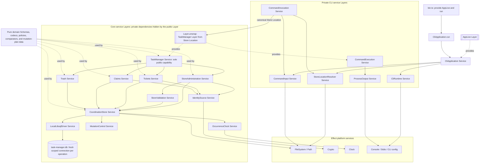
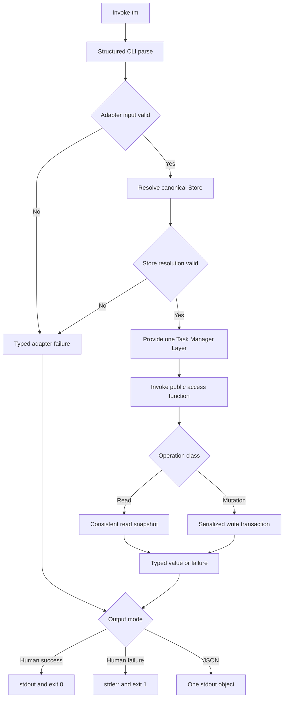
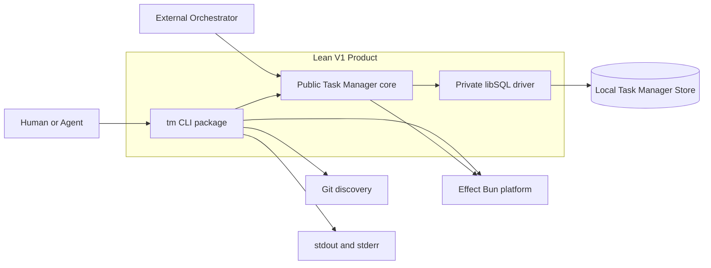
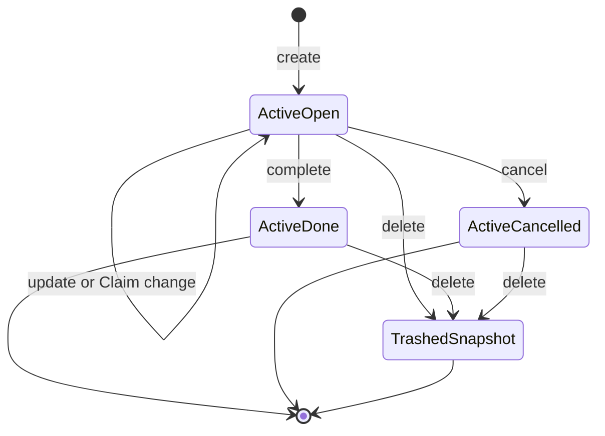
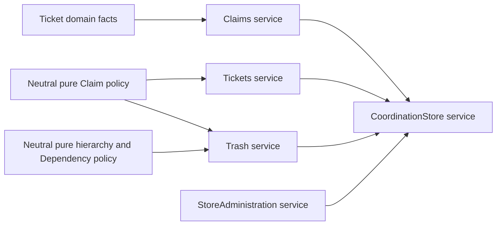
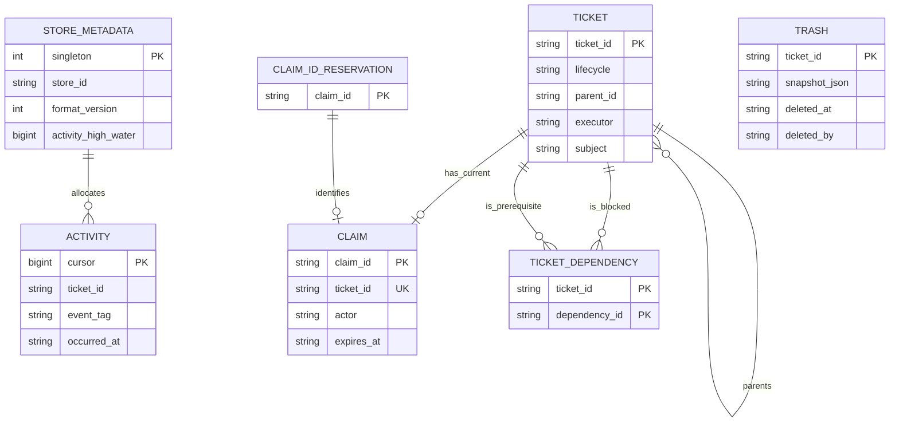
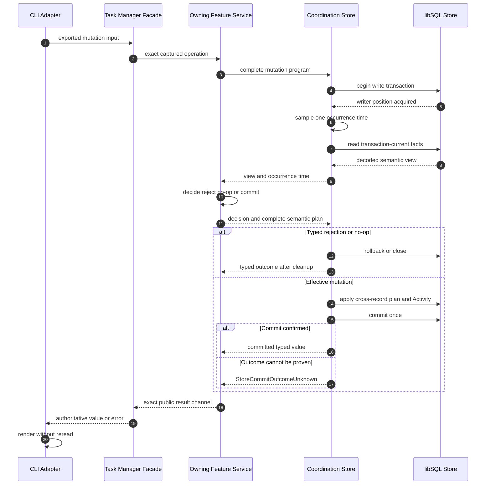

# Technical Design

## Architecture Summary

- Runtime profile: Bun-only local CLI targeting qualification on macOS arm64/APFS; no server, browser, worker, remote Store, or background process.
- Service-first rule: every coherent effectful application capability is an Effect `Context.Service` constructed by a Layer. This includes the public façade, private core features, persistence and deterministic runtime boundaries, CLI preparation/execution, and process publication. Immutable domain values, Schemas, codecs' pure transformations, deterministic policy/comparison functions, constants, and mutation-plan data remain ordinary pure modules; they are not runtime capabilities and must not be wrapped in artificial services.
- Composition root: `packages/cli/src/AppLive.ts` owns the complete Layer graph and `packages/cli/src/bin.ts` does only two things: provide `AppLive` to `CliApplication.run` and pass that one resulting Effect to `BunRuntime.runMain`. No entrypoint, access function, or command handler manually constructs a service object.
- Two-stage CLI composition: static `AppLive` constructs the CLI services. After structured parsing and adapter preparation resolve one canonical Store Location, a `CommandInvocation` Layer uses `Layer.unwrap` to select the exported `layer({ storeLocation })` and construct the Store-specific `TaskManager` plus `CommandExecution` services. This sanctioned dynamic Layer boundary is owned by `CliApplication`, occurs once per selected command, and preserves the requirement that malformed adapter input fails before core construction.
- Main execution model: parse and prepare through CLI services, resolve one canonical Store Location, invoke one or more public core access functions through one provided capability instance, route each operation once to its owning private feature service, execute it in one consistent read snapshot or serialized write transaction, then render the returned typed value or typed failure without rereading.
- Summary: Lean V1 uses two packages with one-way dependency `CLI -> public core`. The core is a deep Effect service graph: its small public interface is exactly the approved 15-operation `TaskManager` capability, whose exported parameterized Layer composes and hides private `StoreAdministration`, `Tickets`, `Claims`, `Trash`, `StoreValidation`, `CoordinationStore`, `LocalLibsqlDriver`, identity, clock, and mutation-control services. The CLI is likewise a private service graph for syntax, settings, files, Store resolution, command execution, confirmations, semantic scopes, process output, and exit status. Layers are the only construction and dependency-wiring mechanism; domain policy, libSQL details, transaction choreography, validation evidence, and Semantic Activity remain private. This design consumes the approved charter, user stories, and requirements while remaining consistency-checked against the legacy architecture and mandatory verification checklist until final four-artifact pack approval changes repository authority.

The required implementation baseline will pin the Rust `libsql` crate `0.9.30` and one repository-built, package-private Darwin-arm64 N-API artifact for `LocalLibsqlDriver`, alongside the repository-pinned Effect `4.0.0-rc.108` and Bun `1.3.13`. The npm compatibility packages `libsql` `0.5.28` and `@libsql/darwin-arm64` `0.5.28` are explicitly not the live adapter: their TypeScript declarations include `fileMustExist`, but the `0.5.28` JavaScript constructor does not forward that option and its native path uses create-enabled `Builder::new_local`. Qualification targets Darwin 25 arm64 on a local APFS volume, using one fresh native connection per core operation, SQLite delete-journal mode, safe-integer reads, a 30-second busy timeout, foreign keys enabled per connection, and full synchronous durability. This is the only release-support profile unless another profile later passes the complete approved qualification suite. The exact Rust toolchain, Cargo lock, native artifact digest, patch-level OS, and resolved JavaScript lockfile artifacts must be recorded by the suite before support is advertised. (NFR2.11, DEP6.1-DEP6.4)

### High-Level Service and Layer Composition



Solid arrows mean “the calling service depends on this capability.” Dotted `provides` arrows show Layer output. The diagram does not expand the public package seam: only `TaskManager` is exported from the core, and every other product service remains package-private. Layer identity is shared deliberately so all feature services receive the same `CoordinationStore`, identity, clock, and control instances, while the Store still acquires a fresh scoped native connection per operation.

## System Context

- Human and agent callers invoke `tm` directly or consume the public `@urban/task-manager` core package.
- Git contributes only the canonical common-root scope used by default Store resolution; it is not a Store or workflow authority.
- The local filesystem holds one Store directory whose active database is `task-manager.db` plus engine-owned sidecars.
- libSQL supplies embedded storage and cross-process writer serialization; Effect supplies Schema, capability, Layer, Clock, Crypto, platform, CLI, and test composition.
- Task Manager records coordination facts and transitions. An external Orchestrator may interpret work and Result data but receives no assignment, review, progress, retry, authentication, or workflow policy from Task Manager.
- Story or requirements traceability: US1.1-US1.14, US1.53-US1.60; FR1.1-FR1.11, FR1.37-FR1.43; TC3.1-TC3.9; IR5.1-IR5.7.

### Process Flowchart



Parsing, source conflicts, file loading, JSON parsing, public boundary decoding, adapter acknowledgments, and Actor-source selection precede Store access. A preview or acknowledgment pre-read is observational only; the later mutation reacquires transaction-current state and gains no reservation or precedence. (FR1.9-FR1.11, FR1.30, FR1.36, FR1.38)

### Context Flowchart



Arrows denote calls or capability dependencies, not lifecycle transitions. The CLI may import only the public root of the core package. Neither the libSQL driver nor any persistence type crosses the public core seam. (TC3.1-TC3.3, IR5.5)

## Components and Responsibilities

### Behavior State Diagram



`TrashedSnapshot` is a durable-location condition, not a fourth Ticket lifecycle status. A Claim is a separate record associated only with an open Ticket; acquiring, renewing, releasing, or logically expiring it does not transition the Ticket Snapshot. (FR1.20-FR1.23, FR1.25, FR1.28, FR1.31-FR1.32; DR4.4, DR4.8, DR4.13)

### Public Task Manager Module

The Public Task Manager Module is the only caller-visible core capability and hides all implementation dependencies behind the approved 15-operation interface.

- Boundary type: public `Context.Service`, exported access functions, and Store-configured Layer constructor.
- Owned capability: exact public methods, method/access-function parity, Layer construction, public schemas, canonical values, read models, operation inputs/results, and typed failures.
- Hidden depth: operation routing, persistence acquisition, transaction selection, policy evaluation, and vendor failure mapping.
- Inputs: decoded approved operation inputs and one `TaskManagerLayerOptions { storeLocation }` supplied to the exported `layer` constructor.
- Outputs: only the approved success values and closed error channels.
- Story impact: US1.1 and every story that invokes a core operation; FR1.1, FR1.44-FR1.51, FR1.66; TC3.2-TC3.3; IR5.5.

`packages/core` is named `@urban/task-manager`. Its package exports are only `.` and `./package.json`. The root exports `TaskManager`, `TaskManagerService`, `TaskManagerLayerOptions`, `layer`, the 15 access functions, `CanonicalAbsolutePath`, public schemas and canonical values, public read models, inputs/results, and typed failures. It does not export `internal/*`, SQL records, Store sessions, client factories, transaction plans, platform handles, clocks, barriers, identity generators, fault controls, or test utilities.

The following representative shape shows the seam; the exact operation channels remain those approved in FR1.44-FR1.51 rather than a second definition here.

```ts
export type TaskManagerLayerOptions = {
  readonly storeLocation: CanonicalAbsolutePath
}

export class TaskManager extends Context.Service<
  TaskManager,
  TaskManagerService
>()("@urban/task-manager/TaskManager") {}

export const layer = ({ storeLocation }: TaskManagerLayerOptions) =>
  makeTaskManagerLayer(storeLocation)

export const createTicket = Effect.fn("TaskManager.createTicket")(
  function* (input: CreateTicketInput) {
    const service = yield* TaskManager
    return yield* service.createTicket(input)
  }
)
```

The service method has the same success and error channels as the access function but no `TaskManager` requirement. Every reusable operation implementation uses `Effect.fn`; public access functions use stable names such as `TaskManager.createTicket`, while private helpers use named or intentionally untraced `Effect.fnUntraced` boundaries without duplicating public spans. The access function never provides the live Layer. `layer({ storeLocation })` captures no cwd, environment, Git, or implicit Store setting and hides all private dependencies with `Layer.provide`, not `Layer.provideMerge`.

### Domain Contract Module

The Domain Contract Module owns canonical values, closed schemas, pure normalization, deterministic comparison, and illegal-state exclusion shared by operations and boundaries.

- Boundary type: pure Schema-backed module family.
- Owned capability: Store metadata, Ticket Snapshot variants, Claim, Result, Trash, Semantic Activity, Claim Consumption, read models, operation models, error parents/reasons, public validation evidence, and canonical ordering.
- Hidden depth: text normalization, UTF-8/code-point bounds, exact timestamp parsing, optional omission, structural paths, diagnostics, Schema-owned JSON codecs, and stack-safe canonical JSON encoding.
- Inputs: unknown boundary values or already decoded domain values.
- Outputs: canonical domain values or structural decoding issues.
- Story impact: US1.15-US1.59; DR4.1-DR4.35; TC3.8.

All closed struct boundaries decode through shared pinned Effect Schema parse options with `onExcessProperty: "error"`, `reportInput: false`, and, where aggregate structural evidence is required, `errors: "all"`. Omit-only fields use `Schema.optionalKey`, not `Schema.optional`, so a present `undefined` is rejected; `null` is rejected unless the boundary's encoded schema explicitly accepts and normalizes it. Public expected failures use the pinned `Schema.TaggedError` constructor so they are both yieldable typed errors and Schema values. Plain serializable tagged values use `Schema.TaggedStruct` and `Schema.TaggedUnion` rather than error classes.

Unknown CLI values, public runtime inputs, and libSQL row objects cross module-scope parsers compiled once with pinned `Schema.decodeUnknown*`; malformed persisted values are never copied into Schema issues because `reportInput` remains false. Already-canonical domain values cross typed encoders compiled from the same codecs with `Schema.encode*`, never `Schema.encodeUnknown*`. Hot-path row parsers, JSON codecs, and typed encoders are constructed once per module and reused rather than rebuilt per record or render.

`CanonicalJson` is a specialized submodule behind Schema codecs. `DuplicateAwareJsonText` is a bidirectional Schema transformation whose `Encoded` side is JSON text and whose `Type` is `Schema.Json`: decoding uses an iterative tokenizer/parser with an explicit container stack so duplicate object members and arbitrary accepted depth are observable, then decodes the produced unknown graph exclusively through pinned `Schema.Json`; encoding uses the same iterative canonical JSON encoder used for persistence and output. Direct core values decode exclusively through pinned `Schema.Json`, whose exact `4.0.0-rc.108` implementation already uses an explicit stack and cycle cache to reject cycles, sparse arrays, unsupported leaves, non-plain objects, and non-finite numbers. No project-owned graph validator duplicates that work. The project-owned encoder handles only approved key ordering, deterministic compact JSON text, UTF-8 measurement, and the inclusive Result bound without native recursive traversal. No native `JSON.parse`, recursive project validator, or recursive `JSON.stringify` is the qualification path for Result data. (FR1.27, NFR2.6)

### Private Feature Services

The public `TaskManager` is implemented by four package-private `Context.Service` capabilities: `StoreAdministration`, `Tickets`, `Claims`, and `Trash`. Each has a dependency-requiring implementation Layer and a fully wired Layer used only in core composition. Each service owns complete caller-meaningful use cases from canonical input through transaction-current policy and semantic observation to the approved result or complete mutation plan. They own use cases rather than database tables; one shared `CoordinationStore` remains the sole persistence and transaction authority.

- Boundary type: four core-internal `Context.Service` tags with Layer constructors; none is exported from the package.
- Owned capability: exact allocation of all 15 public operations to one service owner, decision views, operation precedence, read projections, semantic plans, and public result/error construction.
- Hidden depth: hierarchy and Dependency traversal, Claim incarnation and fencing rules, lifecycle transitions, cascade selection, Trash preservation, blocker collection, readiness, and operation-specific recovery evidence.
- Inputs: the applicable subset of `CoordinationStore`, `StoreValidation`, and `IdentitySource` captured when each Layer constructs its service, plus imported pure policies, canonical operation inputs, and transaction-scoped semantic observations.
- Outputs: service methods returning the exact approved public `Effect` channels; only their transaction-scoped decision callbacks return `Rejected`, `NoOp`, or `Commit { value, plan }` to the Store runner.
- Story impact: US1.4-US1.11, US1.18-US1.56; FR1.4-FR1.8, FR1.13-FR1.39; NFR2.14-NFR2.19.

The exported `layer({ storeLocation })` is the public core recomposition boundary. It creates each private infrastructure Layer value once, supplies those shared values to the private feature Layers, then supplies the four feature services to the `TaskManager` implementation Layer. `Layer.provide` hides every private output. `Layer.provideMerge` is used only inside private graph construction when a dependency must intentionally remain available to another private Layer; it never broadens the public result. No service object is built manually outside its owning Layer, no feature Layer is reconstructed per method, and no caller can provide or invoke a private feature through the package seam.

```ts
const featureLayers = Layer.mergeAll(
  StoreAdministration.layerNoDeps,
  Tickets.layerNoDeps,
  Claims.layerNoDeps,
  Trash.layerNoDeps
).pipe(Layer.provide(coreInfrastructureLayers))

const taskManagerLayerNoDeps = Layer.effect(
  TaskManager,
  Effect.gen(function* () {
    const storeAdministration = yield* StoreAdministration
    const tickets = yield* Tickets
    const claims = yield* Claims
    const trash = yield* Trash

    return TaskManager.of({
      initializeStore: storeAdministration.initializeStore,
      validateStore: storeAdministration.validateStore,
      createTicket: tickets.createTicket,
      updateTicket: tickets.updateTicket,
      getTicketDetails: tickets.getTicketDetails,
      listTickets: tickets.listTickets,
      selectNextTicket: tickets.selectNextTicket,
      claimTicket: claims.claimTicket,
      renewClaim: claims.renewClaim,
      releaseClaim: claims.releaseClaim,
      completeTicket: tickets.completeTicket,
      cancelTicket: tickets.cancelTicket,
      deleteTicket: trash.deleteTicket,
      addTicketDependency: tickets.addTicketDependency,
      removeTicketDependency: tickets.removeTicketDependency
    })
  })
)

const taskManagerLayer = taskManagerLayerNoDeps.pipe(
  Layer.provide(featureLayers)
)
```

The names are representative, but the ownership rule is normative: every coherent effectful private capability is a service created by a Layer; pure policies and data transformations stay pure.

#### Store Administration Service

`StoreAdministration` owns `initializeStore` and `validateStore`. Its Layer requires the shared `CoordinationStore`, `StoreValidation`, and `IdentitySource` services and captures them once. `StoreAdministration` owns operation orchestration plus projection to the approved initialization and validation values or failures; `CoordinationStore` owns native resource/session execution, while `StoreValidation` owns malformed-storage inspection and issue derivation. Fresh publication remains a `StoreAdministration` use case executed through the Store's initialization runner. This assignment prevents validation or initialization ownership from being split across unnamed helpers.

#### Tickets Service

`Tickets` owns `createTicket`, `updateTicket`, `getTicketDetails`, `listTickets`, `selectNextTicket`, `completeTicket`, `cancelTicket`, `addTicketDependency`, and `removeTicketDependency`. It owns active Ticket Snapshot authoring and lifecycle, hierarchy, Dependency relationships and cycle evidence, read projections, readiness, completion blockers, cancellation scope, no-op placement, Executor scopes, and Ticket-oriented semantic plans.

Completion belongs to `Tickets` even though it removes a Claim: Claim Consumption is part of the atomic completion transition and `TicketCompleted` Activity, not an invocation of `Claims.releaseClaim`. Cancellation likewise owns optional target Claim Consumption as part of `TicketCancelled`. Dependencies remain inside `Tickets` because they determine active Ticket readiness, completion blockers, read projections, and deletion integrity.

#### Claims Service

`Claims` owns `claimTicket`, `renewClaim`, and `releaseClaim`. It owns acquisition-only behavior, logical expiry, Claim incarnation replacement, exact Claim-ID and Actor precedence, permanent new-ID reservation intent, Claim-specific no-op placement, and Claim Activity/results. It does not own every physical write to the `claims` relation: completion, cancellation, and Trash plans may consume or remove Claim facts as part of their own atomic use cases.

Neutral package-private policy modules own `RequireUnclaimed | MatchClaim`, effective-Claim presence, Claim-ID, Actor precedence, hierarchy, and Dependency graph rules used across features. These policies consume only canonical domain facts or semantic views, require no Effect Context, sample no time, perform no Store reads, and return deterministic typed decisions or evidence. Operation-specific precedence and mutation-plan construction remain in the owning feature.

#### Trash Service

`Trash` owns `deleteTicket`. It owns target-only versus cascade selection, canonical selected sets, the every-selected-Ticket-unclaimed rule, surviving-parent fencing, external-dependent checks, Executor scope, complete final Snapshot assembly, permanent Trash insertion intent, active removal order, target-first Activity intent, and the approved deletion result/rejections. CLI preview and confirmation remain adapter behavior and do not become Trash feature operations.

`Trash` is a deep one-method service: its private interface hides hierarchy, Claims, Dependencies, permanent identity reservation, historical Snapshot preservation, and multi-record atomic movement. Trash remains a durable collection and location condition, not a Ticket lifecycle status.

#### Cross-Feature Policy and Transaction Rule

Feature-service methods never call another feature service's top-level operation from inside an operation. In particular, `Tickets.completeTicket` never calls `Claims.releaseClaim`, and `Trash.deleteTicket` never calls public or private Ticket listing. Such calls would create nested observations, independent transactions, or partial-commit risks. Cross-feature dependencies therefore appear only in the Layer graph for shared infrastructure and pure policy, not as feature-to-feature service requirements.

Cross-feature rules are shared as neutral pure package-private policy modules and canonical semantic views. Common Ticket, Claim, Trash, Activity, and validation values remain in the Domain Contract Module. Claims decisions consume Ticket domain facts without invoking `Tickets`; Tickets and Trash consume pure Claim policy without invoking `Claims`; Trash consumes pure hierarchy and Dependency policy without invoking `Tickets`.



Each feature-service method returns its approved public `Effect` channel and internally submits one complete read, write, initialization, or validation program to `CoordinationStore`. For a mutation, that program supplies a transaction-scoped decision callback: the Store acquires writer ownership, samples the occurrence instant, and provides decoded semantic views; only the callback returns `Rejected`, `NoOp`, or `Commit` with a complete semantic `MutationPlan`. The Store alone applies the plan and maps the internal decision back to the feature method's public result. Point operations load only their target, effective Claim, and direct relationships; tree, cascade, cycle, listing, selection, and deletion operations load one decoded active coordination graph in the same session. Canonical graph traversal is iterative, and SQL ordering never selects public witnesses.

### Coordination Store Service

`CoordinationStore` is the private persistence service that converts `LocalLibsqlDriver` observations into domain decision views and applies complete mutation plans atomically.

- Boundary type: private `Context.Service`-backed scoped adapter with read, write, initialization, and raw-validation program runners.
- Owned capability: database resource lifecycle, format-1 schema, parameterized queries, row codecs, read snapshots, serialized writers, write-plan application, Activity allocation, commit classification, and bounded vendor diagnostics.
- Hidden depth: native libSQL connections, SQL, rows, pragmas, rollback journals, statement ordering, affected-row checks, and cleanup.
- Inputs: canonical Store Location and complete private programs submitted by one owning feature-service method.
- Outputs: decoded domain views or internal Store outcomes mapped once to public Store errors.
- Story impact: US1.4-US1.11, US1.53-US1.56; FR1.4-FR1.8, FR1.37-FR1.39; NFR2.1-NFR2.5; TC3.5-TC3.7.

The Layer itself is cheap and infallible; it captures the canonical path and platform capabilities but does not open or create the database. Each operation uses one `Effect.acquireUseRelease` bracket to acquire a fresh scoped connection through `LocalLibsqlDriver.openExisting`, configure and verify that connection, own it through one read or write session, and perform state-aware rollback and close in the release branch. `openExisting` is an atomic driver operation, not an existence-check followed by a create-enabled open: its native implementation builds local libSQL with exactly `OpenFlags::SQLITE_OPEN_READ_WRITE` and never includes `SQLITE_OPEN_CREATE`. If the main file disappears before native open, acquisition returns the internal absent outcome and creates neither the main file nor an engine sidecar. After acquisition, expected domain, statement, and transaction outcomes remain internal data through cleanup. The release protocol records rollback, commit, transaction-state, and close evidence separately, then re-enters the public channel only after classifying that complete report. A failed rollback or otherwise unprovable transaction state after a commit request becomes `StoreCommitOutcomeUnknown`; a proven rollback remains known non-commit; and a returned `COMMIT` with inactive transaction state remains known commit. A later close-only failure never rewrites proven transaction state as unknown: it maps to the operation's existing pre-commit failure only when non-commit was proven, and otherwise becomes a defect because the approved public contract has no committed-but-cleanup-failed outcome. Domain rejection and no-op remain distinct. Interruption remains an interrupt Cause after uninterruptible rollback/close; cleanup defects may compose with non-typed Causes but never masquerade as a typed Store failure. Initialization publishes only after the temporary database closes successfully. No `Scope` requirement escapes the operation, and no client or native connection is cached across operations. This protocol prevents expected data plus cleanup failure from accidentally becoming a composite typed Cause while preserving transaction truth.

`LocalLibsqlDriver` is a package-private `Context.Service` whose live Layer loads the one exact qualified N-API artifact built from the pinned Rust `libsql` crate. Its deliberately narrow interface exposes only create-disabled `openExisting`, parameterized prepare/query/execute, safe-integer rows, autocommit-state inspection, and close; raw handles, builders, open flags, and native values never escape to feature services or public exports. Initialization does not ask libSQL to create a path: Effect FileSystem atomically reserves a unique same-directory temporary main file with exclusive creation and mode `0600`, after which `openExisting` opens that already-created file. The core therefore has one explicit creator—the initialization publication protocol—and every ordinary or existing-Store open is create-disabled by construction.

The direct native adapter remains intentional because the pinned Rust API exposes `Builder::flags`, `OpenFlags::SQLITE_OPEN_READ_WRITE`, prepared statements, `Connection.is_autocommit`, and connection lifetime needed to issue and classify explicit `BEGIN`, `BEGIN IMMEDIATE`, `COMMIT`, and `ROLLBACK` statements on one owned connection. Every connection sets and reads back `PRAGMA foreign_keys = ON`, `PRAGMA synchronous = FULL`, and `PRAGMA busy_timeout = 30000`; read sessions additionally set `PRAGMA query_only = ON`. Delete-journal mode is installed during initialization and verified on ordinary open. Neither the npm `libsql` compatibility constructor nor the high-level `@libsql/client` transaction object satisfies the create-disabled-open and lifecycle-proof contract. The bracket's use program owns the explicit transaction protocol; its release program inspects the recorded phase and native autocommit state, performs any required uninterruptible rollback and close, and preserves a more conservative unknown-outcome classification whenever cleanup cannot prove non-commit.

### Store Validation Service

`StoreValidation` is a private `Context.Service` required by `StoreAdministration`. Its Layer requires the shared `CoordinationStore` and captures the Store's raw validation-session capability. It safely inspects malformed storage through ordered gates without weakening ordinary operation decoders. `StoreAdministration` alone maps its result to the public `validateStore` channel.

- Boundary type: private `Context.Service` with a Layer-backed raw read-only inspector and public-evidence projector.
- Owned capability: absence/open/query separation, database/application/format/structure gates, engine and foreign-key checks, record decoding, cross-record integrity, deterministic locators, canonical issue ordering, and validation counts.
- Hidden depth: schema manifest inspection, raw row isolation, safe identity extraction, malformed-record sorting, foreign-key projection, Activity/Trash matching, and cycle-component analysis.
- Inputs: one read transaction and raw engine observations.
- Outputs: the approved `ValidateStoreReport`, validation rejection, or validation read error.
- Story impact: US1.6-US1.11; FR1.6-FR1.8, FR1.65, FR1.68, FR1.71; NFR2.19; DR4.18-DR4.19, DR4.22, DR4.30-DR4.35.

The gate pipeline is an explicit state machine. Aggregate checks begin only after safe structure and metadata inspection. Each collection is projected to public-safe diagnostic facts, sorted only by those facts, and then assigned positive ordinals. Equal public projections remain equal duplicates; neither row ID, physical order, SQL text, hash order, nor unsafe raw value breaks the tie. Only completely decoded records enter semantic reference graphs. Engine and foreign-key observations are projected to their closed public shapes before sorting. The Domain Contract Module owns the `BoundedDiagnostic` schema and pure normalization; persistence and runtime adapters own projection of vendor/platform causes into that contract.

### CLI Preparation Services

CLI preparation is owned by three private services. `CommandInput` turns parser, environment, and filesystem observations into canonical command values. `StoreLocationResolver` owns cwd, explicit/default Store precedence, canonicalization, Git common-root scope, and project-key hashing. `CommandInvocation` is a per-selected-command service whose parameterized Layer composes those results and exposes one fully prepared command plus canonical Store Location before core construction.

- Boundary type: private `Context.Service` capabilities with static infrastructure Layers and one parameterized invocation Layer.
- Owned capability: structured parse-error projection, occurrence bounds, source conflicts, cwd/Store precedence, canonicalization, Git common-root scope, project-key hashing, strict UTF-8 files, Actor fallback, and adapter-only acknowledgments.
- Hidden depth: deepest-existing-ancestor realpath handling, absent-tail normalization, regular-file checks, SHA-256 project keys, file/source attribution, and first-failure selection.
- Inputs: argv, `TM_CWD`, `TM_STORAGE_PATH`, `TM_ACTOR`, process cwd, home, Git, and files.
- Outputs: a command program ready to run with one canonical Store Location, or a typed adapter failure.
- Story impact: US1.2-US1.3, US1.12-US1.14, US1.22, US1.40, US1.44, US1.59; FR1.2-FR1.3, FR1.9-FR1.11, FR1.30, FR1.36; TC3.4; IR5.1-IR5.4.

The command tree is `init`, `validate`, `create`, `update`, `show`, `list`, `next`, `claim`, `renew`, `release`, `complete`, `cancel`, `delete`, `block`, and `unblock`. Executor changes are `update --executor`; no separate core or CLI operation exists. Production uses `Command.run` as the sole argv ingress; `Command.runWith` is reserved for tests. Only `effect/unstable/cli` parses syntax, produces help/version/completion, and reports structured parser facts. The adapter never reparses argv or parser prose.

For a selected command, `CliApplication.layer` creates one `CommandInvocation.layer(parsedCommand)` value. That Layer completes source validation and Store resolution, then `Layer.unwrap` derives the Store-specific public `TaskManager` Layer and supplies it to `CommandExecution.layerNoDeps`. The command handler only yields `CommandExecution.execute`; it contains no `Effect.provide`, service constructor, Store-layer factory, or platform wiring. Multi-call flows therefore share the same one provided `TaskManager` service. Help, version, completion, and parse-failure paths never build the Store-specific subtree.

`AppLive` provides `CliConfig.layer({ builtIns: [GlobalFlag.Help, GlobalFlag.Version, GlobalFlag.Completions] })` and `CliOutput.layer(CliOutput.defaultFormatter({ colors: false }))` while constructing the CLI service Layers. `GlobalFlag.Wizard` and `GlobalFlag.LogLevel` are deliberately absent because they are not part of the closed Lean V1 grammar. The declaration order above is the action precedence. Architecture tests inspect the installed built-ins so a future Effect default cannot silently expand the command surface.

The pinned `Command.run` renders help before re-failing every `CliError.ShowHelp`, including parse failures, even when `renderErrors: false`. To preserve Effect CLI parsing without leaking that help into product error output, a private testable `cliRuntime.ts` invokes `Command.run(commandTree, { version, renderErrors: false })` with a runner-scoped `Console.Console` derived from the live service. Its overridden `log` and `error` methods write no process bytes, accept exactly one formatted string for supported framework actions, append one literal LF in the staging implementation, encode the result as UTF-8, and capture it in a per-invocation `MutableRef`. Any other staged Console call shape is a defect; no claim is made about newline behavior of the default Console implementation.

Selected command handlers do not write process streams. On success they complete one private `Deferred<ProcessOutput>` command-result cell, inspect the boolean returned by `Deferred.succeed`, and defect when it is `false`. After `Command.run` settles, the outer runner uses `Deferred.poll`; it never directly awaits an empty cell. The runner then follows exactly one path:

1. a selected handler result is supplied as a one-element Stream to the chosen live Effect `Stdio` Sink;
2. successful help, version, or completion with no handler result supplies the staged framework bytes once to the chosen live Stdio Sink;
3. a `ShowHelp` with structured parse errors discards all staged help, projects the pinned `CliError` facts, and writes only the Task Manager error output; or
4. another typed adapter/core failure discards staged framework output and writes only its exhaustive Task Manager projection.

Each non-empty destination is run at most once, and an empty destination is skipped. A Stdio Sink `PlatformError` is converted to a defect only at this process boundary. An empty-error `ShowHelp` is treated as framework help and exits successfully; a non-empty error collection is a parse failure. Simultaneous framework and handler output is a defect. `CliRuntime` uses only public Effect services and CLI error values; it imports no Effect CLI internals and does not infer behavior from rendered text. `packages/cli/src/bin.ts` remains a minimal executable edge: it provides the already composed `AppLive` Layer to `CliApplication.run` and invokes `BunRuntime.runMain`; staging, arbitration, rendering selection, expected-exit construction, and platform/CLI Layer wiring remain in private testable services and `AppLive.ts`.

Deletion preview uses exactly one public `listTickets` call with the explicit target as root and all statuses/Executors selected; that one read snapshot returns the target and complete observed descendant tree needed for neutral preview summaries and required flags. It remains nonbinding and does not combine `getTicketDetails` with a second observation. Human-completion acknowledgment may use `getTicketDetails` before `completeTicket`; the exact completion input stays closed, and completion rechecks current state. Optional Claim flags map directly to semantic fence unions without Claim pre-reads. Purpose-specific acknowledgments map to exact semantic scope unions, never a generic force boolean.

### CLI Rendering and Runtime Services

Pure human/JSON formatting remains an ordinary exhaustive projection from typed outcomes to exact bytes. Effectful publication and arbitration are services: `ProcessOutput` owns the single-assignment command-result cell and live Stdio Sink publication; `CliRuntime` owns staged Effect Console behavior, framework/product arbitration, and expected process exit; `CommandExecution` invokes the prepared command through one provided `TaskManager` and passes its authoritative typed outcome to the pure renderer and `ProcessOutput`.

- Boundary type: private `CommandExecution`, `ProcessOutput`, and `CliRuntime` `Context.Service` capabilities plus pure renderer functions.
- Owned capability: command-to-core routing, human templates, tree/detail grammar, command JSON envelopes, compact canonical JSON bytes, stdout/stderr selection, one newline, framework-output staging, and exit status.
- Hidden depth: complete-Subject rendering, typed collection formatting, connector state, typed Schema-JSON codec selection, parser/domain error dispatch, and staged-output selection.
- Inputs: authoritative typed adapter/core value or error, staged framework bytes, and selected output mode.
- Outputs: `ProcessOutput { stdoutBytes, stderrBytes, exitCode: 0 | 1 }` published exactly once through live Effect `Stdio` Sinks, followed by ordinary success for exit 0 or a private expected-exit failure for exit 1.
- Story impact: US1.23-US1.26, US1.57-US1.58; FR1.5-FR1.6, FR1.12, FR1.40-FR1.41, FR1.52-FR1.71.

Renderers never access Task Manager, Store Location, filesystem state, or persistence. Every public success and expected-failure JSON representation is a named Schema codec: each applicable `Schema.TaggedStruct` or `Schema.TaggedError` member applies `Schema.encodeKeys({ _tag: "type" })` before union composition, and `Schema.toCodecJson` derives the complete nested `Schema.Json` representation. Exact `4.0.0-rc.108` source and executable API evidence verifies that the same composition encodes and decodes `Schema.TaggedError` instances structurally; no declaration relies on the permissive fallback for an opaque value. Module-scope typed encoders accept canonical domain values and produce `Schema.Json`; the renderer only chooses the command envelope, encodes it through its Schema codec, and feeds that JSON value to the iterative canonical byte encoder. It performs no recursive `_tag` walk, key renaming, or parallel DTO mapping.

Framework formatting remains owned by Effect CLI, while the runner controls final stream publication. After rendering and publishing an expected failure, the CLI fails with a private `Data.TaggedError` carrying `[Runtime.errorExitCode] = 1` and `[Runtime.errorReported] = false`. `BunRuntime.runMain` uses `Runtime.defaultTeardown`, which therefore selects status 1 without duplicate reporting. Success remains ordinary Effect success and exits 0. No product code mutates `process.exitCode`, and unexpected defects, sink failures, and interruption remain failed exits with Bun Runtime's ordinary reporting and signal behavior.

### Private Deterministic Controls

The Private Deterministic Controls schedule or fail production logic for evidence without becoming public product capabilities.

- Boundary type: core-internal Context services with live defaults and package-private test Layers.
- Owned capability: one occurrence Clock, cryptographic Identity Source, writer barriers, mutation checkpoints, and commit-response loss simulation.
- Hidden depth: deterministic schedules and fault latches.
- Inputs: test schedules or live Effect Clock/Crypto services.
- Outputs: time/IDs, suspension, or an injected persistence failure at a real production checkpoint.
- Story impact: US1.53-US1.56; TC3.7; NFR2.3, NFR2.9-NFR2.10, NFR2.14-NFR2.19.

Production uses Effect Clock and Crypto. Implementations acquire `const crypto = yield* Crypto.Crypto` and invoke `crypto.randomUUIDv4`, `crypto.randomBytes(size)`, and `crypto.digest("SHA-256", bytes)`; `IdentitySource.layerCrypto` depends on `Crypto.Crypto`. Ticket IDs use secure bytes, rejection sampling over the complete `36^6` range, and a transaction-current active/Trash collision check; a full-space count proves `TicketIdSpaceExhausted`, while a deterministic cyclic fallback from a random start guarantees finding an available ID rather than relying on bounded luck. Claim IDs are inserted into a permanent private `claim_id_reservations` relation in the same transaction as the Claim and Activity so a released, renewed, expired, or consumed ID is never generated again.

The exact private Layer graph is centralized inside the exported public Layer factory and shared at the transaction level:

- `layer({ storeLocation })` composes `TaskManager` from the four private feature-service Layers.
- `StoreAdministration.layerNoDeps` requires `CoordinationStore | StoreValidation | IdentitySource`; `Tickets.layerNoDeps` requires `CoordinationStore | IdentitySource`; `Claims.layerNoDeps` requires `CoordinationStore | IdentitySource`; and `Trash.layerNoDeps` requires `CoordinationStore`.
- `StoreValidation.layerNoDeps` requires `CoordinationStore`.
- `CoordinationStore.layerNoDeps(storeLocation)` requires `FileSystem | Path | LocalLibsqlDriver | OccurrenceClock | MutationControl`.
- `LocalLibsqlDriver.layerLive` loads the exact qualified package-private native artifact; `OccurrenceClock.layerLive` uses the live Effect Clock reference, `IdentitySource.layerCrypto` requires `Crypto.Crypto`, and `MutationControl.layerDisabled` is infallible.
- Pure policy modules are imported by the service implementation that owns the rule; they add no Context requirement or Layer node.

`CoordinationStore` captures `OccurrenceClock` because the Store session runner owns the invariant that a read instant is sampled inside its snapshot and a mutation instant only after `BEGIN IMMEDIATE` acquires writer ownership. It captures `MutationControl` because the Store owns material-effect, pre-commit, commit-request, rollback, close, and response-loss checkpoints. Feature-service methods receive the one sampled instant and semantic observations through the transaction program; they cannot sample a second time or invoke a checkpoint outside the real transaction path.

One invocation of `layer({ storeLocation })` creates each private Layer value once. Layer memoization therefore gives all feature services one shared `CoordinationStore`, `StoreValidation`, `LocalLibsqlDriver`, identity, and control graph. Sharing is scoped to that provisioning; it is not a process-global connection cache. The graph must not use `Layer.fresh`, reconstruct an equivalent Store Layer per feature, or cache a native connection; every Store operation still acquires a fresh native connection. The public constructor returns `Layer<TaskManager, never, FileSystem | Path | Crypto.Crypto>`, and the CLI invocation Layer supplies those remaining platform services once.

Package-private tests call `TestTaskManager.layer({ storeLocation, controlProtocol })`, construct the same complete service graph and real Coordination Store, and replace only Clock, identity, and mutation-control Layers before dependent services are built. No private service or control is in package exports. The composition is intentionally centralized; `Layer.provide` hides implementation requirements, while tests assert requirement elimination and shared-node behavior rather than one exact combinator tree:

```ts
const makeInfrastructureLayers = (
  storeLocation: CanonicalAbsolutePath,
  clockLayer: OccurrenceClockLayer,
  identityLayer: IdentitySourceLayer,
  controlLayer: MutationControlLayer
) => {
  const driverLayer = LocalLibsqlDriver.layerLive
  const storeLayer = CoordinationStore.layerNoDeps(storeLocation).pipe(
    Layer.provide(driverLayer),
    Layer.provide(clockLayer),
    Layer.provide(controlLayer)
  )
  const validationLayer = StoreValidation.layerNoDeps.pipe(
    Layer.provide(storeLayer)
  )
  return Layer.mergeAll(storeLayer, validationLayer, identityLayer)
}

const makeLiveLayer = (storeLocation: CanonicalAbsolutePath) =>
  makeTaskManagerLayer(
    makeInfrastructureLayers(
      storeLocation,
      OccurrenceClock.layerLive,
      IdentitySource.layerCrypto,
      MutationControl.layerDisabled
    )
  )

const makeTestLayer = (
  storeLocation: CanonicalAbsolutePath,
  controls: TestControlProtocol
) =>
  makeTaskManagerLayer(
    makeInfrastructureLayers(
      storeLocation,
      OccurrenceClock.layerTest(controls),
      IdentitySource.layerTest(controls),
      MutationControl.layerTest(controls)
    )
  )
```

The named Layer aliases above are representative documentation names, not public types. Exact aliases and signatures must be verified against the pinned Effect source without type assertions. Test controls are supplied before the Store, validation, feature, and Task Manager Layers are built, so live defaults cannot shadow them.

## Data Model and Data Flow

- Entities: singleton Store metadata; active Ticket Snapshot facts; normalized Dependency edges; separate current Claim; permanent Claim-ID reservation; Trash entry with complete final Snapshot; ordered Semantic Activity.
- Flow: CLI/core schemas decode external input; the public façade delegates once to the provided owning feature service; a read or writer session decodes rows through private persistence schemas; that service derives a read model or complete semantic mutation plan; the Store applies the plan and Activity/high-water together; public values/errors are encoded without row leakage.
- Observation support: effective Claims and progressed-descendant state are derived at one observation instant; details, lists, selection, preview, blockers, and validation are assembled inside one snapshot and returned complete to the caller.

A private mutation plan makes all intended effects explicit before the first write. Its shape is implementation-only and is never a public transaction interface:

```ts
type MutationDecision<A, E> =
  | { readonly _tag: "Rejected"; readonly error: E }
  | { readonly _tag: "NoOp"; readonly value: A }
  | {
      readonly _tag: "Commit"
      readonly value: A
      readonly plan: MutationPlan
    }
```

`MutationPlan` contains ordered Ticket inserts/updates/removals, Dependency changes, Claim changes and reservations, Trash inserts, and semantic event intents. It cannot contain a Cursor or second occurrence time; the transaction runner assigns both after writer ownership. Rejected and no-op decisions cannot be passed to the write-plan executor.

### Schema Boundary and Codec Policy

Every boundary names its Effect Schema `Encoded` and `Type` representations; a SQL record, JSON object, or CLI source is never treated as the domain type merely because its TypeScript fields are similar.

| Boundary codec | `Encoded` representation | Canonical `Type` | Transformation |
| --- | --- | --- | --- |
| Public operation input | Closed unbranded runtime structure | Branded IDs, normalized text, omission-only options, and closed input unions | Validate unknown input, normalize once, and reject excess fields |
| `DuplicateAwareJsonText` | Complete JSON text | `Schema.Json` | Iterative duplicate-aware parse on decode; iterative canonical JSON text on encode |
| Result data | `Schema.Json` | Canonical Result data inside the closed Result type | Pinned `Schema.Json` validation plus aggregate canonical-byte check |
| Ticket persistence row | Exact libSQL row object with nullable lifecycle columns and JSON text columns | One closed open/done/cancelled Ticket Snapshot union | Decode column primitives, normalize each legal nullable-column combination to one union member, and encode that member back to its one format-1 row shape |
| Claim, Trash, Activity, Dependency, and metadata rows | Exact relation-specific libSQL row objects | Canonical domain records and relations | Decode identifiers/timestamps/discriminants; JSON text columns compose `DuplicateAwareJsonText` with the relevant domain schema |
| Public JSON success/error | `Schema.Json` with `type` discriminants and exact omission | Canonical public value or `Schema.TaggedError` instance | Per-member `Schema.encodeKeys({ _tag: "type" })`, union composition, then `Schema.toCodecJson` |

Persistence row schemas therefore define raw libSQL objects as `Encoded` and canonical domain records as `Type`. SQL `NULL` exists only on the encoded side and is normalized into the closed lifecycle union or an omitted domain field; domain logic never handles nullable lifecycle combinations. `result_json`, Trash Snapshot JSON, and Activity event JSON are text only on the encoded side and compose through the iterative JSON-text codec into their canonical domain schemas. The reverse encoder is the sole producer of those columns. CLI JSON text uses that same text-to-`Schema.Json` transformation before composition with the Result schema. No repository, feature, or renderer maintains a parallel DTO conversion table outside these codecs.

Each transformation documents both directions. For canonical domain `t`, `decode(encode(t))` must be equivalent to `t`; for accepted boundary `e`, `encode(decode(e))` may normalize whitespace, null layout, object-member order, and JSON text, and is compared with the documented canonical encoded form rather than original bytes. Unknown decoding may fail with precise Schema issues; typed encoding of a canonical domain value is expected to succeed, and an encoding failure is a defect at the owning boundary.

### Format-1 Storage

`SchemaManifest` owns this exact format-1 schema. Full text/control/timestamp/UUID validity remains in closed persistence codecs; SQL checks enforce structural discriminants and lifecycle-field coherence.

```sql
CREATE TABLE store_metadata (
  singleton INTEGER PRIMARY KEY CHECK (singleton = 1),
  application_identity TEXT NOT NULL CHECK (application_identity = 'task-manager'),
  format_version INTEGER NOT NULL CHECK (format_version = 1),
  store_id TEXT NOT NULL UNIQUE,
  activity_high_water INTEGER NOT NULL CHECK (activity_high_water >= 0)
) STRICT;

CREATE TABLE tickets (
  ticket_id TEXT PRIMARY KEY,
  level TEXT NOT NULL CHECK (level IN ('epic', 'task', 'subtask')),
  executor TEXT NOT NULL CHECK (executor IN ('agent', 'human')),
  subject TEXT NOT NULL,
  description TEXT NOT NULL,
  context TEXT,
  parent_id TEXT REFERENCES tickets(ticket_id) ON UPDATE RESTRICT ON DELETE RESTRICT,
  status TEXT NOT NULL CHECK (status IN ('open', 'done', 'cancelled')),
  created_at TEXT NOT NULL,
  updated_at TEXT NOT NULL,
  result_json TEXT,
  completed_at TEXT,
  completed_by TEXT,
  cancellation_reason TEXT,
  cancelled_at TEXT,
  cancelled_by TEXT,
  CHECK (
    (status = 'open' AND result_json IS NULL AND completed_at IS NULL AND completed_by IS NULL
      AND cancellation_reason IS NULL AND cancelled_at IS NULL AND cancelled_by IS NULL)
    OR
    (status = 'done' AND result_json IS NOT NULL AND completed_at IS NOT NULL AND completed_by IS NOT NULL
      AND cancellation_reason IS NULL AND cancelled_at IS NULL AND cancelled_by IS NULL)
    OR
    (status = 'cancelled' AND result_json IS NULL AND completed_at IS NULL AND completed_by IS NULL
      AND cancellation_reason IS NOT NULL AND cancelled_at IS NOT NULL AND cancelled_by IS NOT NULL)
  )
) STRICT;

CREATE TABLE ticket_dependencies (
  ticket_id TEXT NOT NULL REFERENCES tickets(ticket_id) ON UPDATE RESTRICT ON DELETE RESTRICT,
  dependency_id TEXT NOT NULL REFERENCES tickets(ticket_id) ON UPDATE RESTRICT ON DELETE RESTRICT,
  PRIMARY KEY (ticket_id, dependency_id),
  CHECK (ticket_id <> dependency_id)
) STRICT;

CREATE TABLE claim_id_reservations (
  claim_id TEXT PRIMARY KEY
) STRICT;

CREATE TABLE claims (
  claim_id TEXT PRIMARY KEY,
  ticket_id TEXT NOT NULL UNIQUE REFERENCES tickets(ticket_id) ON UPDATE RESTRICT ON DELETE RESTRICT,
  actor TEXT NOT NULL,
  claimed_at TEXT NOT NULL,
  expires_at TEXT NOT NULL
) STRICT;

CREATE TRIGGER claims_require_reservation_insert
BEFORE INSERT ON claims
WHEN NOT EXISTS (
  SELECT 1 FROM claim_id_reservations WHERE claim_id = NEW.claim_id
)
BEGIN
  SELECT RAISE(ABORT, 'claim id is not reserved');
END;

CREATE TRIGGER claims_require_reservation_update
BEFORE UPDATE OF claim_id ON claims
WHEN NOT EXISTS (
  SELECT 1 FROM claim_id_reservations WHERE claim_id = NEW.claim_id
)
BEGIN
  SELECT RAISE(ABORT, 'claim id is not reserved');
END;

CREATE TRIGGER claim_reservation_restrict_delete
BEFORE DELETE ON claim_id_reservations
WHEN EXISTS (
  SELECT 1 FROM claims WHERE claim_id = OLD.claim_id
)
BEGIN
  SELECT RAISE(ABORT, 'active claim id remains reserved');
END;

CREATE TRIGGER claim_reservation_restrict_update
BEFORE UPDATE OF claim_id ON claim_id_reservations
WHEN EXISTS (
  SELECT 1 FROM claims WHERE claim_id = OLD.claim_id
)
BEGIN
  SELECT RAISE(ABORT, 'active claim id remains reserved');
END;

CREATE TABLE trash (
  ticket_id TEXT PRIMARY KEY,
  snapshot_json TEXT NOT NULL,
  deleted_at TEXT NOT NULL,
  deleted_by TEXT NOT NULL
) STRICT;

CREATE TABLE activity (
  cursor INTEGER PRIMARY KEY CHECK (cursor > 0),
  occurred_at TEXT NOT NULL,
  actor TEXT NOT NULL,
  ticket_id TEXT NOT NULL,
  event_tag TEXT NOT NULL CHECK (event_tag IN (
    'TicketCreated', 'TicketUpdated', 'TicketClaimed', 'TicketClaimRenewed',
    'TicketClaimReleased', 'TicketCompleted', 'TicketCancelled', 'TicketTrashed',
    'TicketDependencyAdded', 'TicketDependencyRemoved'
  )),
  event_payload_json TEXT NOT NULL
) STRICT;

CREATE INDEX tickets_parent_order ON tickets(parent_id, created_at, ticket_id);
CREATE INDEX tickets_root_order ON tickets(level, created_at, ticket_id) WHERE parent_id IS NULL;
CREATE INDEX tickets_selection ON tickets(status, executor, created_at, ticket_id);
CREATE INDEX dependencies_reverse ON ticket_dependencies(dependency_id, ticket_id);
CREATE INDEX activity_ticket_cursor ON activity(ticket_id, cursor);
CREATE UNIQUE INDEX activity_one_trashed ON activity(ticket_id)
  WHERE event_tag = 'TicketTrashed';
```

There are no SQL cascade actions; deletion plans explicitly remove selected Dependency rows and any persisted expired Claims first, then delete selected Ticket rows in reverse canonical tree order so every child precedes its parent under `ON DELETE RESTRICT`. Trash insertion, the returned target/descendant values, and Activity remain target-first in canonical tree order. Every planned insert/update/delete has an expected affected-row count. A mismatch before commit is an internal Store transaction failure and must roll back; the metadata update additionally uses the previously read high-water in its predicate and must affect exactly one row.

The active Ticket Snapshot's public `blockedBy` field is assembled only from `ticket_dependencies`; it is not duplicated in `tickets`. `result_json` is the canonical compact encoded Result object. `trash.snapshot_json` is the canonical compact encoded complete public Ticket Snapshot, including assembled `blockedBy` before active edges are removed. `activity.event_payload_json` contains only the event-specific payload: resulting Ticket for `TicketCreated`; effective field deltas for `TicketUpdated`; complete new Claim facts for `TicketClaimed`; prior Claim ID plus complete replacement Claim for `TicketClaimRenewed`; Claim ID for `TicketClaimReleased`; Result plus consumed Claim ID for `TicketCompleted`; reason plus Claim Consumption for `TicketCancelled`; `{}` for `TicketTrashed`; and prerequisite ID for Dependency events. The event tag is stored only in `event_tag`, not duplicated in the payload.

Activity deliberately has no physical foreign key to active `tickets`: Activity survives movement to Trash, and its Ticket ID is validated semantically against active coordination or Trash. Trash likewise has no active-Ticket foreign key. `claim_id_reservations` intentionally has no public-record foreign key because the approved foreign-key evidence union contains no private reservation collection. Instead, the exact insert/update/delete triggers are part of `SchemaManifest`: every current Claim must have a reservation, active reservations cannot be removed, and operation code inserts the permanent reservation before inserting or replacing the current Claim in the same transaction. Missing or changed triggers fail the structure gate; affected-row and trigger failures roll back the operation. SQLite integers are read with native safe-integer mode and converted only after schema bounds prove a safe public value. Defense-in-depth constraints do not replace transaction-current domain checks or public validation.

### Entity Relationship Diagram



The ERD omits a physical Activity-to-Ticket/Trash edge deliberately. Historical Activity retains a Ticket ID after the active row moves to Trash; validation enforces the semantic identity and exact `TicketTrashed` attribution match. The DDL above, not the conceptual ERD, is the physical schema authority.

### Initialization Publication

Fresh initialization must not expose a partial canonical database. When `task-manager.db` is absent, the `StoreAdministration` initialization method uses the shared `CoordinationStore` initialization runner to reserve a uniquely named private main file in the same Store directory through exclusive Effect FileSystem creation with mode `0600`, open that existing temporary file through `LocalLibsqlDriver.openExisting`, configure and verify delete-journal/full-synchronous/foreign-key mode on its owned native connection, install the complete format-1 schema and metadata in one `BEGIN IMMEDIATE` transaction, validate it, reverify mode `0600`, close it, and publish it with `FileSystem.link(temp, task-manager.db)`. A same-filesystem hard link is atomic and does not replace an existing path. The winner removes its temporary name and returns `Created`; a loser observing `AlreadyExists` removes its complete temporary database, opens the winner, and returns `Existing` only if it is compatible. Every scoped path cleans its own temporary files and sidecars.

When the canonical path already exists, initialization never installs or migrates anything. It performs the approved identity, format, and structure inspection and returns `Existing` or the corresponding rejection unchanged. A valid unrelated or partial database is therefore never rewritten. Ordinary opens use `LocalLibsqlDriver.openExisting`, whose native open flags omit `SQLITE_OPEN_CREATE`, verify the compatible Store's declared delete-journal mode, and configure full synchronous durability on their owned connection; initialization publishes one complete main file before any rollback journal can be active. (FR1.4-FR1.5, NFR2.1, TC3.6)

## Interfaces and Contracts

- Interface: public `TaskManagerService`, `TaskManagerLayerOptions`, exported `layer(options)`, and 15 exported access functions.
- Accepted input grammar: only the approved closed Effect Schemas and canonical domain values; CLI grammar is declared through `effect/unstable/cli`, and file/JSON sources are decoded before Store access.
- Validation rules: every closed struct decode uses `onExcessProperty: "error"`; structural-evidence boundaries use `errors: "all"`; omit-only fields use `Schema.optionalKey` and reject present `undefined` or `null`; parent/reason errors remain nested; public tags are closed; persistence rows are separately decoded and never trusted.
- Boundary errors: approved operation-specific errors and Store parents only. Vendor/platform errors are classified once, stripped of private data, and converted to bounded diagnostics. Expected failures remain in the Effect error channel; impossible implementation invariants and output-sink failure are defects handled only by the process root.
- Trigger and boundary conditions: read operations use one snapshot; mutations use one writer position and one occurrence instant; no-op/rejection produces no write; commit is attempted once; rendering consumes only the returned value/error.

### Public Capability Contract

`TaskManagerService` contains no repository, health, Activity-read, transaction, retry, migration, purge, recovery, authentication, or orchestration method. The Layer constructor accepts one branded canonical Store Location and requires Effect FileSystem, Path, and `Crypto.Crypto` capabilities during composition; Effect Clock is the runtime's default Context reference and is captured behind private `OccurrenceClock`. The provided `TaskManager` service captures these dependencies so access functions require only `TaskManager`. This keeps environment requirements out of direct consumers and prevents ad hoc provision chains.

`TaskManagerLayerOptions.storeLocation` is the exported `CanonicalAbsolutePath` representing the canonical containing Store Location, not the database filename. The core appends only `task-manager.db`. The CLI owns effectful path canonicalization and then decodes the result through the exported `CanonicalAbsolutePath` Schema before passing `layer({ storeLocation })`. Direct core consumers carry the same responsibility: canonicalize at their platform boundary and decode through that Schema rather than asserting the brand. The core exports no second path-canonicalization capability. (FR1.2, TC3.2, TC3.6)

### Read Session Contract

A read session uses `LocalLibsqlDriver.openExisting` to perform one create-disabled native open, configures and verifies its fresh connection, sets query-only mode, issues `BEGIN`, and performs one deterministic metadata read to establish the deferred SQLite snapshot. Only after that first read pins the snapshot does it sample one observation instant and run all remaining semantic queries on the same connection; it then issues `ROLLBACK` to end the snapshot and closes without writes. Effective Claim filtering uses only that instant. Details, relationships, trees, selection, preview, and validation never combine observations from different transactions. Query/row decode failure maps to `StoreQueryFailed`; no read performs Claim cleanup, timestamp changes, Activity, or reservations. (FR1.6, FR1.17-FR1.19, FR1.23, NFR2.4)

### Write Session Contract

A write session opens an existing compatible Store, configures and verifies its fresh native connection, issues literal `BEGIN IMMEDIATE`, and does not sample the occurrence instant or read decision state until that statement succeeds. This establishes the serialized writer position before domain observation on the same connection that will execute and close the transaction. The transaction then:

1. samples one exact millisecond occurrence time;
2. loads transaction-current decision views;
3. evaluates the operation's approved precedence once;
4. returns rejection/no-op after rollback with no semantic write;
5. applies the complete mutation plan in deterministic order;
6. allocates contiguous Cursors from metadata high-water;
7. inserts target-first Activity and updates high-water;
8. reaches private material-effect and pre-commit checkpoints;
9. requests commit exactly once; and
10. returns the already constructed public value only after confirmed commit.

No automatic domain or transaction retry exists. The 30-second libSQL busy timeout waits for writer ownership but does not replay a domain decision. A timeout before ownership is a known Store transaction failure; a competing writer that commits first changes the later operation's transaction-current typed outcome. (FR1.37-FR1.39, NFR2.1-NFR2.3, NFR2.10)

### Interaction Diagram



### Commit Outcome Decision Table

| Last proven phase | Cleanup evidence | Public mapping | Retry rule |
| --- | --- | --- | --- |
| Client/open before transaction | No write transaction began | `StoreOpenFailed` or operation-appropriate open failure | Caller may correct/reread |
| Begin or statement failed before commit request | Rollback/close confirmed | `StoreTransactionFailed` | Deliberate retry is safe |
| Domain rejection or approved no-op | Rollback/close confirmed | Typed domain outcome or success no-op | No automatic retry |
| Pre-commit failure | Rollback/close confirmed | `StoreTransactionFailed` | Deliberate retry is safe |
| Any pre-commit path | Rollback or inactive transaction state cannot be proven, but no commit was requested | Defect; the expected error contract cannot claim completed rollback | Do not blind-retry; inspect and reread |
| Commit requested and `COMMIT` threw while `inTransaction` remains true | Explicit `ROLLBACK` succeeds and `inTransaction` becomes false; later close failure does not erase non-commit proof | `StoreTransactionFailed` | Deliberate retry is safe |
| Commit requested and `COMMIT` returned | `inTransaction` is false and close succeeds | Success | Do not replay |
| Commit requested and `COMMIT` returned | `inTransaction` is false but close fails | Defect after known commit | Do not replay; reread before further action |
| Commit requested; transaction state or rollback result is unprovable | No explicit commit or non-commit proof | `StoreCommitOutcomeUnknown` | Reread and reconcile |

Diagnostics are derived from typed libSQL error fields where safe, not vendor messages as policy. The sanitizer removes SQL, parameters, stacks, raw serialization, and path aliases, collapses controls/whitespace, applies the exact default and UTF-8/code-point truncation rules, and returns only `BoundedDiagnostic`. (NFR2.5, DR4.16)

## Integration Points

- Effect `4.0.0-rc.108`: `Context.Service`, `Layer`, `Schema`, `Effect.fn`, `Effect.acquireUseRelease`, Deferred, MutableRef, Clock, `Crypto.Crypto`, FileSystem, Path, Stream, Sink, Stdio, Console, Runtime expected-exit markers/default teardown, Bun runtime, and `effect/unstable/cli`. The CLI pins `CliConfig` to Help, Version, and Completions and pins the no-color `CliOutput` formatter. Exact signatures must be verified against the resolved `4.0.0-rc.108` package source; a vendored Effect checkout at another version is pattern evidence only. The core follows `Effect.gen`/`Effect.fn` and the pinned service practices.
- Rust `libsql` crate `0.9.30`: `Builder::flags`, create-disabled `OpenFlags::SQLITE_OPEN_READ_WRITE`, prepared statements, safe integers, `Connection.is_autocommit`, explicit SQL transaction statements, and connection ownership.
- Private `LocalLibsqlDriver` N-API artifact: repository-built from its exact Cargo lock and Rust toolchain for Darwin arm64, loaded only by the core persistence Layer, and identified in qualification by a recorded cryptographic digest. The npm `libsql` `0.5.28` and `@libsql/darwin-arm64` compatibility artifacts are not runtime dependencies.
- Filesystem: canonical Store directory, mode `0700` when created by Task Manager, initialization temporary files, atomic hard-link publication, database mode `0600` when created, regular-file input, strict UTF-8 reads, and scoped test directories.
- Git: one child-process query for canonical common-root discovery after cwd resolution. Failure to establish Git scope falls back outside Git only when Git reports not-a-repository; operational Git failures remain typed path/configuration failures rather than silently changing project identity.
- SHA-256: Effect Crypto over UTF-8 canonical project scope; the project key implementation uses the complete lowercase digest.
- Environment: only `TM_CWD`, `TM_STORAGE_PATH`, and `TM_ACTOR`, read at the CLI adapter.
- Process streams: a runner-scoped Effect Console stages only framework output and appends the required LF, Effect Stdio publishes each selected pre-encoded byte sequence through a one-element Stream/Sink run, and a private expected-exit error uses `Runtime.errorExitCode`/`Runtime.errorReported` with default teardown while preserving ordinary defect and signal handling.
- Skills and documentation: rebuilt only after core/CLI conformance, tested in fresh sessions against disposable Stores and real generated help/JSON. They import no implementation authority. (FR1.42, IR5.6)

## Failure and Recovery Strategy

- Error model: public expected failures are closed Schema-backed tagged values. Operation wrappers own target IDs and nested reasons; common Store/lookup/fence values are reused without generic prose fields. Persistence and platform errors are private and mapped before crossing the core or CLI seam.
- Store absence: ordinary operations call only create-disabled `LocalLibsqlDriver.openExisting`; a missing path or disappearance before native open cannot create a database or sidecar. The driver preserves absence separately from other open failures so the public result is `StoreNotInitialized` when absence is established and `StoreOpenFailed` when an existing file cannot be opened.
- Open/query failure: client-construction and database-identity failures are separated from failures after a safe open. Query/decode failures direct validation but disclose no SQL or rows.
- Known rollback: statement, injected pre-commit, or domain-program failure returns `StoreTransactionFailed` only after rollback or close proves non-commit. Reopen evidence must show equality and successful retry.
- Unknown outcome: only an unprovable transaction state after a commit request returns `StoreCommitOutcomeUnknown`; close-only failure after a proven commit or rollback never falsifies that transaction proof. No automatic retry, durable receipt, or retryability boolean is added.
- Domain race: current identity, lifecycle, Claim, hierarchy, Dependency, Executor scope, and relation state select the typed outcome. The core never waits for a preferred domain result or reruns policy after losing a race.
- Initialization: same-directory complete temporary construction plus no-replace hard-link publication prevents an incomplete canonical Store and turns a concurrent publication loss into compatibility inspection.
- Validation: gates fail fast through structure safety; aggregate issues are returned together only after safe inspection. Unsafe optional observations are omitted, not coerced.
- Logical expiry: the operation's single instant determines effective Claim state. Expired rows remain durable until a mutation on that Ticket replaces or consumes/removes them; ordinary reads do not clean them.
- Interruption: read sessions close; pre-commit write interruption runs uninterruptible rollback/close; commit request and classification are uninterruptible so cancellation cannot turn an attempted commit into a false known rollback.
- Degraded modes and recovery: invalid/incompatible Store is read-only rejected; query/integrity problems direct `tm validate`; known rollback permits deliberate retry; unknown outcome requires reread; Trash has no recovery/purge; Claim handoff remains release then ordinary acquisition or waiting for expiry.

Private fault checkpoints exist after Snapshot effects, Claim effects, relationship effects, Trash effects, Activity/high-water effects, immediately before commit, and after commit request before response delivery. Checkpoints can suspend or fail the real transaction path but cannot return a fabricated domain result. (TC3.7, NFR2.9-NFR2.10)

## Security, Reliability, and Performance

- Actor Identity is recorded attribution only. No module authenticates it or treats `--allow-human` or other acknowledgments as authorization.
- Task Manager-created Store directories and databases use owner-only permissions; existing permissions are not silently widened. Explicit paths do not expand `~`, and canonicalization prevents symlink aliases from producing separate Store identities.
- All SQL is parameterized. Raw SQL, parameters, rows, stacks, native objects, and path aliases remain private. Only bounded typed diagnostics cross the seam.
- Foreign keys, uniqueness, lifecycle checks, and indexes provide defense in depth. Cross-feature domain policy remains in neutral pure private modules, while operation precedence and mutation-plan construction remain in the owning feature because SQL constraints cannot express approved precedence, no-op placement, or human scopes.
- Delete-journal plus full synchronous mode is the declared qualification target. All multi-record facts and high-water commit together; no network call, Git command, file input, or human wait occurs inside a database transaction.
- One fresh native connection per operation makes connection-local pragmas and close ownership explicit. Concurrent calls through one capability may own separate connections; same-process and cross-process writers still serialize through `BEGIN IMMEDIATE`, while each read owns one snapshot connection.
- Point operations use indexed targeted reads. Graph operations are `O(V + E)` in active Tickets/Dependencies and use iterative structures; canonical cycle evidence adds bounded breadth-first work within cyclic components. No graph or JSON algorithm relies on call-stack depth.
- Result input is capped by its approved aggregate encoding. Description/Context remain uncapped by product policy, so renderers and codecs stream or iterate and avoid duplicate full-string copies where possible.
- Activity Cursor allocation checks integer range before conversion. Malformed or out-of-range persisted values fail closed through query or validation paths.
- Determinism comes only from approved fields and comparators. SQL row IDs, insertion order, object hash iteration, private reservation rows, and filesystem enumeration never break public ties.
- The support statement is qualification-driven: remote URLs, network filesystems, containers, Linux, Windows, x64, other Bun/libSQL/native versions, and multiple client profiles are unsupported until separately qualified.

## Implementation Strategy

- Composition sites: `packages/core/src/TaskManager.ts` exposes the public service and exported `layer(options)` that composes and hides the complete private core service graph. `packages/cli/src/AppLive.ts` is the static process composition root. `CliApplication.layer` owns the one sanctioned dynamic `CommandInvocation`/`Layer.unwrap` subtree that constructs the Store-specific `TaskManager` and `CommandExecution` services after preparation. `packages/cli/src/bin.ts` only provides `AppLive` to `CliApplication.run` and invokes `BunRuntime.runMain`; command handlers contain no Layer construction or manual service provision.
- Resource ownership: the `CoordinationStore` service method for each core operation owns one fresh native connection and its read/write transaction inside one `Effect.acquireUseRelease` bracket with no outward `Scope` requirement; `StoreAdministration` initialization owns the logical publication use case while the Store runner owns and cleans its unique temporary database; `CliRuntime` and `ProcessOutput` own per-invocation staging, command-result state, and publication; CLI tests own subprocesses and disposable Store directories.
- Direct runtime escape hatches: one controlled integration escape hatch exists—the package-private native libSQL bridge behind `LocalLibsqlDriver`. Its synchronous N-API calls are wrapped with `Effect.try` and connection ownership with `Effect.acquireUseRelease`; transaction evidence is classified explicitly, and cleanup defects do not masquerade as public typed failures. Filesystem links, Stdio, Console, child processes, Crypto, Clock, paths, and process teardown otherwise use Effect capabilities.
- Strategy: establish strict pure domain Schemas and policies first; define each effectful capability as a `Context.Service` with a dependency-requiring implementation Layer; implement and qualify `LocalLibsqlDriver`; implement `CoordinationStore` and `StoreValidation`; implement the four feature-service Layers and exact `TaskManager` façade mapping; assemble live/test core Layers; define CLI preparation, execution, runtime, and output services; compose `AppLive`; and finally reduce `bin.ts` to provision plus `runMain`. This dependency order keeps use-case ownership visible in the Layer graph, lets tests exercise public access functions as soon as the live Layer exists, and prevents persistence or CLI shapes from redefining the approved interface.

The source tree follows Lalph's capability-first naming and thin-entrypoint pattern without copying its single-package product layout: the public capability stays near the package root, cohesive feature behavior is grouped by owned use case, and generic horizontal repository/service folders are avoided. The additional `internal/` partition enforces Lean V1's stricter two-package export seam.

The source ownership is:

```text
packages/core/native/local-libsql-driver/ private Rust/N-API bridge and Cargo lock
packages/core/src/
  index.ts                              public export manifest
  TaskManager.ts                        public service, access functions, public Layer factory
  domain/                               public Schemas and pure canonical contracts
  internal/policy/                      neutral pure Claim, hierarchy, Dependency policy
  internal/store-administration/        StoreAdministration and StoreValidation services/Layers
  internal/tickets/                     Tickets service/Layer
    authoring/                          create and update
    reads/                              details, listing, selection
    lifecycle/                          completion and cancellation
    dependencies/                       add/remove and operation-specific planning
    hierarchy/                          traversal and operation-specific planning
  internal/claims/                      Claims service/Layer
  internal/trash/                       Trash service/Layer
  internal/persistence/                 CoordinationStore and LocalLibsqlDriver services/Layers, native bridge, schema, codecs, sessions
  internal/runtime/                     Clock, identity, mutation-control services/Layers, diagnostics
  internal/testing/                     private test Layers, barriers, and fault controls

packages/cli/src/
  bin.ts                                provide AppLive to main Effect; Bun runMain only
  AppLive.ts                            static CLI Layer composition root
  CliApplication.ts                     application service and dynamic invocation Layer composition
  CliRuntime.ts                         staged Console, arbitration, Stdio, expected-exit service
  CommandInput.ts                       sources, files, JSON, Actor, and scope service
  StoreLocationResolver.ts              cwd, Git, and canonical Store-resolution service
  CommandInvocation.ts                  prepared per-command service and Layer factory
  CommandExecution.ts                   one-TaskManager command execution service
  ProcessOutput.ts                      single-publication service
  commandTree.ts                        Effect CLI grammar and service calls only
  output/                               pure human and JSON renderers
```

`packages/cli` depends on `@urban/task-manager` through its public root. Core domain and neutral policy modules depend on no persistence or CLI modules. Each private feature Layer requires the smallest service capabilities it consumes and captures them during service construction; no feature service requires or invokes another feature's committing operation. Persistence depends on domain codecs but never on the CLI or public façade. The exported `layer(options)` is the only public core factory and hides the complete private service graph. No table-per-repository pattern, service-per-function pattern, or feature ownership of physical relations is introduced.

Implementation must add the private native-driver build inside the core package, pin Rust `libsql` `0.9.30`, the exact Rust toolchain and Cargo lock, record the built artifact digest, omit the npm `libsql` compatibility packages from runtime dependencies, remove the CLI's unused Node runtime dependency, and add the core workspace dependency. TypeScript follows the repository rule: runtime imports are ordinary imports, external types use import type-expression aliases, and there is no `any`, type assertion, non-null assertion, hidden global, or exception-driven expected failure.

## Testing Strategy

- Pure contract tests cover canonical IDs, timestamps, text, Actor Identity, diagnostics, optional omission, closed/excess-field behavior, ordering, event minimality, and every parent/reason projection.
- Ordinary valid domain values come from `Schema.toArbitrary`; each canonical domain schema and boundary codec uses `Schema.toEquivalence` for domain equality and round-trip laws. Every transformation independently proves representative decode/encode success, meaningful rejection, `decode(encode(t)) ≡ t`, and canonicalizing `encode(decode(e))` behavior. Schema-value custom generators are limited to extreme-depth JSON, exact aggregate-byte boundaries, and deliberately invalid runtime graphs or encoded row combinations; concurrency schedule generators remain protocol-model evidence rather than substitutes for Schema-derived domain values.
- `CanonicalJson` property and boundary tests prove duplicate object-member rejection in CLI and persistence text, direct unknown graph validation exclusively through pinned `Schema.Json`, arrays/objects, sparse arrays, cycles, unsupported/non-finite values, deterministic keys/numbers/escaping, extreme accepted depth, and exact 262,144-byte boundaries without stack overflow. Source-boundary tests reject any project-owned direct JSON graph validator or native recursive parser/stringifier on the qualification path.
- JSON projection tests derive nested public success and `Schema.TaggedError` values, encode them through named `Schema.toCodecJson` codecs, and prove exact recursive `_tag` to `type` mapping, omission, round-trip equivalence, and canonical bytes without renderer-owned key conversion.
- Every public core conformance test creates a real temporary file Store, supplies `layer({ storeLocation: location })`, and invokes exported access functions. Tests may replace the whole capability only for consumer tests; they do not call private feature-service methods, pure decisions, or persistence modules as a substitute for public evidence. (NFR2.7)
- Read tests prove one observation for details, list, selection, preview, and validation while a competing process commits; pin a deferred read transaction with its first metadata read before sampling the observation instant; cover a Claim commit between `BEGIN` and that pinning read; and prove logical expiry causes no write.
- Black-box multi-process tests spawn a dedicated fixture importing only the public core package; natural start barriers coordinate before invocation. Controlled race fixtures under `packages/core/test/fixtures/` may additionally import the package-private `TestTaskManager.layer` and control protocol, but they still invoke only exported access functions and the real Store implementation. The controls only pause at named production checkpoints; the real database decides concurrent initialization, multiple writers, Claim acquisition, renewal/release/expiry fences, cascades, and competing cycles. (NFR2.2, NFR2.14-NFR2.18)
- The global fence, completion, cancellation, deletion, and Dependency suites enumerate every precedence and race combination in NFR2.14-NFR2.18 as named table rows. Each losing operation asserts its exact typed reason and absence of automatic retry.
- Completion, cancellation cascade, Trash cascade, Dependency addition, and Dependency removal each inject a known pre-commit failure after material effects, close the Layer, reopen the Store, prove byte/domain equality of all relevant Snapshot, Claim, relationship, Trash, Activity, timestamp, and high-water facts, then retry through the public access function. Focused bracket tests separately cover expected use failure plus rollback failure, close failure after proven rollback, close failure after confirmed commit, interruption before commit, and close failure after an unproven commit request. They assert typed transaction classification only where the approved contract can state it, preserve interrupt Causes after uninterruptible cleanup, and treat close-only failure after known commit as a defect rather than a false unknown outcome. (NFR2.9)
- Unknown-outcome tests commit a real transaction, suppress the acknowledgment at the post-request checkpoint, assert `StoreCommitOutcomeUnknown`, and then reread to reconcile without a blind retry. A complementary pre-commit test proves known rollback classification.
- Validation fixtures construct real malformed databases only through private test arrangement. Every gate, issue family, deterministic locator, physical reorder, duplicate issue, valid/invalid reference combination, cycle witness, Cursor/high-water case, safe/unsafe identity, diagnostic bound, and JSON nested tag is asserted through exported `validateStore`. Schema-manifest fixtures also remove or alter each Claim-reservation trigger and prove structure rejection before aggregate validation. (NFR2.19)
- Real CLI process tests spawn `packages/cli/src/bin.ts` using the pinned Bun runtime and disposable Stores. They assert raw stdout/stderr bytes, exit status, argv-order parse errors, duplicate flags, environment fallback, cwd/Git/Store paths, strict files, Actor-before-Store, acknowledgments, exact human output, compact one-object JSON, and one newline. Dedicated runner cases prove explicit help/version/completion exit 0; an empty-error `ShowHelp` forwards staged help; every non-empty parse failure discards staged help in both human and JSON modes; duplicate `Deferred.succeed`, unsupported staged Console arguments, and simultaneous framework/product output defect; Stdio Sink failure defects; `--wizard` and `--log-level` are unknown options; expected failures carry the Runtime markers and exit 1 without runtime diagnostics; and an unexpected defect still follows default Bun reporting and teardown. Source-level boundary tests prove `bin.ts` remains thin and no command handler calls `BunRuntime`, mutates `process.exitCode`, or writes live streams. Core race matrices are not duplicated at this layer. (NFR2.8, NFR2.19)
- Initialization tests race independent processes against an absent final path and assert exactly one `Created`, compatible `Existing` outcomes, one complete canonical database, no partial publication, verified published mode `0600`, and unchanged incompatible existing files. Driver contract tests invoke `openExisting` on an absent path and assert no main file or sidecar appears; ordinary-open tests remove the file immediately before native construction and prove the same create-disabled result. Initialization tests additionally prove exclusive temporary-file reservation is the only libSQL file-creation path.
- Architecture tests assert the core service has exactly 15 methods and matching named access functions; the root exports exact `TaskManagerLayerOptions` and `layer(options)` alongside the closed capability; access functions retain only the `TaskManager` requirement; the public Layer eliminates every private requirement and shares one Store and driver service value without `Layer.fresh`; no private service, native handle, or core internal subpath is exported; every coherent effectful component named by the design has a `Context.Service` and Layer; package import direction remains closed; the CLI imports only the public core root; `bin.ts` only provides `AppLive` and calls `runMain`; command handlers perform no Layer construction; and no CLI source imports libSQL or contains SQL. Tests do not freeze one exact `Layer.mergeAll`/`Layer.provide` syntax, but they do prove service ownership, dependency elimination, shared Layer identity, public behavior, transaction evidence, and export closure.
- Qualification runs the complete suite on Bun `1.3.13`, Effect `4.0.0-rc.108`, the private N-API artifact built from Rust `libsql` `0.9.30` with its exact recorded digest/toolchain/Cargo lock, the exact recorded Darwin 25 arm64 patch, local APFS, and the declared connection/pragmas. The generated support statement is evidence output, not an assumption.
- Rebuilt skills run in fresh isolated agent sessions against disposable Stores only after core and CLI conformance. Examples are compared with generated help and real public JSON before documentation regeneration. (FR1.42, IR5.6)
- `bun run check` remains the aggregate formatting, lint, types, and test gate. Mandatory NFR evidence keeps named test files/cases so aggregate success cannot hide an omitted matrix row.

## Risks and Tradeoffs

- Repository-built native libSQL adapter versus the npm compatibility client or generic Effect SQL: the private bridge adds a native build and qualification obligation, but it is the smallest libSQL-preserving option that provides a proven create-disabled open, one owned connection, explicit pragma setup, autocommit-state inspection, close ownership, and begin/commit/rollback phases needed for typed unknown-outcome semantics. Switching to Bun SQLite would remove this bridge but would reopen the approved embedded-libSQL requirement.
- Same-directory hard-link initialization is intentionally profile-specific. It provides no-replace atomic publication on the local APFS qualification target but is why network filesystems and other unqualified platforms are not advertised.
- Delete-journal mode favors explicit one-connection lifecycle and initialization publication over WAL read/write concurrency. Writers may wait for readers at commit, bounded by the busy timeout; the complete concurrency suite must qualify this tradeoff.
- Fresh per-operation connections repeat verified pragma setup and allow concurrent direct-core reads. This costs connection setup time but avoids hidden detached connections and makes finalization evidence testable.
- Normalized Dependency rows avoid duplicate authority for active `blockedBy`, but Trash and creation Activity must encode complete Snapshots before active edges disappear. Codec equality and rollback tests are mandatory at that seam.
- Permanent Claim-ID reservations add a private relation not visible in the domain. It is justified by global non-reuse after current Claim removal and remains excluded from public validation collections, ordering, and output.
- Operation-specific semantic views reduce point-read cost, while complete active graphs simplify cascades, selection, and cycle correctness. The tradeoff is `O(V + E)` memory for graph operations; indexes and local V1 scope are preferred over embedding policy in recursive SQL.
- Exact validation of malformed data cannot reuse only ordinary strict repositories. The raw inspector duplicates some low-level reading, but it shares canonical codecs and is isolated so permissive diagnostics cannot weaken production reads.
- Exact parser and output obligations exceed common framework defaults. The pinned runner renders help before returning structured parse failure, so a runner-scoped staged Effect Console and single-assignment command-result cell add adapter state and buffer framework output. In return, the design keeps Effect CLI as the only parser while preventing help leakage, prose parsing, stderr drift, and multiple live writes; conformance tests pin this public-API composition to the exact Effect release under qualification.
- Private feature services and Layers make Ticket, Claim, Trash, Store-administration, validation, CLI, and runtime ownership explicit and independently replaceable inside package-private tests. This adds Layer nodes, but the graph remains capability-grained rather than method- or table-grained; pure policies and transformations stay ordinary modules, and only `TaskManager` crosses the public core seam.
- Private scheduling/fault seams increase internal composition complexity. Capturing occurrence time and mutation checkpoints in `CoordinationStore`, keeping all controls unexported, and requiring public-operation tests prevent them from becoming alternate product behavior.
- Legacy source code and generated help are migration evidence only. Reusing their module layout or output helpers without approved-contract tests risks restoring behavior that this design deliberately replaces.

## Further Notes

- Assumptions: Requirements approval covers the exact snapshot `2347ae6551ffb4b769a1797eae8f503d5ccc31ff3f51ff80040c1e3950356dcc`; final pack approval will update repository authority references and remove the legacy architecture/checklist before implementation Ticket recreation.
- Open questions: None.
- TODO: Confirm: None.
