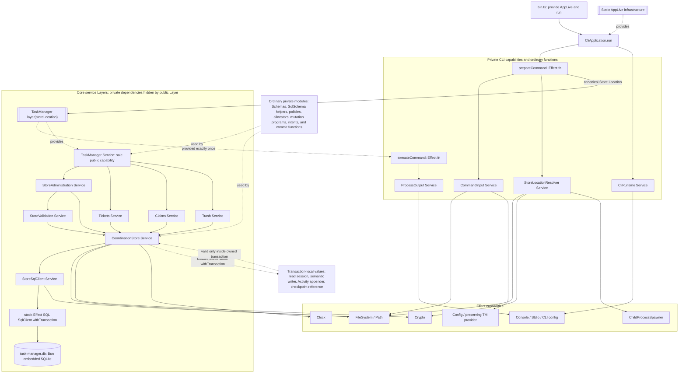
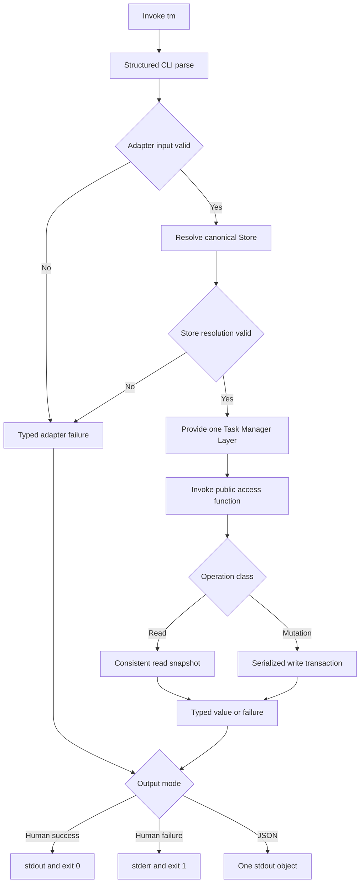
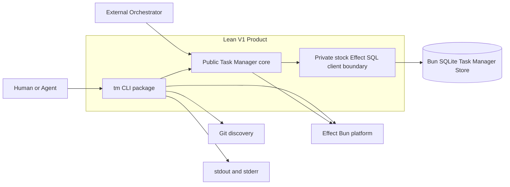
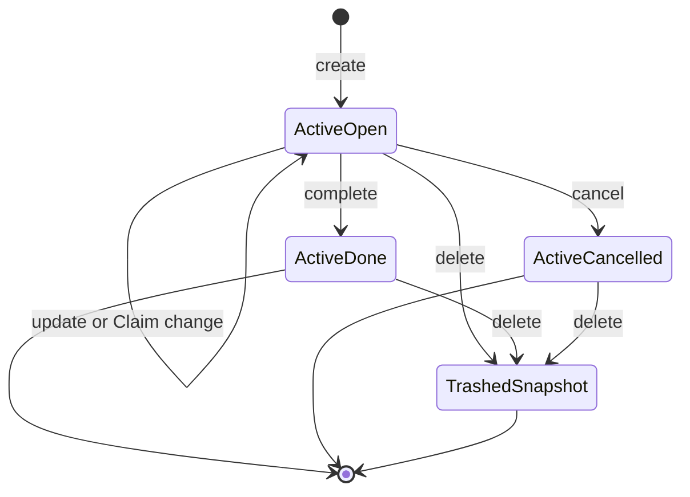
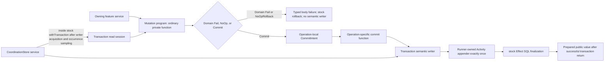
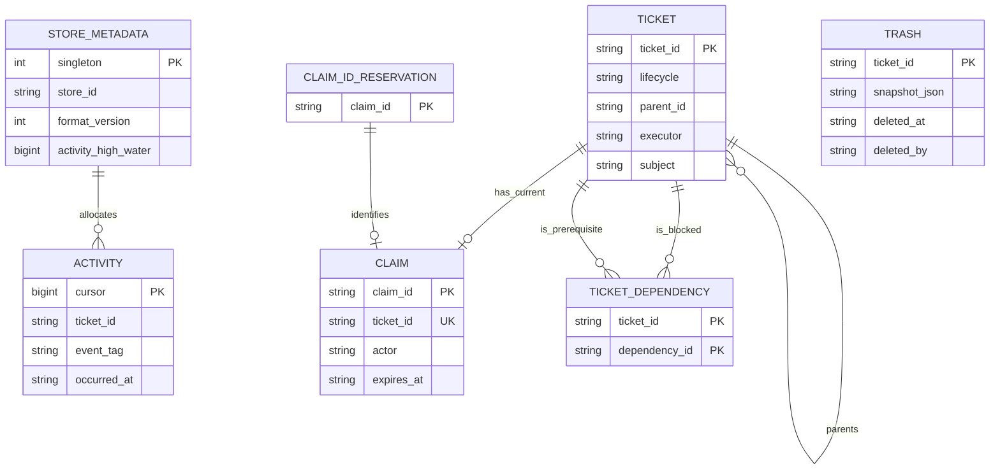
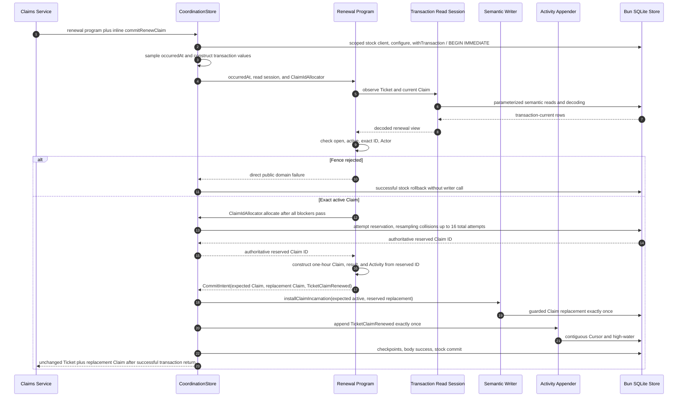
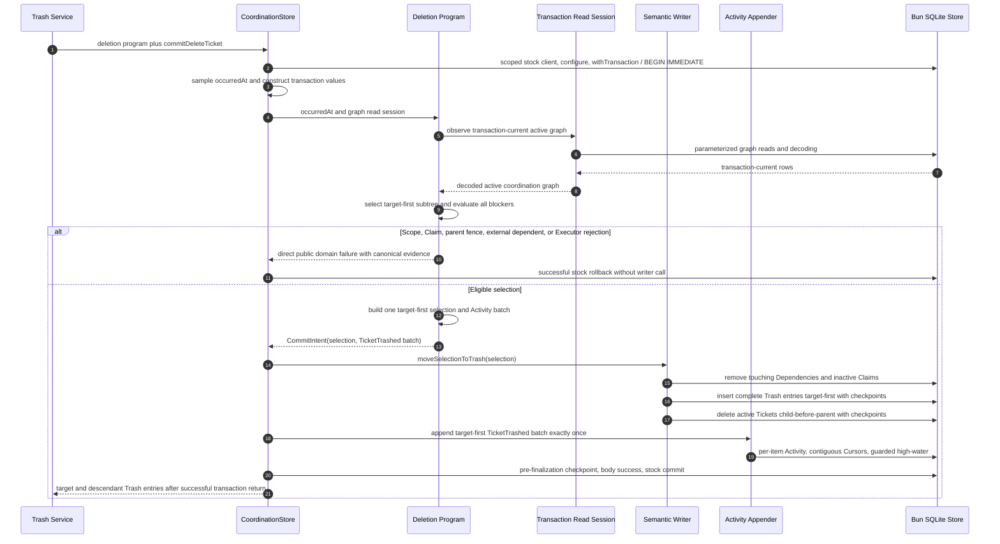

# Technical Design

## Architecture Summary

- Runtime profile: Bun-only local CLI targeting qualification on macOS arm64/APFS; no server, browser, worker, remote Store, or background process.
- Service-first rule: every coherent, reusable effectful application capability with independent runtime identity or resource ownership is an Effect `Context.Service` constructed by a Layer. This includes the public façade, four private feature capabilities, persistence, process publication, and CLI runtime arbitration. One-shot preparation/execution, native Clock/Crypto access, immutable domain values, Schemas, codec transformations, deterministic policies/comparators, operation-local intents, ordinary commit functions, and transaction-scoped values remain ordinary private functions or values rather than Layer nodes.
- Composition root: `packages/cli/src/AppLive.ts` owns static infrastructure and is the only assembly point for a private resource-free privileged-debug session factory. `packages/cli/src/bin.ts` provides that infrastructure to `CliApplication.run`, which conditionally acquires the command-scoped debug session only after parsing and activation, and passes the resulting Effect to `BunRuntime.runMain`; `bin.ts` does not own parser, product, output, or telemetry policy.
- Prepared-command composition: after the sole structured parser and ordinary `prepareCommand` resolve one canonical Store Location, `CliApplication` constructs `layer({ storeLocation })` and directly applies `Effect.provide(executeCommand(prepared), taskManagerLayer)` exactly once. `Layer.unwrap` remains an approved RC 111 tool where an Effect genuinely produces a Layer, but is not used to transport `PreparedCommand`.
- Main execution model: parse and prepare, resolve one canonical Store Location, invoke one or more public core access functions through one provided capability instance, route each operation once to its owning private feature service, execute it in one consistent read snapshot or serialized write transaction, then render the authoritative typed value or failure without rereading.
- Summary: Lean V1 uses two packages with one-way dependency `CLI -> public core`. The core's small public interface is exactly the approved 15-operation `TaskManager`; its exported parameterized Layer hides private feature, validation, coordination, and scoped SQL-client services while native Effect Clock/Crypto and a private disabled-by-default mutation-checkpoint reference provide deterministic seams. The CLI keeps services only for coherent reusable capabilities such as input, Store resolution, process output, and runtime arbitration; prepared commands and execution are ordinary values/functions. Domain policy, SQL, transaction choreography, validation evidence, and Semantic Activity remain private.

The required implementation baseline pins `effect` `4.0.0-rc.111`, `@effect/sql-sqlite-bun` `4.0.0-rc.111`, every participating Effect package in lockstep at RC 111, and Bun `1.3.13` with its embedded SQLite engine. Lean V1 adopts stock `effect/unstable/sql` `SqlClient`, stock `SqlClient.withTransaction`, statement compilation and parameter binding, private `SqlError`, and `SqlSchema` as the normative ordinary fixed-shape request/result boundary. It does not adopt `SqliteMigrator`, `SqlModel.makeRepository`, `SqlResolver`, reactive product behavior, or SQL streaming. It uses no local Effect fork, `node_modules` patch, monkey-patch, package-internal import, or underlying Bun handle access. Qualification targets Darwin 25 arm64 on a local APFS volume with one scoped stock client per ordinary Store operation, SQLite rollback-journal `DELETE` mode, safe-integer reads, a 30-second busy timeout, foreign keys enabled per connection, and full synchronous durability for writers. This is the only release-support profile unless another profile later passes the complete approved qualification suite. The suite records exact Effect and driver versions, the exact Bun version and executable digest, `sqlite_version()`, `sqlite_source_id()`, ordered compile options, patch-level OS/architecture/filesystem, configured pragmas and connection behavior, and resolved lockfile artifacts before support is advertised. (NFR2.11, DEP6.1-DEP6.4)

### High-Level Service and Layer Composition



Solid arrows mean dependency/call flow; dotted arrows show Layer provision or transaction-local construction. Only `TaskManager` is exported as a core capability; the public root also exports the approved schemas, domain values, inputs, results, failures, access functions, Layer options, and Layer constructor. Native Effect Clock and Crypto are captured by the public Layer, while the private mutation-checkpoint `Context.Reference` defaults disabled. `StoreSqlClient` constructs one fresh scoped stock client for each ordinary operation and caches none.

## System Context

- Human and agent callers invoke `tm` directly or consume the public `@urban/task-manager` core package.
- Git contributes only the canonical common-root scope used by default Store resolution; it is not a Store or workflow authority.
- The local filesystem holds one Store directory whose active database is `task-manager.db` plus engine-owned sidecars.
- The pinned Bun runtime's embedded SQLite engine supplies local storage and cross-process locking; stock Effect SQL owns client, statement, parameter-binding, connection, and transaction lifecycle; Effect also supplies Schema, capability, Layer, Clock, Crypto, platform, CLI, and test composition.
- Task Manager records coordination facts and transitions. An external Orchestrator may interpret work and Result data but receives no assignment, review, progress, retry, authentication, or workflow policy from Task Manager.
- Story or requirements traceability: US1.1-US1.14, US1.53-US1.62; FR1.1-FR1.11, FR1.37-FR1.43, FR1.67, FR1.72-FR1.79; TC3.1-TC3.10; IR5.1-IR5.8.

### Process Flowchart



Parsing, source conflicts, file loading, JSON parsing, public boundary decoding, adapter acknowledgments, and Actor-source selection precede Store access. A preview or acknowledgment pre-read is observational only; the later mutation reacquires transaction-current state and gains no reservation or precedence. (FR1.9-FR1.11, FR1.30, FR1.36, FR1.38)

### Context Flowchart



Arrows denote calls or capability dependencies, not lifecycle transitions. The CLI may import only the public root of the core package. No `SqlClient`, connection, statement, row, `SqlError`, engine detail, or other persistence type crosses the public core seam. (TC3.1-TC3.3, IR5.5)

## Components and Responsibilities

### Behavior State Diagram



`TrashedSnapshot` is a durable-location condition, not a fourth Ticket lifecycle status. A Claim is a separate record associated only with an open Ticket; acquiring, renewing, releasing, or logically expiring it does not transition the Ticket Snapshot. (FR1.20-FR1.23, FR1.25, FR1.28, FR1.31-FR1.32; DR4.4, DR4.8, DR4.13)

### Public Task Manager Module

The Public Task Manager Module is the only caller-visible core capability and hides all implementation dependencies behind the approved 15-operation interface.

- Boundary type: public `Context.Service`, exported access functions, and Store-configured Layer constructor.
- Owned capability: exact public methods, method/access-function parity, Layer construction, public schemas, canonical values, read models, operation inputs/results, and typed failures.
- Hidden depth: operation routing, persistence acquisition, transaction selection, policy evaluation, and vendor failure mapping.
- Inputs: decoded approved operation inputs and one `TaskManagerLayerOptions { storeLocation }` supplied to the exported `layer` constructor.
- Outputs: only the approved success values and closed error channels.
- Story impact: US1.1 and every story that invokes a core operation; FR1.1, FR1.44-FR1.51, FR1.66; TC3.2-TC3.3; IR5.5.

`packages/core` is named `@urban/task-manager`. Its package exports are only `.` and `./package.json`. The root exports `TaskManager`, `TaskManagerService`, `TaskManagerLayerOptions`, `layer`, the 15 access functions, `CanonicalAbsolutePath`, public schemas and canonical values, public read models, inputs/results, and typed failures. It does not export `internal/*`, SQL records, Store sessions, client factories, mutation programs, operation-local intents, commit functions, transaction writers or Activity appenders, platform handles, clocks, barriers, identity generators, fault controls, or test utilities.

The following representative shape shows the seam; the exact operation channels remain those approved in FR1.44-FR1.51 rather than a second definition here.

```ts
export type TaskManagerLayerOptions = {
  readonly storeLocation: CanonicalAbsolutePath
}

export class TaskManager extends Context.Service<
  TaskManager,
  TaskManagerService
>()("@urban/task-manager/TaskManager") {}

export const layer = ({ storeLocation }: TaskManagerLayerOptions) =>
  makeTaskManagerLayer(storeLocation)

export const createTicket = Effect.fn("TaskManager.createTicket")(
  function* (input: CreateTicketInput) {
    const service = yield* TaskManager
    return yield* service.createTicket(input)
  }
)
```

The service method has the same success and error channels as the access function but no `TaskManager` requirement. Every reusable operation implementation uses `Effect.fn`; public access functions use stable names such as `TaskManager.createTicket`, while private helpers use named or intentionally untraced `Effect.fnUntraced` boundaries without duplicating public spans. The access function never provides the live Layer. `layer({ storeLocation })` captures no cwd, environment, Git, or implicit Store setting and hides all private dependencies with `Layer.provide`, not `Layer.provideMerge`.

### Domain Contract Module

The Domain Contract Module owns canonical values, closed schemas, pure normalization, deterministic comparison, and illegal-state exclusion shared by operations and boundaries.

- Boundary type: pure Schema-backed module family.
- Owned capability: Store metadata, Ticket Snapshot variants, Claim, Result, Trash, Semantic Activity, Claim Consumption, read models, operation models, error parents/reasons, public validation evidence, and canonical ordering.
- Hidden depth: text normalization, UTF-8/code-point bounds, exact timestamp parsing, optional omission, structural paths, diagnostics, Schema-owned JSON codecs, and stack-safe canonical JSON encoding.
- Inputs: unknown boundary values or already decoded domain values.
- Outputs: canonical domain values or structural decoding issues.
- Story impact: US1.15-US1.59; DR4.1-DR4.35; TC3.8.

All closed struct boundaries decode through shared pinned Effect Schema parse options with `onExcessProperty: "error"`, `reportInput: false`, and, where aggregate structural evidence is required, `errors: "all"`. Omit-only fields use `Schema.optionalKey`, not `Schema.optional`, so a present `undefined` is rejected; `null` is rejected unless the boundary's encoded schema explicitly accepts and normalizes it. Public expected failures use the pinned `Schema.TaggedError` constructor so they are both yieldable typed errors and Schema values. Plain serializable tagged values use `Schema.TaggedStruct` and `Schema.TaggedUnion` rather than error classes.

Unknown CLI values, public runtime inputs, and Effect SQL result-row objects cross module-scope parsers compiled once with pinned `Schema.decodeUnknown*`; malformed persisted values are never copied into Schema issues because `reportInput` remains false. Already-canonical domain values cross typed encoders compiled from the same codecs with `Schema.encode*`, never `Schema.encodeUnknown*`. Hot-path row parsers, JSON codecs, and typed encoders are constructed once per module and reused rather than rebuilt per record or render.

`CanonicalJson` is a specialized submodule behind Schema codecs. `DuplicateAwareJsonText` is a bidirectional Schema transformation whose `Encoded` side is JSON text and whose `Type` is `Schema.Json`: decoding uses an iterative tokenizer/parser with an explicit container stack so duplicate object members and arbitrary accepted depth are observable, then decodes the produced unknown graph exclusively through pinned `Schema.Json`; encoding uses the same iterative canonical JSON encoder used for persistence and output. Direct core values decode exclusively through pinned `Schema.Json`, whose exact `4.0.0-rc.111` implementation already uses an explicit stack and cycle cache to reject cycles, sparse arrays, unsupported leaves, non-plain objects, and non-finite numbers. No project-owned graph validator duplicates that work. The project-owned encoder handles only approved key ordering, deterministic compact JSON text, UTF-8 measurement, and the inclusive Result bound without native recursive traversal. No native `JSON.parse`, recursive project validator, or recursive `JSON.stringify` is the qualification path for Result data. (FR1.27, NFR2.6)

### Private Feature Services

The public `TaskManager` is implemented by four package-private `Context.Service` capabilities: `StoreAdministration`, `Tickets`, `Claims`, and `Trash`. Each owns complete caller-meaningful use cases from canonical input through transaction-current observation and policy to the approved result or typed error. They own features rather than tables. `CoordinationStore` remains the only transaction owner, and transaction-local implementation values never become additional services.

- Boundary type: four core-internal `Context.Service` tags with Layer constructors; none is exported.
- Owned capability: exact allocation of all 15 public operations, transaction-current semantic view selection, exact rejection and no-op precedence, pure Claim/hierarchy/Dependency policy, deterministic graph traversal and canonical evidence, operation-local immutable intent construction, Activity event semantics and target-first order, public result/error construction, and operation-specific semantic persistence choreography.
- Forbidden ownership: SQL, rows, native handles, connection lifecycle, commit, rollback, Activity Cursor allocation, metadata high-water, or transaction retry.
- Inputs: the applicable private services captured by each feature Layer, canonical operation input, pure policies, and ordinary transaction-scoped values supplied only while `CoordinationStore` owns the transaction.
- Outputs: exact approved public `Effect` channels; mutation programs fail directly with operation-specific public domain errors or decide once between `NoOp` and `Commit` with an immutable operation-local `CommitIntent`.
- Story impact: US1.4-US1.11, US1.18-US1.56; FR1.4-FR1.8, FR1.13-FR1.39; NFR2.14-NFR2.19.

The exported `layer({ storeLocation })` remains the public recomposition boundary. It creates each private infrastructure Layer once, supplies shared values to the four feature Layers, then supplies only those four feature services to the `TaskManager` implementation Layer. `Layer.provide` hides every private output. Neither operation commit functions nor transaction read/write values are Layer nodes, and no caller can provide, replace, or invoke them through package exports.

```ts
const featureLayers = Layer.mergeAll(
  StoreAdministration.layerNoDeps,
  Tickets.layerNoDeps,
  Claims.layerNoDeps,
  Trash.layerNoDeps
).pipe(Layer.provide(coreInfrastructureLayers))

const taskManagerLayerNoDeps = Layer.effect(
  TaskManager,
  Effect.gen(function* () {
    const storeAdministration = yield* StoreAdministration
    const tickets = yield* Tickets
    const claims = yield* Claims
    const trash = yield* Trash

    return TaskManager.of({
      initializeStore: storeAdministration.initializeStore,
      validateStore: storeAdministration.validateStore,
      createTicket: tickets.createTicket,
      updateTicket: tickets.updateTicket,
      getTicketDetails: tickets.getTicketDetails,
      listTickets: tickets.listTickets,
      selectNextTicket: tickets.selectNextTicket,
      claimTicket: claims.claimTicket,
      renewClaim: claims.renewClaim,
      releaseClaim: claims.releaseClaim,
      completeTicket: tickets.completeTicket,
      cancelTicket: tickets.cancelTicket,
      deleteTicket: trash.deleteTicket,
      addTicketDependency: tickets.addTicketDependency,
      removeTicketDependency: tickets.removeTicketDependency
    })
  })
)

const taskManagerLayer = taskManagerLayerNoDeps.pipe(
  Layer.provide(featureLayers)
)
```

The names are representative, but the ownership rule is normative: services exist for coherent reusable capabilities with runtime identity or resource ownership, not for each operation, table, callback, or transaction-local value.

#### Store Administration Service

`StoreAdministration` owns `initializeStore` and `validateStore`. Its Layer captures the shared `CoordinationStore`, `StoreValidation`, and native `Crypto.Crypto` capabilities once. `StoreAdministration` owns operation orchestration and projection to the approved initialization and validation values or failures; `CoordinationStore` owns native resources and sessions; `StoreValidation` owns malformed-storage inspection and issue derivation. Fresh publication remains a `StoreAdministration` use case executed through the Store's initialization runner.

#### Tickets Service

`Tickets` owns `createTicket`, `updateTicket`, `getTicketDetails`, `listTickets`, `selectNextTicket`, `completeTicket`, `cancelTicket`, `addTicketDependency`, and `removeTicketDependency`. It owns Snapshot authoring and lifecycle, hierarchy, Dependency relationships and cycle evidence, read projections, readiness, blockers, cancellation selection, no-op placement, Executor scopes, immutable operation intents, Activity semantics, and the ordinary commit functions for those mutations.

Completion remains a Tickets use case even though its commit function removes one exact Claim before installing the done Snapshot. Cancellation likewise may remove a permitted target Claim as part of `TicketCancelled`; neither calls `Claims.releaseClaim`. Dependency mutation remains in Tickets because it determines readiness and completion behavior, but SQL relationship storage remains hidden by the transaction writer.

#### Claims Service

`Claims` owns `claimTicket`, `renewClaim`, and `releaseClaim`. It owns acquisition-only behavior, logical expiry, exact Claim-ID/Actor precedence, replacement Claim construction, Claim-specific no-op placement, immutable Claim intents, Claim Activity semantics, public results/errors, and the ordinary commit functions that invoke the semantic Claim writer.

Permanent Claim-ID reservation remains a persistence invariant hidden behind one transaction-local `ClaimIdAllocator`. After every public rejection and no-op check has passed, the Claims mutation program invokes that allocator once; the allocator performs the complete bounded collision loop and returns the authoritative reserved ID before the feature constructs the replacement Claim, public result, and Activity intent. `installClaimIncarnation` then requires that reservation and installs the exact Claim. Completion, cancellation, and Trash may remove exact Claim facts as part of their own feature-owned choreography without invoking the Claims service.

Neutral package-private policy modules own `RequireUnclaimed | MatchClaim`, effective-Claim presence, Claim-ID and Actor precedence, hierarchy rules, and Dependency graph rules shared across features. They consume canonical facts or semantic views, sample no time, perform no Store access, and return deterministic decisions or evidence.

#### Trash Service

`Trash` owns `deleteTicket`. It owns transaction-current subtree selection, all domain blockers, one canonical target-first semantic selection, exact persisted inactive-Claim and touching-Dependency evidence, complete Trash entry construction, target-first Activity semantics, and the approved result/rejections. It does not choose physical deletion order independently; `moveSelectionToTrash` derives child-before-parent deletion from the one canonical selection.

`Trash` is a deep one-method service because deleting it would spread hierarchy, Claim fences, external-dependent checks, Executor scope, permanent Snapshot preservation, and blocker evidence. CLI preview and confirmation remain adapter behavior and do not become a Trash feature operation.

#### Cross-Feature Policy and Transaction Rule

Feature-service methods never invoke another feature service's top-level operation from inside an operation. Such calls would create nested observations, independent transactions, or partial-commit risk. Shared cross-feature rules remain neutral pure modules and canonical semantic views.

Every feature mutation is one ordinary private mutation program submitted to `CoordinationStore`. `StoreSqlClient` first constructs one scoped create-disabled writable stock client and `CoordinationStore` configures and verifies it. The Store then enters stock `SqlClient.withTransaction`; RC 111's Bun driver acquires the writable transaction with `BEGIN IMMEDIATE`. Inside that transaction the Store samples the one occurrence instant and constructs transaction-scoped read and write values. Only then does the owning feature select the required transaction-current view and decide once. A public domain rejection fails the transaction body directly, while only approved no-op success uses private `NoOpRollback { value }`; stock Effect SQL rolls both paths back. Only an effective decision constructs an immutable intent and reaches its ordinary operation-specific commit function. `CoordinationStore` runs that function through the semantic writer and invokes the shared Activity appender exactly once, while stock Effect SQL alone commits or rolls back.



The diagram deliberately distinguishes service identities from ordinary transaction-local values. A mutation program, intent, commit function, read session, semantic writer, and Activity appender are not `Context.Service`s, Layer-provided dependencies, package exports, or valid public test seams. Point operations may load targeted semantic views; graph operations may load one decoded active coordination graph. Canonical graph traversal remains iterative, and SQL ordering never selects public witnesses.

### Coordination Store Service

`CoordinationStore` is the private persistence service that owns the complete transaction around one feature mutation program and exposes only transaction-scoped semantic values to that program.

- Boundary type: private `Context.Service`-backed adapter with read, mutation, initialization, and raw-validation program runners.
- Owned capability: stock `SqlClient.withTransaction`; one occurrence instant; transaction read-session, semantic-writer, and Activity-appender construction; SQL and persistence codecs; affected-row assertions; real production fault checkpoints; Activity Cursor allocation and high-water; private transaction-body phase evidence; targeted transaction/client-finalization conversion; and release of the prepared public value only after stock transaction success plus normal isolated outer client close.
- Hidden depth: `SqlClient`, statements, compiled SQL, bound parameters, Effect SQL result rows and `SqlError`, Bun SQLite, pragmas, rollback journals, physical statement order, codecs, and affected-row checks.
- Inputs: canonical Store Location plus one owning feature's private mutation program and ordinary operation-specific commit function. An intent is never constructed outside the transaction and then handed to the Store.
- Outputs: decoded semantic observations, confirmed public values, typed feature rejections/no-ops after successful rollback, or mapped Store failures.
- Story impact: US1.4-US1.11, US1.53-US1.56, US1.61; FR1.4-FR1.8, FR1.37-FR1.39, FR1.67; NFR2.1-NFR2.5; TC3.5-TC3.7.

The public Task Manager Layer and the private `CoordinationStore` Layer are cheap and perform no database open. `StoreSqlClient` is a package-private capability that captures the canonical database path and owns `SqliteClient.make`, the exact read/write configuration, the narrow construction-defect classifier, private `Reactivity` provision, and the complete client scope. Each ordinary Store operation asks it to run one program with one fresh scoped stock client; no `SqlClient` or connection is cached, globally exposed, or allowed to escape. Initialization is the deliberate exception: it may run one scoped construction client followed by one independent scoped read-only verification client.

Every actual SQL open passes `create: false`. Writable clients also pass `readonly: false`, `readwrite: true`, `disableWAL: true`, and `busyTimeout: 30 seconds`; read clients pass `readonly: true` and the same timeout. The Store provides `SqlClient.SafeIntegers` as `true`, configures and verifies connection-local pragmas before entering `withTransaction`, and relies exclusively on Effect SQL statement compilation and parameter binding. It does not add a parallel Bun strict-binding layer. Because RC 111 `SqliteClient.make` synchronously constructs Bun `Database` inside an Effect whose declared error channel is `never`, `StoreSqlClient` permits one narrow construction recovery boundary: a recognized Bun SQLite construction defect plus positively established path absence maps to `StoreNotInitialized`; a recognized construction defect with an existing or ambiguous path maps to `StoreOpenFailed`; an unrelated construction defect remains a defect. An existence precheck never authorizes creation and never replaces post-defect path classification.

`CoordinationStore` alone invokes stock `SqlClient.withTransaction`. RC 111's Bun driver supplies `BEGIN IMMEDIATE`; stock `withTransaction` routes statements through the transaction connection and owns begin, commit, rollback, interruption masking, and its acquired transaction-connection scope. The separately acquired outer `SqliteClient.make` scope is not part of `withTransaction`. Transaction bodies never call `orDie` on `SqlError`. Because stock begin runs before the body exit handler, a typed `BEGIN IMMEDIATE` failure proves body invocation count zero and non-commit and maps directly to `StoreTransactionFailed`; a typed private persistence failure returned after successful stock rollback also maps there. Successful-body commit `Die(SqlError)`, plus only the positively phase-evidenced composite of a recognized public expected `Schema.TaggedError` body `Fail` or `NoOpRollback` body `Fail` with rollback `Die(SqlError)`, map to `StoreTransactionOutcomeUnknown`. Private persistence Fail plus rollback defect, original defects, interruption, reordered/extra-reason look-alikes, and unrelated composites remain unchanged; phase is never inferred from tags alone.

Transaction-current public domain errors fail the body directly; there is no decision variant or private wrapper for them. `Unchanged`, `AlreadyInactive`, `AlreadyBlocked`, and `AlreadyUnblocked` alone fail with `NoOpRollback { value }`. Stock `withTransaction` rolls back and returns the original domain error or sentinel only after rollback succeeds. No-op paths occur before any semantic writer or Activity appender call. Rollback finalization failure supersedes the body outcome as transaction uncertainty. Only `Commit` executes the semantic writer and Activity appender. After `withTransaction` succeeds, no application work follows in the isolated mutation-client scope; normal close releases the prepared value, while a positively identified pure outer close defect maps to `StoreMutationCommittedButFinalizationFailed`. The committed state is authoritative and is never replayed automatically.

`SqlError`, Bun errors, statements, rows, and transaction implementation details never cross `CoordinationStore`. The Store ignores `SqlError.isRetryable`: known non-commit permits deliberate retry only after correcting the cause, unknown outcome requires reread and reconciliation, and neither transaction nor domain decisions are automatically retried. The 30-second SQLite busy wait is connection waiting, not a retry, and cannot replay the transaction body.

### Store Validation Service

`StoreValidation` is a private `Context.Service` required by `StoreAdministration`. Its Layer requires the shared `CoordinationStore` and captures the Store's raw validation-session capability. It safely inspects malformed storage through ordered gates without weakening ordinary operation decoders. `StoreAdministration` alone maps its result to the public `validateStore` channel.

- Boundary type: private `Context.Service` with a Layer-backed raw read-only inspector and public-evidence projector.
- Owned capability: absence/open/query separation, database/application/format/structure gates, engine and foreign-key checks, record decoding, cross-record integrity, deterministic locators, canonical issue ordering, and validation counts.
- Hidden depth: schema manifest inspection, raw row isolation, safe identity extraction, malformed-record sorting, foreign-key projection, Activity/Trash matching, and cycle-component analysis.
- Inputs: one read transaction and raw engine observations.
- Outputs: the approved `ValidateStoreReport`, validation rejection, or validation read error.
- Story impact: US1.6-US1.11; FR1.6-FR1.8, FR1.65, FR1.68, FR1.71; NFR2.19; DR4.18-DR4.19, DR4.22, DR4.30-DR4.35.

The gate pipeline is an explicit state machine. Aggregate checks begin only after safe structure and metadata inspection. Each collection is projected to public-safe diagnostic facts, sorted only by those facts, and then assigned positive ordinals. Equal public projections remain equal duplicates; neither row ID, physical order, SQL text, hash order, nor unsafe raw value breaks the tie. Only completely decoded records enter semantic reference graphs. Engine and foreign-key observations are projected to their closed public shapes before sorting. The Domain Contract Module owns the `BoundedDiagnostic` schema and pure normalization; persistence and runtime adapters own projection of vendor/platform causes into that contract.

### CLI Preparation Capabilities

`CommandInput` and `StoreLocationResolver` remain private services because they own reusable input/filesystem and Store-resolution behavior. One-shot preparation is ordinary named `Effect.fn("prepareCommand")`; it combines their observations into an immutable `PreparedCommand` plus canonical Store Location before core construction. One-shot execution is ordinary named `Effect.fn("executeCommand")`.

- Boundary type: private `CommandInput` and `StoreLocationResolver` `Context.Service` capabilities plus ordinary `PreparedCommand` and functions.
- Owned capability: structured parse-error projection, occurrence bounds, source conflicts, lazy cwd/Store/Actor precedence, canonicalization, Git common-root scope, project-key hashing, strict UTF-8 files, and adapter-only acknowledgments.
- Hidden depth: preserving Effect Config acquisition, deepest-existing-ancestor realpath handling, bounded Git process capture, SHA-256 project keys, file/source attribution, and first-failure selection.
- Inputs: structured parser values, independent `TM_CWD`, `TM_STORAGE_PATH`, and `TM_ACTOR` descriptors, process cwd, home, Git, and files.
- Outputs: one prepared command ready for exactly one Task Manager provision, or a typed adapter failure.
- Story impact: US1.2-US1.3, US1.12-US1.14, US1.22, US1.40, US1.44, US1.59; FR1.2-FR1.3, FR1.9-FR1.11, FR1.30, FR1.36; TC3.3-TC3.4; IR5.1-IR5.4.

The command tree is `init`, `validate`, `create`, `update`, `show`, `list`, `next`, `claim`, `renew`, `release`, `complete`, `cancel`, `delete`, `block`, and `unblock`. Executor changes are `update --executor`; no separate core or CLI operation exists. Production uses `Command.run` as the sole argv ingress; `Command.runWith` is reserved for tests. Only `effect/unstable/cli` parses syntax, produces help/version/completion, and reports structured parser facts. The adapter never reparses argv or parser prose.

`TM_CWD`, `TM_STORAGE_PATH`, `TM_ACTOR`, and CLI-private `TM_DEBUG` each have an independent lazy Config descriptor. A private `ConfigProvider.fromEnv({ preserveEmptyStrings: true })` acquires only those descriptors and does not replace the ambient provider used by OTEL configuration. `CommandInput` evaluates a descriptor only when higher-precedence syntax did not select the value; it never uses `Config.all`. Selected empty strings are explicitly supplied invalid environment values and decode as `InputRejected { source: environment }`, not absence/fallback. `CommandInput`, not Config, owns source attribution, normalization, precedence, and public error mapping.

`StoreLocationResolver` performs Git discovery with one `ChildProcess.make` after cwd resolution and scoped `ChildProcessSpawner.spawn`. It captures bounded raw stdout and stderr byte streams, strictly decodes them, and distinguishes only documented Git not-a-repository from operational failure; direct Bun/Node child-process APIs and message parsing are forbidden. The same unstable process services own all real CLI/process fixtures. Fixture handles are scoped, byte capture is bounded, exit is awaited, and cleanup escalates through the bounded harness protocol. RC 111 exposes no observed termination-signal identity, so evidence records only a harness-requested signal and never infers one from `PlatformError` prose.

For a selected command, `prepareCommand(parsedCommand)` completes source validation and Store resolution. `CliApplication` constructs the exported Task Manager `layer({ storeLocation: prepared.storeLocation })` once, then applies `Effect.provide(executeCommand(prepared), taskManagerLayer)` exactly once; multi-call flows share that provision. `Layer.unwrap` is not used to transport `PreparedCommand`, and no one-shot service or hidden mutable cell substitutes for the value. Help, version, completion, and parse-failure paths never construct the Store-specific Layer.

`AppLive` provides `CliConfig.layer({ builtIns: [GlobalFlag.Help, GlobalFlag.Version, GlobalFlag.Completions] })` and `CliOutput.layer(CliOutput.defaultFormatter({ colors: false }))` while constructing the CLI service Layers. `GlobalFlag.Wizard` and `GlobalFlag.LogLevel` are deliberately absent because they are not part of the closed Lean V1 grammar. The declaration order above is the action precedence. Architecture tests inspect the installed built-ins so a future Effect default cannot silently expand the command surface.

The pinned `Command.run` renders help before re-failing every `CliError.ShowHelp`, including parse failures, even when `renderErrors: false`. To preserve Effect CLI parsing without leaking that help into product error output, a private testable `cliRuntime.ts` invokes `Command.run(commandTree, { version, renderErrors: false })` with a runner-scoped `Console.Console` derived from the live service. Its overridden `log` and `error` methods write no process bytes, accept exactly one formatted string for supported framework actions, append one literal LF in the staging implementation, encode the result as UTF-8, and capture it in a per-invocation `MutableRef`. Any other staged Console call shape is a defect; no claim is made about newline behavior of the default Console implementation.

Selected command handlers do not write process streams. On success they complete one private `Deferred<ProcessOutput>` command-result cell, inspect the boolean returned by `Deferred.succeed`, and defect when it is `false`. After `Command.run` settles, the outer runner uses `Deferred.poll`; it never directly awaits an empty cell. The runner then follows exactly one path:

1. a selected handler result is supplied as a one-element Stream to the chosen live Effect `Stdio` Sink;
2. successful help, version, or completion with no handler result supplies the staged framework bytes once to the chosen live Stdio Sink;
3. a `ShowHelp` with structured parse errors discards all staged help, projects the pinned `CliError` facts, and writes only the Task Manager error output; or
4. another typed adapter/core failure discards staged framework output and writes only its exhaustive Task Manager projection.

Each non-empty destination is run at most once, and an empty destination is skipped. A Stdio Sink `PlatformError` is converted to a defect only at this process boundary. An empty-error `ShowHelp` is treated as framework help and exits successfully; a non-empty error collection is a parse failure. Simultaneous framework and handler output is a defect. `CliRuntime` uses only public Effect services and CLI error values; it imports no Effect CLI internals and does not infer behavior from rendered text. `packages/cli/src/bin.ts` remains a minimal executable edge: it provides the already composed `AppLive` Layer to `CliApplication.run` and invokes `BunRuntime.runMain`; staging, arbitration, rendering selection, expected-exit construction, and platform/CLI Layer wiring remain in private testable services and `AppLive.ts`.

Deletion preview uses exactly one public `listTickets` call with the explicit target as root and all statuses/Executors selected; that one read snapshot returns the target and complete observed descendant tree needed for neutral preview summaries and required flags. It remains nonbinding and does not combine `getTicketDetails` with a second observation. Human completion has one mandatory adapter pre-read: after syntax, source, file, JSON, identity, Actor, and complete Result decoding, the already provided capability calls `getTicketDetails(ticketId)` exactly once. Only an open human-executor target without `--allow-human` fails `HumanCompletionConfirmationRequired { ticketId }` and renders `Error: Completing human-executor Ticket <ticket-id> requires --allow-human.`; a terminal target proceeds to `completeTicket` so core lifecycle remains authoritative. When acknowledgment is present or unnecessary, the adapter calls `completeTicket` exactly once with the same Claim ID; completion rechecks Store, lifecycle, Claim incarnation, Actor, descendants, and dependencies transaction-current. Invalid Result therefore precedes missing Store, while missing human acknowledgment for an observed open human target precedes a stale Claim. Optional Claim flags map directly to semantic fence unions without Claim pre-reads. Purpose-specific acknowledgments map to exact semantic scope unions, never a generic force boolean.

### CLI Rendering and Runtime Services

Pure human/JSON formatting remains an ordinary exhaustive projection from typed outcomes to exact bytes. Effectful publication and arbitration remain services: `ProcessOutput` owns the single-assignment command-result cell and live Stdio Sink publication; `CliRuntime` owns staged Effect Console behavior, framework/product arbitration, and expected process exit. Ordinary `executeCommand(prepared)` invokes the provided `TaskManager` and passes its authoritative typed outcome to the pure renderer and `ProcessOutput`.

- Boundary type: private `ProcessOutput` and `CliRuntime` `Context.Service` capabilities plus ordinary `executeCommand` and pure renderer functions.
- Owned capability: command-to-core routing, human templates, tree/detail grammar, command JSON envelopes, compact canonical JSON bytes, stdout/stderr selection, one newline, framework-output staging, and exit status.
- Hidden depth: complete-Subject rendering, typed collection formatting, connector state, typed Schema-JSON codec selection, parser/domain error dispatch, and staged-output selection.
- Inputs: authoritative typed adapter/core value or error, staged framework bytes, and selected output mode.
- Outputs: `ProcessOutput { stdoutBytes, stderrBytes, exitCode: 0 | 1 }` published exactly once through live Effect `Stdio` Sinks, followed by ordinary success for exit 0 or a private expected-exit failure for exit 1.
- Story impact: US1.23-US1.26, US1.57-US1.58; FR1.5-FR1.6, FR1.12, FR1.40-FR1.41, FR1.52-FR1.71.

Renderers never access Task Manager, Store Location, filesystem state, or persistence. Every public success and expected-failure JSON representation is a named Schema codec: each applicable `Schema.TaggedStruct` or `Schema.TaggedError` member applies `Schema.encodeKeys({ _tag: "type" })` before union composition, and `Schema.toCodecJson` derives the complete nested `Schema.Json` representation. Exact `4.0.0-rc.111` source and executable API evidence verifies that the same composition encodes and decodes `Schema.TaggedError` instances structurally; no declaration relies on the permissive fallback for an opaque value. Module-scope typed encoders accept canonical domain values and produce `Schema.Json`; the renderer only chooses the command envelope, encodes it through its Schema codec, and feeds that JSON value to the iterative canonical byte encoder. It performs no recursive `_tag` walk, key renaming, or parallel DTO mapping.

Framework formatting remains owned by Effect CLI, while the runner controls final stream publication. After rendering and publishing an expected failure, the CLI fails with a private `Data.TaggedError` carrying `[Runtime.errorExitCode] = 1` and `[Runtime.errorReported] = false`. `BunRuntime.runMain` uses `Runtime.defaultTeardown`, which therefore selects status 1 without duplicate reporting. Success remains ordinary Effect success and exits 0. No product code mutates `process.exitCode`, and unexpected defects, sink failures, and interruption remain failed exits with Bun Runtime's ordinary reporting and signal behavior.

### Private Deterministic Controls

Private deterministic controls schedule or fail real production logic for evidence without becoming public product capabilities.

- Boundary type: native Effect Clock and Crypto capabilities, ordinary private allocation/hash helpers, and one private mutation-checkpoint `Context.Reference` whose default is disabled.
- Owned capability: one sampled occurrence instant, secure production entropy, deterministic test provision, writer barriers/body checkpoints, and test-only public-`SqlClient` decoration for finalization evidence.
- Hidden depth: rejection sampling, collision/exhaustion handling, deterministic schedules, body-failure latches, and exact Cause classification.
- Inputs: native live Clock/Crypto or package-private `TestClock`/`Crypto.make` provision plus test schedules.
- Outputs: canonical time/IDs, suspension, or injected persistence failure at a real production checkpoint.
- Story impact: US1.53-US1.56, US1.61; TC3.7; NFR2.3, NFR2.9-NFR2.10, NFR2.14-NFR2.19.

`CoordinationStore` samples `DateTime.now` exactly once after snapshot pinning for reads or writer acquisition for mutations. Claim expiry is computed with `DateTime.addDuration(occurredAt, Duration.hours(1))`; tests provide `TestClock`. The exported core Layer captures native `Crypto.Crypto`; ordinary helpers use `crypto.randomUUIDv4`, `crypto.randomBytes(size)`, and `crypto.digest("SHA-256", bytes)`. Tests provide deterministic `Crypto.make`. Ticket IDs retain secure rejection sampling over `36^6`, transaction-current active/Trash collision checks, full-space exhaustion proof, and deterministic cyclic fallback. Claim allocation samples and attempts permanent UUIDv4 reservation inside the writer transaction; a reservation collision resamples, with exactly 16 total attempts. Exhausting all 16 attempts is an implementation/entropy defect rather than a Store failure or public expected failure. Tests deterministically prove a collision followed by success and bounded 16-collision exhaustion. No project Clock or identity service exists.

Mutation checkpoints remain indispensable because they pause/fail exact production writer positions. A private `Context.Reference` supplies the disabled default without a required live Layer; package-private tests locally set a protocol before building the same public graph. Feature methods receive the one sampled instant and cannot sample again or invoke checkpoints outside the transaction. Test-only transaction/client-finalizer decorators wrap public Effect contracts below `CoordinationStore`, delegate to the real stock work, manufacture no domain outcome, and never retry.

One invocation of `layer({ storeLocation })` creates the private Layers once. Layer memoization shares `CoordinationStore`, `StoreValidation`, and `StoreSqlClient`; FileSystem, Path, Clock, Crypto, Reactivity, and the disabled checkpoint reference are provided and captured consistently inside the graph. Sharing is scoped, not a process-global client cache. The graph does not use `Layer.fresh`, reconstruct an equivalent Store Layer per feature, or cache a `SqlClient`; every ordinary operation constructs a fresh scoped client. The public constructor is exactly `layer(options: TaskManagerLayerOptions): Layer.Layer<TaskManager>` and leaves no implementation requirement for callers. Package-private test composition may substitute `TestClock`, deterministic `Crypto.make`, and the checkpoint protocol before dependent private Layers are built, but no test constructor or control is exported from the public package root.

## Data Model and Data Flow

- Entities: singleton Store metadata; active Ticket Snapshot facts; normalized Dependency edges; separate current Claim; permanent Claim-ID reservation; Trash entry with complete final Snapshot; ordered Semantic Activity.
- Flow: CLI/core Schemas decode external input; the public façade delegates once to the owning feature service; `StoreSqlClient` constructs one scoped stock client; `CoordinationStore` enters stock `withTransaction`, obtains the serialized writer position, and samples the occurrence instant; the feature observes transaction-current semantic facts and constructs one operation-local immutable intent; an ordinary commit function executes that intent through a constrained semantic writer; the runner appends Activity once and stock Effect SQL commits all material and high-water effects together.
- Observation support: effective Claims and progressed-descendant state are derived at one observation instant; details, lists, selection, preview, blockers, and validation are assembled inside one snapshot and returned complete to the caller.

The Hybrid uses a generic decision shape and common commit envelope, but it has no universal operation union or dispatcher:

```ts
type MutationDecision<A, Intent> =
  | {
      readonly _tag: "NoOp"
      readonly value: A
    }
  | {
      readonly _tag: "Commit"
      readonly value: A
      readonly intent: Intent
    }

type ActivityEventIntent = {
  readonly ticketId: TicketId
  readonly event: SemanticActivityEvent
}

type ActivityBatchIntent = {
  readonly actor: ActorIdentity
  readonly items: NonEmptyReadonlyArray<ActivityEventIntent>
}

type CommitIntent<Mutation> = {
  readonly mutation: Mutation
  readonly activity: ActivityBatchIntent
}
```

A mutation program fails directly with `E` for an operation-specific public domain rejection. It returns `NoOp` only for the four approved successful no-op cases and `Commit` only for an effective mutation; no private domain-error wrapper exists.

`ActivityBatchIntent.items` is target-first for every multi-Ticket operation. It contains Actor Identity, Ticket ID, and semantic event only. Neither an Activity Cursor nor an occurrence instant may appear in it. The runner supplies its already sampled occurrence instant to the Activity appender and allocates Cursors inside persistence.

A mutation program is an ordinary private function owned by one feature. It closes over the decoded operation input and feature dependencies, but receives transaction-local values only inside stock `withTransaction` after writable transaction acquisition and occurrence sampling. The operation commit function is another ordinary private function. It accepts only the mutation body and semantic writer, performs no reads, and cannot append Activity or commit:

```ts
type ClaimIdAllocator = {
  readonly allocate: () => Effect.Effect<
    ClaimId,
    PersistenceAssertionFailure
  >
}

type MutationContext = {
  readonly occurredAt: DateTime.Utc
  readonly read: TransactionReadSession
  readonly claimIds: ClaimIdAllocator
}

type MutationProgram<A, E, Mutation> = (
  context: MutationContext
) => Effect.Effect<
  MutationDecision<A, CommitIntent<Mutation>>,
  E | InternalDecisionFailure
>

type OperationCommit<Mutation> = (
  mutation: Mutation,
  writer: SemanticWriter
) => Effect.Effect<void, PersistenceAssertionFailure>

type RunMutation = <A, E, Mutation>(
  program: MutationProgram<A, E, Mutation>,
  commit: OperationCommit<Mutation>
) => Effect.Effect<A, E | StoreMutationError>
```

A simple operation such as `renewClaim` may define its commit function inline. No pass-through file, `Context.Service`, Layer, runtime identity, or operation registry is required. A commit function never re-reads Store state, reconsiders the feature decision, chooses a public domain error, samples Clock, allocates Activity, accesses SQL/rows/native connections, commits, rolls back, or retries.

Transaction read sessions, write sessions, semantic writers, and Activity appenders are ordinary private values created inside the Store-owned transaction. They have no `Scope` outside it, are not package exports, and are not valid public test seams:

```ts
type TransactionReadSession = {
  readonly observeTicketMutationView: (
    ticketId: TicketId
  ) => Effect.Effect<TicketMutationView, PersistenceReadFailure>
  readonly observeDependencyMutationView: (
    ticketId: TicketId,
    dependencyId: TicketId
  ) => Effect.Effect<DependencyMutationView, PersistenceReadFailure>
  readonly observeActiveCoordinationGraph: () => Effect.Effect<
    ActiveCoordinationGraph,
    PersistenceReadFailure
  >
  readonly isTicketIdReserved: (
    ticketId: TicketId
  ) => Effect.Effect<boolean, PersistenceReadFailure>
}

type TransactionWriteSession = {
  readonly claimIdAllocator: ClaimIdAllocator
  readonly semanticWriter: SemanticWriter
  readonly activityAppender: ActivityAppender
}
```

The read session exposes decoded semantic observations rather than SQL or rows. Each mutation program selects only the targeted view or complete graph needed for its own precedence. The write session exposes no commit, rollback, connection, Clock, or generic retry method. `ClaimIdAllocator` is the sole narrow exception: it captures Crypto and the transaction connection, attempts `INSERT` into `claim_id_reservations`, handles only the exact unique-reservation collision by resampling, and returns the successfully reserved canonical UUID. It performs at most 16 total attempts; every non-collision SQL failure becomes `PersistenceAssertionFailure`, while sixteen collisions defect. A Claims program may invoke it only after all public rejection/no-op decisions and must construct its replacement Claim, returned value, and Activity intent from the returned ID. Failure, defect, or interruption after reservation but before commit rolls the transaction back.

The initial feature-facing writer vocabulary is deliberately constrained:

```ts
type SnapshotReplacement = {
  readonly expected: Ticket
  readonly next: Ticket
}

type ClaimSlotExpectation =
  | { readonly _tag: "NoPersistedClaim" }
  | {
      readonly _tag: "ExactPersistedInactiveClaim"
      readonly claim: Claim
    }
  | {
      readonly _tag: "ExactActiveClaimBeingRenewed"
      readonly claim: Claim
    }

type ClaimRemovalExpectation =
  | {
      readonly _tag: "ExactActiveClaim"
      readonly claim: Claim
    }
  | {
      readonly _tag: "ExactPersistedInactiveClaim"
      readonly claim: Claim
    }

type SemanticWriter = {
  readonly insertOpenTicketWithDependencies: (
    ticket: OpenTicket
  ) => Effect.Effect<void, PersistenceAssertionFailure>
  readonly replaceCanonicalTicketSnapshot: (
    replacement: SnapshotReplacement
  ) => Effect.Effect<void, PersistenceAssertionFailure>
  readonly installClaimIncarnation: (
    expected: ClaimSlotExpectation,
    replacement: Claim
  ) => Effect.Effect<void, PersistenceAssertionFailure>
  readonly removeCurrentClaim: (
    expected: ClaimRemovalExpectation
  ) => Effect.Effect<void, PersistenceAssertionFailure>
  readonly addDependencyToOpenTicket: (
    change: DependencyWriterChange
  ) => Effect.Effect<void, PersistenceAssertionFailure>
  readonly removeDependencyFromOpenTicket: (
    change: DependencyWriterChange
  ) => Effect.Effect<void, PersistenceAssertionFailure>
  readonly moveSelectionToTrash: (
    selection: TargetFirstDeletionSelection
  ) => Effect.Effect<void, PersistenceAssertionFailure>
}

type ActivityAppender = {
  readonly appendActivityBatch: (
    occurredAt: DateTime.Utc,
    intent: ActivityBatchIntent
  ) => Effect.Effect<void, PersistenceAssertionFailure>
}
```

`SemanticWriter` is the only feature-facing write value. `ActivityAppender` is retained by the runner and never passed to an operation commit function. Together they are the initial transaction-scoped write vocabulary; they are ordinary methods on transaction-local values, not eight services.

Renewal uses one exact expected active incarnation and one complete replacement Claim built from the transaction occurrence instant and fixed one-hour lease:

```ts
type RenewClaimMutation = {
  readonly expected: Claim
  readonly replacement: Claim
}

const commitRenewClaim: OperationCommit<RenewClaimMutation> = (
  mutation,
  writer
) => writer.installClaimIncarnation(
  {
    _tag: "ExactActiveClaimBeingRenewed",
    claim: mutation.expected
  },
  mutation.replacement
)
```

Deletion carries one canonical semantic selection, not independently ordered collections for Ticket deletion, Trash insertion, or Activity:

```ts
type ExactDependency = {
  readonly ticketId: TicketId
  readonly dependencyId: TicketId
}

type PersistedInactiveClaimEvidence =
  | { readonly _tag: "NoPersistedClaim" }
  | {
      readonly _tag: "ExactPersistedInactiveClaim"
      readonly claim: Claim
    }

type DeletionSelectionItem = {
  readonly trashEntry: TrashEntry
  readonly persistedInactiveClaim: PersistedInactiveClaimEvidence
}

declare const TargetFirstDeletionSelectionTypeId: unique symbol

type TargetFirstDeletionSelection = {
  readonly entries: NonEmptyReadonlyArray<DeletionSelectionItem>
  readonly touchingDependencies: ReadonlyArray<ExactDependency>
  readonly [TargetFirstDeletionSelectionTypeId]: "TargetFirstDeletionSelection"
}

type DeleteTicketMutation = {
  readonly selection: TargetFirstDeletionSelection
}

const commitDeleteTicket: OperationCommit<DeleteTicketMutation> = (
  mutation,
  writer
) => writer.moveSelectionToTrash(mutation.selection)
```

The `Trash` feature's pure constructor is the only way to obtain the branded selection after target-first traversal and all domain blockers pass. It may construct `ExactPersistedInactiveClaim` only from the transaction read session's exact persisted row observed inactive at the runner's occurrence instant; that occurrence instant is not copied into the intent. `moveSelectionToTrash` derives selected IDs, expected counts, reverse-tree deletion order, and target-first Trash order from that one value. The `CommitIntent` Activity batch is derived separately from the same selection in target-first order, so the writer never allocates Activity and the feature never supplies a second physical-order array.

### Schema Boundary and Codec Policy

Every boundary names its Effect Schema `Encoded` and `Type` representations; a SQL record, JSON object, or CLI source is never treated as the domain type merely because its TypeScript fields are similar.

| Boundary codec | `Encoded` representation | Canonical `Type` | Transformation |
| --- | --- | --- | --- |
| Public operation input | Closed unbranded runtime structure | Branded IDs, normalized text, omission-only options, and closed input unions | Validate unknown input, normalize once, and reject excess fields |
| `DuplicateAwareJsonText` | Complete JSON text | `Schema.Json` | Iterative duplicate-aware parse on decode; iterative canonical JSON text on encode |
| Result data | `Schema.Json` | Canonical Result data inside the closed Result type | Pinned `Schema.Json` validation plus aggregate canonical-byte check |
| Ticket persistence row | Exact untrusted Effect SQL result-row object with nullable lifecycle columns and JSON text columns | One closed open/done/cancelled Ticket Snapshot union | Decode column primitives, normalize each legal nullable-column combination to one union member, and encode that member back to its one format-1 row shape |
| Claim, Trash, Activity, Dependency, and metadata rows | Exact untrusted relation-specific Effect SQL result-row objects | Canonical domain records and relations | Decode identifiers/timestamps/discriminants; JSON text columns compose `DuplicateAwareJsonText` with the relevant domain schema |
| Public JSON success/error | `Schema.Json` with `type` discriminants and exact omission | Canonical public value or `Schema.TaggedError` instance | Per-member `Schema.encodeKeys({ _tag: "type" })`, union composition, then `Schema.toCodecJson` |

Persistence row schemas therefore define unknown Effect SQL result-row objects as `Encoded` and canonical domain records as `Type`. SQL `NULL` exists only on the encoded side and is normalized into the closed lifecycle union or an omitted domain field; domain logic never handles nullable lifecycle combinations. `result_json`, Trash Snapshot JSON, and Activity event JSON are text only on the encoded side and compose through the iterative JSON-text codec into their canonical domain schemas. The reverse encoder is the sole producer of those columns. CLI JSON text uses that same text-to-`Schema.Json` transformation before composition with the Result schema. No repository, feature, or renderer maintains a parallel DTO conversion table outside these codecs.

Each transformation documents both directions. For canonical domain `t`, `decode(encode(t))` must be equivalent to `t`; for accepted boundary `e`, `encode(decode(e))` may normalize whitespace, null layout, object-member order, and JSON text, and is compared with the documented canonical encoded form rather than original bytes. Ordinary persistence request/result schemas, bidirectional codecs, and `SqlSchema` helpers are module-scope constants. Their result schemas carry `onExcessProperty: "error"` and `reportInput: false` because RC 111 `SqlSchema` exposes no parse-options argument; aggregate raw validation alone uses `errors: "all"`. Invocation-local parameter-bound Statements are obtained through the currently scoped private generic `SqlClient`.

`SqlSchema` helper selection is normative:

| RC 111 helper | Approved use |
| --- | --- |
| `findAll` | Zero-or-more reads and every guarded DML `RETURNING`; decode all rows, then explicitly assert exact count and identity where required |
| `findNonEmpty` | One-or-more only when exact count is not part of the contract |
| `findOne` | Required singleton only when established structure/query shape makes duplicates impossible; never affected-row proof |
| `findOneOption` | Optional singleton only under established uniqueness; never duplicate detection or affected-row proof |
| `void` | DDL, connection configuration, or deliberately result-free effects; never semantic-writer DML |

RC 111 `findOne` and `findOneOption` decode only the first row, `findNonEmpty` proves only non-emptiness, and `void` discards results. Guarded semantic writers therefore use `RETURNING`, `findAll`, and explicit zero/exact/excess and identity assertions. At the SQL helper boundary, request encoding and result decoding `SchemaError` map privately to `PersistenceSchemaFailure`: read runners sanitize it to `StoreQueryFailed`; mutation bodies treat it as `PersistenceAssertionFailure`, roll back, and return `StoreTransactionFailed`; it is never `InputRejected`. `NoSuchElementError` likewise remains private cardinality evidence. The read-only raw-validation runner is the sole direct unknown-row exception; it uses closed package-owned statement structure and bound parameters, performs no writes or feature calls, immediately passes unknown rows to module-scope aggregate-safe decoders, and never leaks raw rows, SQL, parameters, or schema objects.

### Format-1 Storage

`SchemaManifest` owns this exact format-1 schema. Full text/control/timestamp/UUID validity remains in closed persistence codecs; SQL checks enforce structural discriminants and lifecycle-field coherence.

```sql
CREATE TABLE store_metadata (
  singleton INTEGER PRIMARY KEY CHECK (singleton = 1),
  application_identity TEXT NOT NULL CHECK (application_identity = 'task-manager'),
  format_version INTEGER NOT NULL CHECK (format_version = 1),
  store_id TEXT NOT NULL UNIQUE,
  activity_high_water INTEGER NOT NULL CHECK (activity_high_water >= 0)
) STRICT;

CREATE TABLE tickets (
  ticket_id TEXT PRIMARY KEY,
  level TEXT NOT NULL CHECK (level IN ('epic', 'task', 'subtask')),
  executor TEXT NOT NULL CHECK (executor IN ('agent', 'human')),
  subject TEXT NOT NULL,
  description TEXT NOT NULL,
  context TEXT,
  parent_id TEXT REFERENCES tickets(ticket_id) ON UPDATE RESTRICT ON DELETE RESTRICT,
  status TEXT NOT NULL CHECK (status IN ('open', 'done', 'cancelled')),
  created_at TEXT NOT NULL,
  updated_at TEXT NOT NULL,
  result_json TEXT,
  completed_at TEXT,
  completed_by TEXT,
  cancellation_reason TEXT,
  cancelled_at TEXT,
  cancelled_by TEXT,
  CHECK (
    (status = 'open' AND result_json IS NULL AND completed_at IS NULL AND completed_by IS NULL
      AND cancellation_reason IS NULL AND cancelled_at IS NULL AND cancelled_by IS NULL)
    OR
    (status = 'done' AND result_json IS NOT NULL AND completed_at IS NOT NULL AND completed_by IS NOT NULL
      AND cancellation_reason IS NULL AND cancelled_at IS NULL AND cancelled_by IS NULL)
    OR
    (status = 'cancelled' AND result_json IS NULL AND completed_at IS NULL AND completed_by IS NULL
      AND cancellation_reason IS NOT NULL AND cancelled_at IS NOT NULL AND cancelled_by IS NOT NULL)
  )
) STRICT;

CREATE TABLE ticket_dependencies (
  ticket_id TEXT NOT NULL REFERENCES tickets(ticket_id) ON UPDATE RESTRICT ON DELETE RESTRICT,
  dependency_id TEXT NOT NULL REFERENCES tickets(ticket_id) ON UPDATE RESTRICT ON DELETE RESTRICT,
  PRIMARY KEY (ticket_id, dependency_id),
  CHECK (ticket_id <> dependency_id)
) STRICT;

CREATE TABLE claim_id_reservations (
  claim_id TEXT PRIMARY KEY,
  CHECK (
    length(claim_id) = 36
    AND claim_id = lower(claim_id)
    AND substr(claim_id, 9, 1) = '-'
    AND substr(claim_id, 14, 1) = '-'
    AND substr(claim_id, 15, 1) = '4'
    AND substr(claim_id, 19, 1) = '-'
    AND substr(claim_id, 20, 1) GLOB '[89ab]'
    AND substr(claim_id, 24, 1) = '-'
    AND replace(claim_id, '-', '') NOT GLOB '*[^0-9a-f]*'
  )
) STRICT;

CREATE TABLE claims (
  claim_id TEXT PRIMARY KEY,
  ticket_id TEXT NOT NULL UNIQUE REFERENCES tickets(ticket_id) ON UPDATE RESTRICT ON DELETE RESTRICT,
  actor TEXT NOT NULL,
  claimed_at TEXT NOT NULL,
  expires_at TEXT NOT NULL
) STRICT;

CREATE TRIGGER claims_require_reservation_insert
BEFORE INSERT ON claims
WHEN NOT EXISTS (
  SELECT 1 FROM claim_id_reservations WHERE claim_id = NEW.claim_id
)
BEGIN
  SELECT RAISE(ABORT, 'claim id is not reserved');
END;

CREATE TRIGGER claims_require_reservation_update
BEFORE UPDATE OF claim_id ON claims
WHEN NOT EXISTS (
  SELECT 1 FROM claim_id_reservations WHERE claim_id = NEW.claim_id
)
BEGIN
  SELECT RAISE(ABORT, 'claim id is not reserved');
END;

CREATE TRIGGER claim_reservation_restrict_delete
BEFORE DELETE ON claim_id_reservations
WHEN EXISTS (
  SELECT 1 FROM claims WHERE claim_id = OLD.claim_id
)
BEGIN
  SELECT RAISE(ABORT, 'active claim id remains reserved');
END;

CREATE TRIGGER claim_reservation_restrict_update
BEFORE UPDATE OF claim_id ON claim_id_reservations
WHEN EXISTS (
  SELECT 1 FROM claims WHERE claim_id = OLD.claim_id
)
BEGIN
  SELECT RAISE(ABORT, 'active claim id remains reserved');
END;

CREATE TABLE trash (
  ticket_id TEXT PRIMARY KEY,
  snapshot_json TEXT NOT NULL,
  deleted_at TEXT NOT NULL,
  deleted_by TEXT NOT NULL
) STRICT;

CREATE TABLE activity (
  cursor INTEGER PRIMARY KEY CHECK (cursor > 0),
  occurred_at TEXT NOT NULL,
  actor TEXT NOT NULL,
  ticket_id TEXT NOT NULL,
  event_tag TEXT NOT NULL CHECK (event_tag IN (
    'TicketCreated', 'TicketUpdated', 'TicketClaimed', 'TicketClaimRenewed',
    'TicketClaimReleased', 'TicketCompleted', 'TicketCancelled', 'TicketTrashed',
    'TicketDependencyAdded', 'TicketDependencyRemoved'
  )),
  event_payload_json TEXT NOT NULL
) STRICT;

CREATE INDEX tickets_parent_order ON tickets(parent_id, created_at, ticket_id);
CREATE INDEX tickets_root_order ON tickets(level, created_at, ticket_id) WHERE parent_id IS NULL;
CREATE INDEX tickets_selection ON tickets(status, executor, created_at, ticket_id);
CREATE INDEX dependencies_reverse ON ticket_dependencies(dependency_id, ticket_id);
CREATE INDEX activity_ticket_cursor ON activity(ticket_id, cursor);
CREATE UNIQUE INDEX activity_one_trashed ON activity(ticket_id)
  WHERE event_tag = 'TicketTrashed';
```

There are no SQL cascade actions. `moveSelectionToTrash` removes all touching Dependency rows and exact persisted inactive Claims, inserts complete Trash entries target-first, then deletes selected Ticket rows in reverse canonical tree order so every child precedes its parent under `ON DELETE RESTRICT`. The returned values and runner-owned Activity remain target-first. Every guarded insert/update/delete uses `RETURNING` of a package-owned sentinel, identity, or exact persisted row, decodes all rows with module-scope `SqlSchema.findAll`, and asserts exact expected count and identity. Zero, excess, duplicate, or unexpected identities are persistence assertions, never second domain decisions. `findOne`, `findOneOption`, and `void` are never affected-row proof. The Activity metadata update additionally predicates on the previously read high-water and must return and prove exactly one row.

The active Ticket Snapshot's public `blockedBy` field is assembled only from `ticket_dependencies`; it is not duplicated in `tickets`. `result_json` is the canonical compact encoded Result object. `trash.snapshot_json` is the canonical compact encoded complete public Ticket Snapshot, including assembled `blockedBy` before active edges are removed. `activity.event_payload_json` contains only the event-specific payload: resulting Ticket for `TicketCreated`; effective field deltas for `TicketUpdated`; complete new Claim facts for `TicketClaimed`; prior Claim ID plus complete replacement Claim for `TicketClaimRenewed`; Claim ID for `TicketClaimReleased`; Result plus consumed Claim ID for `TicketCompleted`; reason plus Claim Consumption for `TicketCancelled`; `{}` for `TicketTrashed`; and prerequisite ID for Dependency events. The event tag is stored only in `event_tag`, not duplicated in the payload.

Activity deliberately has no physical foreign key to active `tickets`: Activity survives movement to Trash, and its Ticket ID is validated semantically against active coordination or Trash. Trash likewise has no active-Ticket foreign key. `claim_id_reservations` intentionally has no public-record foreign key because the approved foreign-key evidence union contains no private reservation collection. Instead, the exact insert/update/delete triggers are part of `SchemaManifest`: every current Claim must have a reservation, active reservations cannot be removed, and operation code inserts the permanent reservation before inserting or replacing the current Claim in the same transaction. Validation also requires every safely decoded Claim ID found in a current Claim or durable Claim Activity to have a reservation and reports `ClaimIdNotReserved` with that Claim and Ticket identity when absent. An extra valid reservation is an allowed conservative tombstone: it has no required public provenance and only prevents reuse of that UUID. The table's manifest-owned canonical UUIDv4 `CHECK` makes malformed reservation text a constraint violation detected by the engine-integrity gate rather than a new public private-record collection. Missing or changed triggers fail the structure gate; affected-row and trigger failures roll back the operation. SQLite integers are read with `SqlClient.SafeIntegers` enabled and converted only after schema bounds prove a safe public value. Defense-in-depth constraints do not replace transaction-current domain checks or public validation.

### Entity Relationship Diagram



The ERD omits a physical Activity-to-Ticket/Trash edge deliberately. Historical Activity retains a Ticket ID after the active row moves to Trash; validation enforces the semantic identity and exact `TicketTrashed` attribution match. The DDL above, not the conceptual ERD, is the physical schema authority.

### Initialization Publication

Fresh initialization must not expose a partial canonical database. When `task-manager.db` is absent, `StoreAdministration` and the `CoordinationStore` initialization runner perform this exact sequence:

0. Prepare the canonical Store Location through Effect FileSystem. Create every absent directory in the missing tail with mode `0700`, preserve every pre-existing directory's permissions, and tolerate concurrent `AlreadyExists` only after verifying the resulting path is a directory. An existing non-directory, permission failure, or ambiguous path state maps to `StoreOpenFailed` with the canonical database path and bounded diagnostic. Revalidate the final canonical directory before artifact creation. Interruption or later failure may leave harmless empty directories but no canonical database.
1. Enter one initialization-artifact `Effect.scoped` region and acquire `FileSystem.makeTempFileScoped({ directory: storeLocation, prefix: ".task-manager-init-" })`. RC 111 creates a protected generated directory and seed file; Effect SQL creates neither.
2. Immediately `chmod(seed, 0o600)` and verify it before SQL open. Derive a unique private same-directory staging basename from the seed path.
3. Acquire a hard link from seed to staging main with `Effect.acquireRelease`. Its idempotent release removes staging `-journal`, `-wal`, and `-shm` then staging main with force; LIFO closure removes these before the scoped seed directory.
4. Open only staging main through one scoped writable `SqliteClient.make` with `readonly: false`, `readwrite: true`, `create: false`, and `disableWAL: true`; configure and verify busy timeout, safe integers, `foreign_keys: ON`, `synchronous: FULL`, and `journal_mode: DELETE`.
5. Stock `SqlClient.withTransaction` installs format 1. Generated-schema/metadata validation failure is a defect. Close the construction-client scope; any close defect prevents publication.
6. Independently reopen staging main through a new read-only `create: false` client, configure it, validate complete format 1 in a stock read transaction, and close it; any close defect prevents publication.
7. Recheck staging mode `0600` and sidecar absence.
8. In an uninterruptible publication region, `FileSystem.link(stagingMain, task-manager.db)` performs no-replace publication.
9. Close the complete artifact scope before returning `Created` or, after `AlreadyExists`, before opening and inspecting the winning Store.

Acquisitions are atomic with finalizer registration. Interruption or failure before publication closes both client scopes and the artifact scope and leaves no canonical Store. Only `PlatformError` reason `AlreadyExists` from the final link is a concurrency loss; every other link failure is known non-publication. After publication, no finalizer ever unlinks `task-manager.db`; private cleanup failure remains a defect, the complete canonical Store remains authoritative, and a later init observes `Existing`. Initialization client-close failures before publication and post-publication artifact cleanup never map to `StoreMutationCommittedButFinalizationFailed`.

When the canonical path already exists, initialization never installs or migrates anything. It uses a scoped read-only stock client to perform the approved identity, format, and structure inspection and returns `Existing` or the corresponding rejection unchanged. A valid unrelated, partial, or incompatible database is never rewritten. Store format 1, its metadata, and its schema remain unchanged; there is no `effect_sql_migrations` table, no Effect SQL migration layer, and no automatic migration. Engine and package versions are qualification facts rather than Store metadata and do not create format 2. (FR1.4-FR1.5, NFR2.1, TC3.6)

## Interfaces and Contracts

- Interface: public `TaskManagerService`, `TaskManagerLayerOptions`, exported `layer(options)`, and 15 exported access functions.
- Accepted input grammar: exactly the closed command matrix and occurrence/default/conflict rules in FR1.80 plus the approved Effect Schemas and canonical domain values. The CLI grammar is declared through `effect/unstable/cli`, and file/JSON sources are decoded before Store access.
- Validation rules: every closed struct decode uses `onExcessProperty: "error"`; structural-evidence boundaries use `errors: "all"`; omit-only fields use `Schema.optionalKey` and reject present `undefined` or `null`; parent/reason errors remain nested; public tags are closed; persistence rows are separately decoded and never trusted.
- Boundary errors: approved operation-specific errors and Store parents only. Vendor/platform errors are classified once, stripped of private data, and converted to bounded diagnostics. Expected failures remain in the Effect error channel; impossible implementation invariants and output-sink failure are defects handled only by the process root.
- Trigger and boundary conditions: read operations use one snapshot; mutations use one writer position and one occurrence instant; no-op/rejection produces no write; commit is attempted once; rendering consumes only the returned value/error.

### Public Capability Contract

`TaskManagerService` contains no repository, health, Activity-read, transaction, retry, migration, purge, recovery, authentication, or orchestration method. The Layer constructor accepts one branded canonical Store Location and captures Effect FileSystem, Path, native `Crypto.Crypto`, native Clock, and the private disabled mutation-checkpoint reference so access functions require only `TaskManager`. No project Clock/identity service or public deterministic control exists.

`TaskManagerLayerOptions.storeLocation` is the exported `CanonicalAbsolutePath` representing the canonical containing Store Location, not the database filename. The core appends only `task-manager.db`. The CLI owns effectful path canonicalization and then decodes the result through the exported `CanonicalAbsolutePath` Schema before passing `layer({ storeLocation })`. Direct core consumers carry the same responsibility: canonicalize at their platform boundary and decode through that Schema rather than asserting the brand. The core exports no second path-canonicalization capability. (FR1.2, TC3.2, TC3.6)

### Read Session Contract

A read session asks `StoreSqlClient` for one scoped stock client configured with `readonly: true`, `create: false`, a 30-second busy timeout, safe integers enabled, `query_only: ON`, `foreign_keys: ON`, and verified `journal_mode: DELETE`. The Store configures and verifies these connection-local settings before stock `SqlClient.withTransaction`. The RC 111 Bun driver explicitly leaves read-only clients unaffected by its writable `BEGIN IMMEDIATE` behavior, so this profile does not acquire a writer reservation.

Inside `withTransaction`, the session first performs one deterministic metadata read to establish the deferred SQLite snapshot. Only after that read pins the snapshot does it sample one observation instant and run every remaining semantic query through the same transaction connection. Effective Claim filtering uses only that instant. Details, relationships, trees, selection, preview, and validation never combine observations from different transactions. Every ordinary fixed-shape request and unknown result row crosses a module-scope `SqlSchema` helper under the helper-selection contract above. Validation alone may use the same generic `SqlClient` to obtain unknown raw rows in its read-only inspector so aggregate-safe decoders can report all safely discoverable issues; query generics are never runtime proof.

Statement, row-decoding, and read-only transaction-finalization failures map to `StoreQueryFailed`, or validation's corresponding query failure, because no mutation was attempted. No read performs Claim cleanup, timestamp changes, Activity, reservation, or reactive invalidation. (FR1.6, FR1.17-FR1.19, FR1.23, NFR2.4)

### Transaction Semantic Writer Contract

The semantic writer is deep enough to hide stable multi-statement persistence invariants but too constrained to become a second application model.

1. `insertOpenTicketWithDependencies` accepts one canonical `OpenTicket` and derives its initial prerequisite edges exclusively from that Snapshot's canonical `blockedBy` field. It hides Ticket-row encoding, initial prerequisite-edge insertion, deterministic edge order, and exact affected-row assertions. There is no separate shallow Ticket-row insert followed by a Dependency repository.
2. `replaceCanonicalTicketSnapshot` accepts canonical expected and next Snapshots, or an equally strong lifecycle-discriminated semantic shape. It hides nullable lifecycle-column encoding, lifecycle coherence, guarded expected-state predicates, and the exact one-row assertion. It accepts no raw columns, generic patch, arbitrary table, or partial lifecycle state. Update, completion, and cancellation reuse it where appropriate.
3. `ClaimIdAllocator.allocate` owns permanent new Claim-ID reservation and the bounded collision loop before immutable Claim intent construction. `installClaimIncarnation` accepts the allocator's already-reserved replacement Claim and performs guarded insertion or replacement of the current Claim. Its discriminated expected slot distinguishes no persisted Claim, one exact persisted inactive Claim, and one exact active Claim being renewed. The reservation and Claim installation share the same transaction; any later failure rolls both back. There is no general-purpose reservation writer method, and no public result or Activity may be constructed from a candidate that the allocator did not successfully reserve.
4. `removeCurrentClaim` accepts one exact active incarnation or one exact persisted inactive incarnation. Its guarded SQL uses the transaction occurrence instant to assert the expected active/inactive classification and requires exactly one affected row. `releaseClaim` `AlreadyInactive` never calls it and never cleans an expired row.
5. `addDependencyToOpenTicket` and `removeDependencyFromOpenTicket` each jointly own the exact edge insert/delete and directly modified target's timestamp update. They guard the expected open target and relationship state and assert one edge plus one Ticket row. There is no generic relation repository followed by `touchTicket`.
6. `moveSelectionToTrash` accepts one canonical target-first semantic selection. It derives selected IDs, expected counts, reverse-tree physical deletion order, and target-first Trash order. It removes every touching Dependency, removes exact persisted inactive Claims, encodes and inserts complete Trash entries target-first, deletes active Tickets child-before-parent, asserts every count, and exposes real per-item material checkpoints. It does not own subtree selection, Claim-fence policy, external-dependent detection, Executor scope, public blocker evidence, Activity allocation, or a second independently ordered set of arrays.
7. Runner-retained `appendActivityBatch` reads prior high-water, safely calculates one contiguous range, inserts every target-first Activity item with exact counts and real per-item checkpoints, and updates metadata through a guarded prior-high-water predicate. There is no standalone range allocator, and the mutation runner invokes this appender exactly once for each `Commit` decision.

A new writer method is admitted only when deleting it would spread meaningful persistence complexity or one stable multi-statement invariant across multiple callers. The initial vocabulary is near the useful upper bound, not an extensible mini-framework. The design rejects table-generic CRUD, raw SQL at the feature-facing seam, one writer method per public operation, arbitrary Ticket/Claim/Dependency/Trash mutation arrays, a universal tagged operation-intent dispatcher, general-purpose reservation or Cursor-allocation methods, and repositories that merely rename one SQL statement. The transaction-local bounded `ClaimIdAllocator` is admitted solely because collision-safe identity must be authoritative before the immutable Claim result and Activity intent are constructed.

SQL predicates, trigger failures, and affected-row mismatches are persistence assertions. They never choose `TicketNotOpen`, `NoActiveClaim`, `ClaimIdMismatch`, `ActorMismatch`, update/Dependency no-op, cycle evidence, subtree blockers, or another public domain reason after the feature has decided. Any mismatch fails the transaction body and maps to known `StoreTransactionFailed` only after stock `withTransaction` successfully rolls back and returns the typed body failure. There is no domain reread or retry after an assertion failure.

### Effective Mutation Coverage

All ten effective mutation families use the same runner but retain operation-specific views, intents, commit functions, and physical choreography. Every listed rejection or no-op path returns before any semantic writer or Activity-appender call.

| Effective mutation | Transaction-current view and immutable mutation body | Commit function order before runner-owned Activity | Assertions and production checkpoints |
| --- | --- | --- | --- |
| Create Ticket | Parent lifecycle/fence, canonical prerequisites, active/Trash ID reservation; body is one complete open Ticket whose `blockedBy` is the sole canonical edge source | `insertOpenTicketWithDependencies` | One Ticket, exact derived initial edge count; Ticket/dependency material and pre-finalization body checkpoints |
| Update Ticket | Exact open Snapshot, effective Claim, requested canonical edits and Executor scope; body contains canonical expected and next open Snapshots | `replaceCanonicalTicketSnapshot` | Guarded one-row replacement; Snapshot material and pre-finalization body checkpoints; `Unchanged` invokes no writer |
| Acquire Claim | Open Ticket, effective/persisted Claim slot, Executor scope; after all blockers pass, `ClaimIdAllocator` returns one reserved ID and the body contains the exact expected slot plus complete new Claim | bounded reservation allocation, then `installClaimIncarnation` | One authoritative reservation and one inserted/replaced Claim; collision candidates never enter result/Activity; reservation/Claim and pre-finalization body checkpoints |
| Renew Claim | Open Ticket then active Claim then exact ID then Actor; after all blockers pass, `ClaimIdAllocator` returns one reserved ID and the body contains one exact expected Claim and one complete replacement Claim | bounded reservation allocation, then `installClaimIncarnation` with `ExactActiveClaimBeingRenewed` | Reservation before intent construction, guarded replacement after it; zero replacement rows is an assertion failure; Claim and pre-finalization body checkpoints |
| Release Claim | Open Ticket and exact effective Claim; body contains `ExactActiveClaim` | `removeCurrentClaim` | Exactly one removed Claim; Claim and pre-finalization body checkpoints; `AlreadyInactive` invokes no writer and leaves an expired persisted row untouched |
| Complete Ticket | Open Ticket, exact active fence, descendants, direct prerequisites; body contains exact active Claim and canonical expected/next done Snapshots | `removeCurrentClaim`, then `replaceCanonicalTicketSnapshot` | One Claim and one Snapshot; Claim/Snapshot, Activity/high-water, and pre-finalization body checkpoints support required rollback/reopen evidence |
| Cancel Ticket/subtree | Target fence, canonical open changed set, descendant Claims, Executor scope; body contains target-first expected/next cancelled Snapshot pairs and exact persisted Claim removals | For each target-first item, `removeCurrentClaim` when exact active/inactive evidence exists, then `replaceCanonicalTicketSnapshot` | Exact selected Snapshot/Claim counts; per-item Snapshot/Claim, Activity/high-water, and pre-finalization body checkpoints support mid-cascade rollback |
| Move Ticket/subtree to Trash | Canonical selected subtree plus target/descendant Claim facts, parent fence, external dependents, Executor scope; body contains one `TargetFirstDeletionSelection` | `moveSelectionToTrash` | Exact touching-edge, inactive-Claim, Trash, and Ticket counts; per-item Trash/delete checkpoints plus Activity/high-water and pre-finalization body checkpoints |
| Add Dependency | Both active endpoints, open target, relation no-op, target fence, self/cycle evidence; body contains expected/next target and exact edge | `addDependencyToOpenTicket` | One edge insert plus one guarded target timestamp update; relationship, Activity/high-water, and pre-finalization body checkpoints |
| Remove Dependency | Both active endpoints, open target, relation no-op, target fence, open-human gate; body contains expected/next target and exact edge | `removeDependencyFromOpenTicket` | One edge delete plus one guarded target timestamp update; relationship, Activity/high-water, and pre-finalization body checkpoints |

`renewClaim` retains exact decision precedence: open Ticket, effective active Claim, exact current Claim ID, then Actor Identity. Only after those checks pass does it call `ClaimIdAllocator.allocate`; its replacement uses that authoritative reserved ID, the one transaction occurrence instant for `claimedAt`, and exactly one hour later for `expiresAt`. The returned Claim and `TicketClaimRenewed` are built from that same replacement value and the prior Claim ID. `installClaimIncarnation` verifies the reservation through the schema trigger and performs the guarded current-Claim replacement. A zero-row replacement is not reinterpreted as a public fence error.

`deleteTicket` remains the stress case. The feature constructs its target-first selection only after transaction-current subtree traversal and every domain blocker passes. The intent carries complete Trash entries, every touching Dependency, and exact persisted inactive-Claim evidence in one canonical semantic selection. The writer derives reverse-tree order rather than accepting it separately, explicitly cleans Dependency and inactive-Claim rows, inserts Trash target-first, and deletes active Tickets child-before-parent. Activity remains a separate target-first batch in `CommitIntent`; the runner appends it once. Per-item material and Activity checkpoints allow a real typed body failure after target and descendant effects, followed by successful stock rollback, client-scope finalization, reopen equality, and deliberate retry.

### Write Session Contract

A write session asks `StoreSqlClient` for one scoped stock client opened with `readonly: false`, `readwrite: true`, `create: false`, `disableWAL: true`, a 30-second busy timeout, and safe integers. Before transaction entry it configures and verifies `foreign_keys: ON`, `synchronous: FULL`, and `journal_mode: DELETE`. `CoordinationStore` then invokes stock `SqlClient.withTransaction`; RC 111's Bun driver uses literal `BEGIN IMMEDIATE` and does not run the body until that statement acquires the serialized writer position. The mutation runner then:

1. completes create-disabled scoped client construction and classification;
2. configures and verifies every connection-local setting;
3. enters stock `withTransaction`, which attempts writer ownership with `BEGIN IMMEDIATE`; a typed begin failure maps to `StoreTransactionFailed` with body invocation count zero and no rollback;
4. after begin succeeds, samples one exact millisecond occurrence instant;
5. constructs the ordinary transaction read session and Store-retained Claim-ID allocator, semantic writer, and Activity appender;
6. lets the owning feature observe transaction-current state and decide exactly once; a Claim acquisition or renewal may invoke the bounded allocator only after every public rejection and no-op check passes, then constructs its complete replacement Claim, result, and Activity intent from the returned reserved ID;
7. on a public domain rejection, fails the body directly with that error; on `NoOp`, fails only with `NoOpRollback { value }`; neither path invokes the Claim-ID allocator, semantic writer, or Activity appender;
8. after stock rollback succeeds, returns the original domain error or recovers the approved no-op value outside `withTransaction`;
9. on `Commit`, runs the supplied operation commit function with only the mutation body and semantic writer;
10. invokes the shared Activity appender exactly once with the same occurrence instant and target-first batch;
11. executes applicable material/per-item and pre-finalization body checkpoints;
12. returns body success so stock `withTransaction` performs commit and closes its acquired transaction scope;
13. classifies typed begin failure or a typed private persistence failure after successful rollback as `StoreTransactionFailed`, commit `Die(SqlError)` as transaction unknown, and only a phase-evidenced recognized public expected `Schema.TaggedError` Fail or `NoOpRollback` Fail plus rollback `Die(SqlError)` as transaction unknown; private persistence plus rollback defect and every negative look-alike remain unchanged;
14. after `withTransaction` success, performs no application work and closes the isolated outer mutation-client scope; and
15. releases the prepared value after normal close, or maps a positively identified pure close defect to `StoreMutationCommittedButFinalizationFailed` without replay.

An intent is therefore always constructed inside the owned stock transaction after writer ownership, occurrence sampling, and transaction-current observation. The Store never wraps an intent constructed outside the transaction. No automatic domain or transaction retry exists. The 30-second SQLite busy timeout waits for writer ownership but does not replay a domain decision and is not a retry. A busy timeout returned by `BEGIN IMMEDIATE` becomes known non-commit without body invocation or rollback; a timeout returned later as a typed body `SqlError` becomes a known transaction failure only after stock rollback succeeds; a competing writer that commits first changes the later operation's transaction-current typed outcome. (FR1.37-FR1.39, NFR2.1-NFR2.3, NFR2.10)

### Preserved Mutation Invariants

- Direct public domain failure and the approved `NoOp` variant are structurally unable to carry `CommitIntent`; the runner performs no Claim-ID allocation, semantic write, or Activity append, fails the body with the original domain error or `NoOpRollback`, and releases that outcome only after successful stock rollback. Claim programs call the allocator only after every such outcome has been excluded.
- The RC 111 Bun driver's stock `BEGIN IMMEDIATE` precedes the single occurrence instant, every mutation observation, intent construction, Claim active/inactive decision, Snapshot timestamp, Trash deletion time, and Activity occurrence time. No commit function can sample a second instant.
- Logical Claim expiry remains a semantic observation. Exact Claim ID and Actor fencing is decided by the feature before intent construction; `releaseClaim` `AlreadyInactive` does not clean an expired row, while effective operations carry exact inactive-row evidence when physical cleanup is required.
- `Unchanged`, `AlreadyInactive`, `AlreadyBlocked`, and `AlreadyUnblocked` retain their exact lifecycle/endpoint precedence, reach no writer, and use `NoOpRollback { value }`. Effective mutations preserve target-fence precedence before later operation-specific blockers.
- Hierarchy descendants, completion blockers, cancellation blockers, external dependents, and cycle witnesses are derived by deterministic application-level traversal. SQL order and affected-row counts cannot select public evidence.
- Multi-Ticket Activity stays target-first because one non-empty batch is constructed by the feature and appended once by the runner. Deletion physical Ticket removal stays reverse-tree because the writer derives it from the same canonical target-first selection.
- Activity Cursor ranges remain contiguous and high-water remains guarded because only the Activity appender owns prior-high-water observation, safe range calculation, insert counts, and metadata update.
- All Ticket, Claim, Dependency, Trash, Activity, and high-water effects share one stock transaction. A typed body failure after partial material or Activity effects reaches `StoreTransactionFailed` only after stock rollback returns the original body failure; reopen evidence must show exact prior state.
- Stock `withTransaction` finalizes its transaction once. Commit `Die(SqlError)` and only the exact phase-evidenced recognized public expected `Schema.TaggedError` Fail or `NoOpRollback` Fail plus rollback `Die(SqlError)` become `StoreTransactionOutcomeUnknown`; private persistence plus rollback defect, negative look-alikes, unrelated composites, defects, and interruption remain unchanged. After transaction success, isolated outer mutation-client close is a separate phase: normal close releases the prepared value, while a pure close defect yields `StoreMutationCommittedButFinalizationFailed` and never replay.
- A writer predicate or affected-row mismatch is an internal persistence assertion. The operation does not reread domain state, choose another public rejection/no-op, or automatically retry after that failure.

### Interaction Diagram

The generic sequence makes Store ownership and the Hybrid hand-off explicit:

```mermaid
sequenceDiagram
  autonumber
  participant CLI as CLI Adapter
  participant TM as Task Manager Facade
  participant Feature as Owning Feature Service
  participant Store as CoordinationStore
  participant Program as Mutation Program
  participant Read as Transaction Read Session
  participant Allocator as Claim ID Allocator
  participant CommitFn as Commit Function
  participant Writer as Semantic Writer
  participant Activity as Activity Appender
  participant DB as Bun SQLite Store

  CLI->>TM: exported mutation input
  TM->>Feature: exact captured operation
  Feature->>Store: mutation program plus commit function
  Store->>DB: scoped create-disabled stock client; configure and verify
  Store->>DB: stock withTransaction / BEGIN IMMEDIATE
  DB-->>Store: writer position acquired
  Store->>Store: sample one occurrence instant
  Store->>Store: construct read session, Claim allocator, writer, appender
  Store->>Program: invoke with occurrence, read session, and Claim allocator
  Program->>Read: request transaction-current semantic view
  Read->>DB: parameterized semantic reads
  DB-->>Read: untrusted rows decoded through persistence codecs
  Read-->>Program: decoded observations
  Program->>Program: decide exactly once and prepare public value
  alt Domain Fail or NoOp
    Program-->>Store: direct typed failure or NoOp decision
    Store->>DB: fail body; stock rollback; no semantic write
    Store-->>Feature: original domain error or no-op after successful rollback
  else Commit
    opt Claim acquisition or renewal after every blocker passes
      Program->>Allocator: allocate authoritative reserved Claim ID
      Allocator->>DB: bounded reservation attempts
      DB-->>Allocator: reserved ID or non-collision persistence failure
      Allocator-->>Program: authoritative reserved ID
      Program->>Program: construct Claim result and Activity from reserved ID
    end
    Program-->>Store: CommitIntent with operation-local mutation and Activity batch
    Store->>CommitFn: mutation body and semantic writer
    CommitFn->>Writer: meaningful operation-specific calls
    Writer->>DB: guarded material writes and assertions
    Store->>Activity: append batch exactly once
    Activity->>DB: contiguous Activity plus guarded high-water
    Store->>DB: material/pre-finalization checkpoints then body success
    Store->>DB: stock withTransaction commit and transaction-scope finalization
    alt Transaction returns successfully
      Store->>DB: isolated outer client close; no application work
      alt Close succeeds
        Store-->>Feature: prepared public value
      else Pure close-finalizer defect
        Store-->>Feature: StoreMutationCommittedButFinalizationFailed
      end
    else Commit/rollback SqlError Cause matches approved uncertainty shape
      Store-->>Feature: StoreTransactionOutcomeUnknown
    end
  end
  Feature-->>TM: exact public result channel
  TM-->>CLI: authoritative value or error
  CLI->>CLI: render without reread
```

#### Representative renewClaim Flow



A guarded replacement affecting zero rows is a persistence assertion failure. The Store rolls back and never re-runs the open/active/ID/Actor decision or selects another public error.

#### Representative deleteTicket Flow



The feature supplies no separate deletion-order array. `moveSelectionToTrash` derives reverse-tree order from the canonical target-first selection, while the Activity appender retains target-first order. A writer or Activity checkpoint can fail after target and descendant material effects; rollback/reopen evidence must then prove no partial active, Trash, Claim, Dependency, Activity, timestamp, or high-water change.

### Transaction Finalization Decision Table

| Observation | Public mapping | Retry/recovery rule |
| --- | --- | --- |
| Recognized Bun SQLite construction defect; path absence established | `StoreNotInitialized` | Initialize deliberately |
| Recognized Bun SQLite construction defect; path exists/ambiguous | `StoreOpenFailed` | Correct access or inspect |
| `BEGIN IMMEDIATE` fails in the typed channel before body invocation | `StoreTransactionFailed` | Non-commit established; deliberate retry only after correction |
| Domain error fails body; rollback succeeds | Original public domain error | No automatic retry |
| `NoOpRollback { value }` fails body; rollback succeeds | Approved no-op success | No automatic retry |
| Private persistence/statement/assertion failure; rollback succeeds | `StoreTransactionFailed` | Deliberate retry only after correction |
| Phase-evidenced recognized public expected `Schema.TaggedError` body `Fail` plus rollback `Die(SqlError)` | `StoreTransactionOutcomeUnknown` | Reread and reconcile |
| `NoOpRollback { value }` body `Fail` plus rollback `Die(SqlError)` | `StoreTransactionOutcomeUnknown` | Reread and reconcile; the no-op is not released |
| Private persistence body `Fail` plus rollback `Die(SqlError)` | Preserve the original flat composite Cause unchanged | Investigate; no typed retry claim |
| Successful body plus commit `Die(SqlError)` | `StoreTransactionOutcomeUnknown` | Reread and reconcile |
| `withTransaction` succeeds; isolated outer mutation-client close then defects | `StoreMutationCommittedButFinalizationFailed` | Committed state authoritative; reread; do not replay |
| Read-only transaction/client finalization fails | `StoreQueryFailed` or validation query failure | Validate/correct; never mutation finalization reason |
| Initialization close fails before publication | Known non-publication | Never committed-finalization reason |
| Original body defect, interruption, unrelated construction defect, unrecognized composite Cause, or negative look-alike composite | Preserve unchanged as defect/interruption | Investigate; no typed retry claim |

Classification uses positive phase evidence captured at the boundary; it never infers begin/body/rollback/commit/outer-close phase from reason tags alone. A private persistence failure plus successful rollback remains `StoreTransactionFailed`; private persistence plus rollback defect, reordered composites, extra reasons, different `SqlError` placement, and every unrelated look-alike remain the exact original RC 111 flat Cause.

Diagnostics come only from stable private classification of Effect SQL failures where safe, never from raw vendor messages as policy. The sanitizer removes SQL identifiers and text, parameters, rows, statement objects, stacks, raw Causes, private paths, and aliases; collapses controls/whitespace; applies the exact default and UTF-8/code-point truncation rules; and returns only `BoundedDiagnostic`. `SqlError.isRetryable` and suspected commit/rollback phase never cross the public boundary. (NFR2.5, DR4.16)

The additive public reason is exactly `StoreMutationCommittedButFinalizationFailed { diagnostic: BoundedDiagnostic }` inside the closed `StoreMutationError` reason union; it adds no other field.

The unknown-outcome human renderer is exactly `Error: Task Manager Store transaction outcome is unknown at <database-path>; reread current state before retrying: <diagnostic>`. Known non-commit remains exactly `Error: Task Manager Store mutation failed before commit at <database-path>: <diagnostic>`. Known commit with outer finalization failure is exactly `Error: Task Manager Store mutation committed but finalization failed at <database-path>; reread current state and do not retry: <diagnostic>`. Its JSON codec mechanically emits this nested shape and no prose message:

```json
{
  "ok": false,
  "error": {
    "type": "StoreMutationError",
    "databasePath": "/canonical/store/task-manager.db",
    "reason": {
      "type": "StoreMutationCommittedButFinalizationFailed",
      "diagnostic": "<bounded-diagnostic>"
    }
  }
}
```

## Privileged Debug Observability

### Activation and ownership

The command tree declares one shared inherited root boolean parameter as `Flag.boolean("debug").pipe(Flag.atMost(1))`. Effect CLI remains the sole argv parser: there is no raw argv scan, pre-parser, or second parser. Exact RC 111 owns `--debug`, generated `--no-debug`, and boolean literal forms (`true | yes | on | 1 | y | false | no | off | 0 | n`) in its supported attached/separate syntax. `Flag.atMost(1)` retains all occurrences so the zero-element result means no explicit value, the one-element result is the explicit boolean, and repetition or a positive/negative mix is mechanically projected to the existing public `DuplicateOption` reason. There is no product alias and `GlobalFlag.LogLevel` remains absent.

Only after successful command selection does `CliApplication` resolve activation lazily from the bounded parser result: explicit parsed CLI boolean, otherwise `TM_DEBUG`, otherwise false. Debug does not use `Flag.withFallbackConfig`, because parser-owned fallback evaluation would violate the help/version/completion and parse-failure bypass. An explicit false, including generated negation or a false literal, does not evaluate `TM_DEBUG`. `TM_DEBUG` is read case-sensitively without trimming and accepts exactly `true`, `false`, `1`, or `0`; present empty or any other spelling uses the existing environment `InputRejected` path. Help, version, completion, and every parse failure finish without reading `TM_DEBUG`, constructing Store/core/debug resources, or exporting.

Debug is entirely CLI-private. It changes neither the exact public 15-method `TaskManagerService`, named access functions, operation inputs/results/errors, Semantic Activity, exact `TaskManagerLayerOptions { storeLocation }`, nor core Layer requirements/exports. `AppLive` provides one private resource-free `DebugTelemetrySessionFactory`; providing `AppLive` before parsing allocates no telemetry resource. Only after activation does `CliApplication.run` invoke the factory inside its command scope. Disabled/default/explicit-false mode skips enabled acquisition and allocates no exporter, queue, timer, stack projector, `HttpClient`, or network resource. The enabled command session owns privacy projection, one combined command queue with cap 128 and drop-on-overflow, fixed transport, force-flush, and shutdown.

### Transparent observation

Every operation observer uses the original Effect directly and returns its exact `Exit`: no catch, error map, retry, recovery, reclassification, reconstruction, `Effect.failCause`, or re-fail. Success identity, typed-failure/defect object identity, reason order and annotations, interruptor IDs, and RC 111 flat composite reasons are preserved. Observation delegates are untraced, non-suspending, and non-throwing. Each observer effect captures and discards its complete Cause, making it total before `Effect.onExit` can combine finalizer failure with the observed Cause. Throwing logger, tracer, attribute, queue, exporter, projector, cleanup, or shutdown delegates are contained at that boundary.

Expected classifications are observation only. Unexpected defects, interruption, and unrecognized composites escape unchanged; they are neither logged as operation errors nor converted, so `BunRuntime` retains singular unexpected-failure reporting. Enabled and disabled runs preserve byte-identical product stdout/stderr, JSON, help/version/completion/parse output where applicable, framing, and status.

Persistence and product observation order is normative: transaction body; narrow `withTransaction` classifier; isolated outer client close; outer-close classifier; final public operation observer; CLI rendering/runtime. The final process sequence is every Store/client finalizer, preserve the original Exit, publish product output exactly once, end `CliApplication.run`, perform one combined traces-plus-logs force-flush/shutdown under one deterministic 250 ms total deadline, then return the original Exit. Finalization has no retry and never reconstructs the Exit.

### Transport and privacy boundary

Enabled transport uses only direct OTLP HTTP to `http://127.0.0.1:4318/v1/traces` and `http://127.0.0.1:4318/v1/logs`. The client performs no DNS lookup, follows no redirect, accepts no proxy destination override, and sends no ambient authorization, proxy-authorization, cookies, URL userinfo/query, headers, credentials, or secrets. OTEL destination/header/credential variables, resource detectors, and ambient host/user/process attributes are not consumed. The exact resource allowlist is `service.name=task-manager`, manifest `service.version`, `effect.version=4.0.0-rc.111`, the closed telemetry schema version, and `telemetry.mode=privileged-debug`.

There is no metric, periodic export, or network operation while a Store transaction or any `SqliteClient` scope is open. Refusal, HTTP status/failure, redirect, hang/timeout, serialization/projection/export defect, queue overflow, and telemetry finalization loss silently drop and cannot alter output or Exit.

Final serialized traces and logs are default deny. They never include raw argv, reconstructed command lines, option or environment values, stdin/file contents, paths; Actor/Ticket/Claim/Store/Cursor/Subject/Description/Context/Result/Cancellation/Trash/Activity values; cwd/home/Git/temp/database paths; SQL identifiers/text/parameters/rows/counts/statements/engine/`SqlError`; public objects or malformed rows; diagnostics, raw vendor values, Exit/Cause/`Cause.pretty`, fibers/composite serialization; host/user/PID/executable/ambient resource; or credentials, cookies, tokens, secrets, URL query/userinfo. Ordinary attributes and logs contain no arbitrary messages or stacks.

One singular package-owned defect may use an explicit reviewed terminal-span projector: a static or closed-enum sanitized message capped at 4096 UTF-8 bytes and at most 64 repository-relative application frames totaling at most 16384 UTF-8 bytes, each containing only function, relative source path, line, and column. External/dependency/cache/source-map frames, absolute prefixes, and URL data are dropped. Otherwise the terminal span uses exactly `Untrusted defect message omitted.` and no stack. Composite, vendor, or unapproved defects receive closed classification only. The Store-finalizer projector never serializes SQL/vendor/domain objects.

RC 111 stock `OtlpTracer` automatically serializes exception messages/stacks and stock `OtlpLogger` serializes `Cause.pretty`; therefore neither unmodified stock Layer is installed and loggers are not default-merged. A total non-throwing allowlist wrapper/filter constructs safe terminal span/log data before stock serialization and never passes the raw application Exit/Cause to stock projection.

### Sparse topology and classification

After successful command selection and activation, the static span tree is only:

- `CliApplication.run`;
- optional `StoreLocationResolver.resolve`, with optional child `StoreLocationResolver.gitCommonRoot`;
- optional `CommandInput.readFile`;
- each genuine named public `TaskManager` access function exactly once;
- exactly one child `CoordinationStore.runRead`, `CoordinationStore.runMutation`, `CoordinationStore.runInitialization`, or `CoordinationStore.runValidation`;
- `StoreSqlClient.acquire`;
- `CoordinationStore.publishInitialization` only for `init`; and
- `ProcessOutput.publish`.

Existing public named `Effect.fn` access functions own operation spans and observe delegated effects inside them; no traced wrapper duplicates them. A direct core invocation has its Task Manager operation as root unless an embedding parent exists. Multi-call flows have one span per genuine access. Static names only are exported. No span is emitted for private feature services/helpers, `CommandExecution`, renderers, Layer creation, semantic writers, Activity appenders, intents, transaction/session values, codecs, graph helpers, rows, SQL statements/transactions/checkpoints; stock `sql.execute` and `sql.transaction` export is suppressed.

Allowed attributes are closed and low-cardinality: command/output mode; operation/kind; Store source/session; client profile; outcome; transaction outcome; recognized public expected-error parent/reason; fail/die/interrupt reason counts; exit code 0 or 1; and `db.system=sqlite`. Outcomes are `success`; `expected_failure` for exactly one recognized public `Schema.TaggedError` Fail; `defect` for exactly one Die; `interrupted` for interrupt-only; and `composite_failure` for multiple or mixed reasons. Recognition uses closed schemas/constructors, never arbitrary `_tag` strings. Recovery class is `non_commit_established`, `transaction_outcome_unknown`, or `committed_finalization_failed` only for the matching Store reasons.

Privileged OTLP logs are required. An ordinary recognized expected failure emits at most one fixed classification log containing only operation, parent/reason, and recovery tags. `StoreTransactionOutcomeUnknown` and `StoreMutationCommittedButFinalizationFailed` each emit exactly one finalization classification log after public reason selection and suppress the ordinary duplicate. Interruption, unexpected defects, and unrecognized composites emit none. Approved defect evidence appears only on the terminal trace projection.

### Debug evidence

Tests use logical time and latches plus final serialized OTLP-byte capture. They prove disabled resource absence; complete flag/environment/precedence/invalid/suppression/repetition/mixed/generated-negation/help/version/completion behavior; off/on byte/status equality for success, no-op/no-work, each expected family, controlled defect, help/version/completion, and parse failure; exact Exit/Cause identity, annotations, interruption, and sequential/parallel-generated flat composites; throwing delegates; refusal/status/redirect/hang; topology/parents/cardinality/forbidden spans; no export until transaction and client scopes close; final order and the one 250 ms deadline; privacy canaries; finalization-log deduplication; and unchanged public architecture. Transaction rows include phase-evidenced public expected Fail plus rollback Die, `NoOpRollback` plus rollback Die, successful-body commit Die, private persistence plus rollback success, private persistence plus rollback defect, and reordered/extra-reason look-alikes.

## Integration Points

- Exact lockstep Effect RC 111: `effect` `4.0.0-rc.111`, `@effect/sql-sqlite-bun` `4.0.0-rc.111`, and every participating Effect package at `4.0.0-rc.111`. The accepted APIs include stock `effect/unstable/sql` `SqlClient`, `SqlSchema`, `SqlError`, statement compilation/binding, and `SqlClient.SafeIntegers`; `effect/unstable/process` `ChildProcess`/`ChildProcessSpawner`; Config/ConfigProvider; `FileSystem.makeTempFileScoped`; Clock/TestClock, DateTime/Duration, Crypto/Crypto.make, private `Context.Reference`, Layer, Schema, `Effect.fn`, Scope, Cause/Exit, Deferred, MutableRef, Stream, Sink, Stdio, Console, Runtime, Bun platform, and `effect/unstable/cli`. RC 111 source at tag `effect@4.0.0-rc.111` is normative for signatures: `SqliteClient.make` requires Scope and Reactivity, opens Bun SQLite synchronously with a declared `never` error channel, uses a scoped close finalizer, and gives writable `withTransaction` `BEGIN IMMEDIATE`; stock `withTransaction` converts commit and rollback `SqlError` to defects with `Effect.orDie`. The CLI retains its pinned built-ins and no-color formatter.
- Effect SQL feature boundary: use `SqliteClient.make`, generic `SqlClient`, stock `withTransaction`, statement compilation and parameter binding, private `SqlError`, and module-scope `SqlSchema` as the default for every ordinary fixed-shape request/result. Provide `Reactivity.layer` privately even though no reactive product API is exposed. Do not use `SqliteMigrator`, `SqlModel.makeRepository`, `SqlResolver`, reactive queries/mutations, SQL streaming, local forks, package-internal imports, patches, monkey-patching, or underlying Bun handles. Private tests may decorate only the public `SqlClient` contract.
- Bun `1.3.13`: the pinned executable and its embedded SQLite engine are the entire native database boundary. Qualification records the Bun executable digest, `sqlite_version()`, `sqlite_source_id()`, ordered compile options, and exact connection behavior. Product code never imports `bun:sqlite.Database` and has no Rust, N-API, Cargo/toolchain, or custom native-artifact dependency.
- Filesystem: canonical Store directory, mode `0700` when Task Manager creates it, scoped seed creation through `makeTempFileScoped`, immediate checked seed `chmod 0600`, acquire/release same-directory staging hard link with sidecar cleanup, independent close/reopen verification, uninterruptible no-replace publication, regular-file input, strict UTF-8 reads, and scoped test directories. Every SQL open uses `create: false`.
- Git and process fixtures: `effect/unstable/process` `ChildProcess.make` and scoped `ChildProcessSpawner.spawn` own the single bounded-byte Git query after cwd resolution and every real process fixture. Only documented not-a-repository falls back; operational failures remain typed. Fixtures bound capture/wait/cleanup and record only harness-requested signals because RC 111 does not expose observed signal identity. Direct Bun/Node spawning and `PlatformError` message parsing are forbidden.
- SHA-256: Effect Crypto over UTF-8 canonical project scope; the project key implementation uses the complete lowercase digest.
- Environment: independent lazy preserving Config descriptors read only `TM_CWD`, `TM_STORAGE_PATH`, `TM_ACTOR`, and CLI-private `TM_DEBUG`; `CommandInput` owns path/Actor precedence and source meaning, the activation boundary owns debug precedence/exact values, and ambient OTEL Config remains untouched.
- Process streams: a runner-scoped Effect Console stages only framework output and appends the required LF, Effect Stdio publishes each selected pre-encoded byte sequence through a one-element Stream/Sink run, and a private expected-exit error uses `Runtime.errorExitCode`/`Runtime.errorReported` with default teardown while preserving ordinary defect and signal handling.
- Skills and documentation: rebuilt only after core/CLI conformance, tested in fresh sessions against disposable Stores and real generated help/JSON. They import no implementation authority. (FR1.42, IR5.6)

## Failure and Recovery Strategy

- Error model: public expected failures are closed Schema-backed tagged values. Operation wrappers own target IDs and nested reasons; common Store/lookup/fence values are reused without generic prose fields. Persistence and platform errors are private and mapped before crossing the core or CLI seam.
- Store absence: every stock client construction uses `create: false`. A narrow boundary around `SqliteClient.make` maps a recognized Bun SQLite construction defect to `StoreNotInitialized` only when post-defect Effect FileSystem evidence positively establishes path absence; existing or ambiguous path state maps the recognized defect to `StoreOpenFailed`. An unrelated construction defect remains a defect. No existence check can enable creation.
- Open/query failure: client construction and database-identity failures are separated from failures after a safe open. Query/decode and read-only finalization failures direct validation but disclose no SQL, rows, `SqlError`, or Bun error.
- Known non-commit: typed `BEGIN IMMEDIATE` failure returns `StoreTransactionFailed` before body invocation and without rollback. Typed statement `SqlError`, semantic-writer assertion mismatch, injected transaction-body failure, or mutation-program infrastructure failure returns `StoreTransactionFailed` only after stock `withTransaction` successfully rolls back and returns that typed body failure. Reopen evidence must show equality and successful retry. A writer assertion never triggers a domain reread, alternative public reason, or retry.
- Transaction uncertainty: successful-body commit `Die(SqlError)` and only the exact phase-evidenced recognized public expected `Schema.TaggedError` Fail or `NoOpRollback` Fail plus rollback `Die(SqlError)` composite return `StoreTransactionOutcomeUnknown`. A private persistence Fail plus rollback success maps `StoreTransactionFailed`; private persistence plus rollback defect, original defects, interruption, negative look-alikes, and unrelated composites remain unchanged.
- Committed but outer finalization failed: only after ordinary effective mutation, proven `withTransaction` success, no subsequent application work, and a positively isolated pure mutation-client close defect does the runner return `StoreMutationCommittedButFinalizationFailed`. Committed state is authoritative; reread is required and replay forbidden. Privileged telemetry may record a sanitized close-defect message and repository-relative stack frames.
- No public finalization reason adds a durable receipt, phase, provider retryability, retryability boolean, SQL, raw Cause, automatic transaction/domain retry, or replay.
- Domain race: current identity, lifecycle, Claim, hierarchy, Dependency, Executor scope, and relation state select the typed outcome. The core never waits for a preferred domain result or reruns policy after losing a race.
- Initialization: scoped FileSystem seed plus same-directory staging construction, independent close/reopen verification, and uninterruptible no-replace hard-link publication prevent an incomplete canonical Store. Only `AlreadyExists` becomes compatibility inspection after private scope closure; interruption before publication leaves no canonical Store, and cleanup never unlinks a published Store.
- Validation: gates fail fast through structure safety; aggregate issues are returned together only after safe inspection. Unsafe optional observations are omitted, not coerced.
- Logical expiry: the operation's single instant determines effective Claim state. Expired rows remain durable until a mutation on that Ticket replaces or consumes/removes them; ordinary reads do not clean them.
- Interruption: stock `withTransaction` restores interruption only for the body and owns uninterruptible rollback/commit finalization. Initialization acquisitions atomically register cleanup and publication is masked. Targeted converters never turn interruption or an unrecognized composite Cause into a typed Store failure.
- Degraded modes and recovery: invalid/incompatible Store is read-only rejected; query/integrity problems direct `tm validate`; known rollback permits deliberate retry after correcting the cause; unknown transaction outcome requires reread and reconciliation before retry; Trash has no recovery/purge; Claim handoff remains release then ordinary acquisition or waiting for expiry.

Private transaction-body fault checkpoints exist after Snapshot effects, Claim reservation/installation/removal effects, relationship effects, per-item Trash insertion and active deletion, per-item Activity insertion and high-water effects, and immediately before body success. They can suspend or fail only the real production body; they cannot return a fabricated domain result, bypass the runner's exactly-once Activity call, or inject after stock finalization begins. Unknown-outcome evidence instead uses one test-only `SqlClient` decorator that delegates to the real stock transaction, allows its real commit, then suppresses the successful return with a defect-form `SqlError` without manufacturing a domain result or retrying. (TC3.7, NFR2.9-NFR2.10)

## Security, Reliability, and Performance

- Actor Identity is recorded attribution only. No module authenticates it or treats `--allow-human` or other acknowledgments as authorization.
- Task Manager-created Store directories and databases use owner-only permissions; existing permissions are not silently widened. Explicit paths do not expand `~`, and canonicalization prevents symlink aliases from producing separate Store identities.
- Effect SQL owns statement compilation and parameter binding. Dynamic SQL structure comes only from closed package-owned manifest values, never caller input. Product stdout/stderr, public JSON, metrics, ordinary attributes, SQL spans, and non-privileged logs contain no SQL identifiers/text, parameters, rows, statement objects, raw Causes, stacks, Store records, Activity/Result payloads, secrets, engine objects, private temporary paths, or aliases. The privileged allowlist may contain sanitized defect messages and repository-relative stack frames, including isolated close-finalizer defects, but this is not authorization to intentionally attach any banned SQL/domain payload. Console and Stdio remain product/framework output capabilities and are never telemetry sinks. Telemetry enablement never changes product bytes or the program's original `Exit`/`Cause`; exported telemetry requires separate review. Only bounded typed diagnostics cross the public seam.
- Foreign keys, uniqueness, lifecycle checks, and indexes provide defense in depth. Cross-feature domain policy remains in neutral pure private modules, while operation precedence and operation-local intent construction remain in the owning feature because SQL constraints cannot express approved precedence, no-op placement, or human scopes. SQL guards and affected-row counts assert the already chosen transition; they never choose public domain outcomes.
- Verified SQLite `journal_mode: DELETE` plus writable `synchronous: FULL` is the declared qualification target. `DELETE` names rollback-journal mode throughout the operation; it does not delete the database. All multi-record facts and high-water commit together; no network call, Git command, file input, or human wait occurs inside a database transaction.
- One fresh scoped stock client per ordinary operation makes connection-local pragma verification and scope ownership explicit. Concurrent calls through one capability may own separate clients; same-process and cross-process writers serialize through the RC 111 Bun driver's `BEGIN IMMEDIATE`, while each read-only client owns one snapshot transaction without a writer reservation.
- Point operations use indexed targeted reads. Graph operations are `O(V + E)` in active Tickets/Dependencies and use iterative structures; canonical cycle evidence adds bounded breadth-first work within cyclic components. No graph or JSON algorithm relies on call-stack depth.
- Result input is capped by its approved aggregate encoding. Description/Context remain uncapped by product policy, so renderers and codecs stream or iterate and avoid duplicate full-string copies where possible.
- Activity Cursor allocation checks integer range before conversion. Malformed or out-of-range persisted values fail closed through query or validation paths.
- Determinism comes only from approved fields and comparators. SQL row IDs, insertion order, object hash iteration, private reservation rows, and filesystem enumeration never break public ties.
- The support statement is qualification-driven: remote URLs, network filesystems, containers, Linux, Windows, x64, other Bun or embedded-SQLite versions, other Effect package versions, and other client profiles are unsupported until separately qualified.

## Implementation Strategy

- Composition sites: `packages/core/src/TaskManager.ts` exposes the public service and exported `layer(options)` that composes and hides the complete private core graph. `packages/cli/src/AppLive.ts` owns static process infrastructure. `CliApplication` invokes ordinary `prepareCommand`, constructs the Store-specific `TaskManager` Layer, and directly provides ordinary `executeCommand(prepared)` exactly once. `packages/cli/src/bin.ts` only provides `AppLive` to `CliApplication.run` and invokes `BunRuntime.runMain`.
- Resource ownership: `StoreSqlClient` constructs one fresh `SqliteClient.make` inside one private scope for each ordinary Store operation, provides Reactivity privately, and finalizes the scope before return; no outward `Scope` requirement remains. `CoordinationStore` owns stock `withTransaction` and creates its read session, semantic writer, and Activity appender only inside that transaction after writer acquisition; none owns a resource independently or escapes. `StoreAdministration` initialization owns the logical publication use case and its sequential construction and verification client scopes while the Store runner owns and cleans its unique temporary database; CLI services and tests retain their existing resource ownership.
- Direct runtime boundary: stock `@effect/sql-sqlite-bun` is the only database runtime integration and internally owns `bun:sqlite.Database`; product code never imports or accesses it. Narrow recovery seams classify construction, stock transaction uncertainty, and isolated outer mutation-client close separately. FileSystem scoped artifacts/links, Config, Stdio, Console, `effect/unstable/process`, Crypto, Clock/TestClock, paths, and process teardown use Effect capabilities.
- Strategy: establish strict pure domain Schemas and policies first; define only coherent effectful capabilities as `Context.Service`s with dependency-requiring Layers; implement and qualify `StoreSqlClient`; implement `CoordinationStore` stock transaction runners and the constrained semantic writer/Activity appender; implement `StoreValidation`; implement feature-owned decision/intent/commit-function slices inside the four feature services; map the exact `TaskManager` façade; assemble live/test core Layers; then define CLI services, compose `AppLive`, and reduce `bin.ts` to provision plus `runMain`. This order keeps feature decisions separate from persistence assertions without introducing service-per-operation or service-per-table nodes.

The source tree follows Lalph's capability-first naming and thin-entrypoint pattern without copying its single-package product layout: the public capability stays near the package root, cohesive feature behavior is grouped by owned use case, and generic horizontal repository/service folders are avoided. The additional `internal/` partition enforces Lean V1's stricter two-package export seam.

The source ownership is:

```text
packages/core/src/
  index.ts                              public export manifest
  TaskManager.ts                        public service, access functions, public Layer factory
  domain/                               public Schemas and pure canonical contracts
  internal/policy/                      neutral pure Claim, hierarchy, Dependency policy
  internal/store-administration/        StoreAdministration and StoreValidation services/Layers
  internal/tickets/                     Tickets service/Layer
    authoring/                          create and update
    reads/                              details, listing, selection
    lifecycle/                          completion and cancellation
    dependencies/                       add/remove decisions, intents, and commit functions
    hierarchy/                          deterministic traversal and canonical evidence
  internal/claims/                      Claims service/Layer, decisions, intents, commit functions
  internal/trash/                       Trash service/Layer, canonical selection and commit function
  internal/persistence/                 CoordinationStore and StoreSqlClient services/Layers, Effect SQL setup, schema, codecs, transaction-local sessions/writers/appender
  internal/runtime/                     identity/allocation helpers, mutation-checkpoint reference, diagnostics
  internal/testing/                     private test Layers, barriers, and fault controls

packages/cli/src/
  bin.ts                                provide AppLive to main Effect; Bun runMain only
  AppLive.ts                            static CLI Layer composition root
  CliApplication.ts                     application service and exactly-once TaskManager provision
  CliRuntime.ts                         staged Console, arbitration, Stdio, expected-exit service
  CommandInput.ts                       Config sources, files, JSON, Actor, and scope service
  StoreLocationResolver.ts              cwd, Effect-process Git, and Store-resolution service
  prepareCommand.ts                     one-shot prepared-command Effect.fn
  executeCommand.ts                     one-shot TaskManager execution Effect.fn
  ProcessOutput.ts                      single-publication service
  commandTree.ts                        Effect CLI grammar and service calls only
  output/                               pure human and JSON renderers
```

`packages/cli` depends on `@urban/task-manager` through its public root. Core domain and neutral policy modules depend on no persistence or CLI modules. Each private feature Layer requires the smallest service capabilities it consumes and captures them during construction; no feature service invokes another feature's committing operation. Persistence depends on domain codecs but never on the CLI or public façade. The exported `layer(options)` is the only public core factory and hides the complete private service graph. Mutation programs, intents, commit functions, transaction sessions, writers, and the appender stay under `internal/` and are neither package subpaths nor services. No table-per-repository, service-per-function, universal operation dispatcher, or feature ownership of physical relations is introduced.

Implementation must pin `effect`, `@effect/sql-sqlite-bun`, and every participating Effect package to exact `4.0.0-rc.111`, retain Bun `1.3.13`, remove obsolete native-build inputs, remove the CLI's unused Node runtime dependency, and add the core workspace dependency. No product source may import `bun:sqlite`, Effect package internals, `SqliteMigrator`, `SqlModel.makeRepository`, or `SqlResolver`. TypeScript follows the repository rule: runtime imports are ordinary imports, external types use import type-expression aliases, and there is no `any`, type assertion, non-null assertion, hidden global, or exception-driven expected failure.

## Testing Strategy

- Pure contract tests cover canonical IDs, timestamps, text, Actor Identity, diagnostics, optional omission, closed/excess-field behavior, ordering, event minimality, and every parent/reason projection.
- Ordinary valid domain values come from `Schema.toArbitrary`; each canonical domain schema and boundary codec uses `Schema.toEquivalence` for domain equality and round-trip laws. Every transformation independently proves representative decode/encode success, meaningful rejection, `decode(encode(t)) ≡ t`, and canonicalizing `encode(decode(e))` behavior. Schema-value custom generators are limited to extreme-depth JSON, exact aggregate-byte boundaries, and deliberately invalid runtime graphs or encoded row combinations; concurrency schedule generators remain protocol-model evidence rather than substitutes for Schema-derived domain values.
- `CanonicalJson` property and boundary tests prove duplicate object-member rejection in CLI and persistence text, direct unknown graph validation exclusively through pinned `Schema.Json`, arrays/objects, sparse arrays, cycles, unsupported/non-finite values, deterministic keys/numbers/escaping, extreme accepted depth, and exact 262,144-byte boundaries without stack overflow. Source-boundary tests reject any project-owned direct JSON graph validator or native recursive parser/stringifier on the qualification path.
- JSON projection tests derive nested public success and `Schema.TaggedError` values, encode them through named `Schema.toCodecJson` codecs, and prove exact recursive `_tag` to `type` mapping, omission, round-trip equivalence, and canonical bytes without renderer-owned key conversion.
- Focused private feature tests exercise pure decision/precedence functions where they add diagnostic value, operation-local intent construction, non-empty target-first Activity invariants, renewal replacement derivation from the one occurrence instant, and deletion selection branding/order derivation. These tests prove no `CommitIntent` contains Cursor or occurrence time, no rejected/no-op decision can reach a commit function, and every `Unchanged`, `AlreadyInactive`, `AlreadyBlocked`, and `AlreadyUnblocked` path chooses `NoOpRollback` before material writes.
- Focused private choreography tests supply recording semantic-writer substitutes to ordinary commit functions and prove meaningful call order for all ten effective mutations. They also prove commit functions perform no reads, Activity append, Clock sampling, commit/rollback, domain error choice, or retry. These private tests are diagnostic only; they never replace public conformance evidence.
- Persistence integration tests construct the transaction-local Claim-ID allocator, writer, and appender through the real `CoordinationStore`, stock `@effect/sql-sqlite-bun`, and real temporary file-backed Bun SQLite Stores. They cover canonical Snapshot replacement guards, exact affected-row mismatch classification, allocator reservation plus `installClaimIncarnation` atomicity, one collision followed by authoritative resampling, exact 16-collision defect exhaustion, rollback of a successful reservation when later Claim installation or Activity fails, acceptance of extra valid reservation tombstones, rejection and public validation of a current or Activity Claim ID missing its reservation, `removeCurrentClaim` active/inactive expectations, Dependency edge-plus-timestamp atomicity, and successful stock rollback after each representative assertion failure.
- Activity-appender integration tests prove one invocation reads prior high-water, allocates a safe contiguous range, inserts target-first items exactly once, and guards the metadata update. They cover empty impossibility, overflow, insert-count mismatch, high-water mismatch, rollback, and concurrent Cursor contiguity without exposing a range allocator.
- `moveSelectionToTrash` integration tests prove one canonical selection derives selected IDs, exact counts, touching-Dependency cleanup, inactive-Claim cleanup, target-first complete Trash insertion, child-before-parent Ticket deletion, and per-item material checkpoints. Tests reject any implementation shape requiring separate delete/Trash/Activity order arrays.
- Architecture/import tests prove there is no universal tagged operation intent or dispatcher, no operation/table service family, no table-generic CRUD or raw-SQL feature seam, no general-purpose Claim-ID reservation or Activity range allocation, and no exported transaction-local type. They permit only the bounded transaction-local `ClaimIdAllocator` required before immutable Claim result/Activity construction. They permit inline commit functions and prohibit pass-through operation modules from becoming a convention.
- Every public core conformance test creates a real temporary file-backed Bun SQLite Store through stock Effect SQL, supplies `layer({ storeLocation: location })`, and invokes exported access functions. Tests may replace the whole capability only for consumer tests; they do not call private feature-service methods, pure decisions, or persistence modules as a substitute for public evidence. (NFR2.7)
- Read tests prove one observation for details, list, selection, preview, and validation while a competing process commits; use the exact read-only profile, prove it acquires no writer reservation, pin a deferred stock read transaction with its first metadata read before sampling the observation instant, cover a Claim commit before that pinning read, and prove logical expiry causes no write. Read-only finalization failure maps to query failure, never mutation unknown outcome.
- Black-box multi-process tests spawn a dedicated fixture importing only the public core package; natural start barriers coordinate before invocation. Controlled race fixtures under `packages/core/test/fixtures/` may additionally import the package-private `TestTaskManager.layer` and control protocol, but they still invoke only exported access functions and the real Store implementation. The controls only pause at named production checkpoints; the real database decides concurrent initialization, multiple writers, Claim acquisition, renewal/release/expiry fences, cascades, and competing cycles. (NFR2.2, NFR2.14-NFR2.18)
- The global fence, completion, cancellation, deletion, and Dependency suites enumerate every precedence and race combination in NFR2.14-NFR2.18 as named table rows. Each losing operation asserts its exact typed reason and absence of automatic retry.
- Real Store transaction evidence proves: typed `BEGIN IMMEDIATE` failure with body invocation count zero, no rollback, and unchanged reopened state; direct public domain body failure plus successful rollback; `NoOpRollback` plus rollback; typed private persistence failure plus rollback and `StoreTransactionFailed`; successful stock commit and transaction-scope completion; isolated outer client close success; and reopen. Representative mutation families fail after material effects, roll back, reopen equal, then deliberately retry. Focused RC 111 Cause tests prove a phase-evidenced recognized public expected `Schema.TaggedError` Fail plus rollback `Die(SqlError)` and `NoOpRollback` plus rollback `Die(SqlError)` map to `StoreTransactionOutcomeUnknown`, successful body plus commit `Die(SqlError)` maps likewise, private persistence plus rollback defect remains unchanged, and original defects, interruption, reordered/extra-reason look-alikes, and unrelated composites remain unchanged. (NFR2.9)
- Known-commit outer-finalization evidence uses an isolated public-client-scope test decorator below real `CoordinationStore`: real `withTransaction` returns success once, no application work follows, then outer close defects. Through an exported public mutation it asserts exact `StoreMutationCommittedButFinalizationFailed` human/JSON, privileged close-defect telemetry, exactly-once authoritative reread, and no replay. This is separate from commit/rollback unknown-outcome tests and read-close classification.
- An executable RC 111 contract test uses actual `SqlClient.make` with controlled `SqlConnection` to prove begin failure returns typed `SqlError` before body invocation and without rollback; success plus commit failure; failed body plus rollback failure composite Cause; failed body plus successful rollback returning the original typed failure; and `withTransaction` success occurring before outer client-scope closure.
- Validation fixtures construct real malformed databases only through private test arrangement. Every gate, issue family, deterministic locator, physical reorder, duplicate issue, valid/invalid reference combination, cycle witness, Cursor/high-water case, safe/unsafe identity, diagnostic bound, and JSON nested tag is asserted through exported `validateStore`. Schema-manifest fixtures also remove or alter each Claim-reservation trigger and prove structure rejection before aggregate validation. (NFR2.19)
- Real CLI process tests spawn `packages/cli/src/bin.ts` through scoped `effect/unstable/process` `ChildProcess.make`/`ChildProcessSpawner.spawn` using the pinned Bun runtime and disposable Stores. A generated-help and argv table covers every FR1.80 command, positional, option spelling, occurrence bound, repeatable `--blocked-by`, default, conflict, Actor fallback, unknown option, and unexpected argument. The tests assert raw stdout/stderr bytes, exit status, argv-order parse errors, duplicate flags, environment fallback, cwd/Git/Store paths, strict files, Actor-before-Store, acknowledgments, exact human output, compact one-object JSON, and one newline. Completion cases prove mandatory ordering: invalid Result before Store access; exactly one `getTicketDetails` pre-read after complete decoding; `HumanCompletionConfirmationRequired { ticketId }` only for an observed open human target without acknowledgment; that confirmation before stale Claim; terminal lifecycle from the core; and exactly one later `completeTicket` call with the same Claim ID when acknowledgment is present or unnecessary. Dedicated runner cases prove explicit help/version/completion exit 0; an empty-error `ShowHelp` forwards staged help; every non-empty parse failure discards staged help in both human and JSON modes; duplicate `Deferred.succeed`, unsupported staged Console arguments, and simultaneous framework/product output defect; Stdio Sink failure defects; `--wizard` and `--log-level` are unknown options; expected failures carry the Runtime markers and exit 1 without runtime diagnostics; and an unexpected defect still follows default Bun reporting and teardown. Source-level boundary tests prove `bin.ts` remains thin and no command handler calls `BunRuntime`, mutates `process.exitCode`, or writes live streams. Core race matrices are not duplicated at this layer. (NFR2.8, NFR2.19)
- Initialization tests race independent processes against an absent Store Location and final path and assert exactly one `Created`, compatible `Existing` outcomes, one complete canonical database, no partial publication, Task Manager-created directory modes `0700`, published mode `0600`, and unchanged existing directory permissions and incompatible files. They cover missing parent chains, concurrent directory creation, existing non-directory, permission failure, ambiguous path state, final directory revalidation, and harmless empty-directory residue after interruption. They prove `makeTempFileScoped` seed ownership, immediate chmod verification, acquire/release same-directory staging link and LIFO idempotent sidecar cleanup, every client `create: false`, independent construction/verification scopes, uninterruptible no-replace publication, loser scope closure before winner inspection, and interruption/failure at every phase. Prepublication failure leaves no canonical Store; postpublication cleanup failure leaves a valid Store and later init returns `Existing`; neither uses the committed-mutation finalization reason. Removing the main file immediately before `SqliteClient.make` proves no absent Store is created; recognized construction defects exercise absent/existing/ambiguous path classification, while unrelated defects remain defects. Generated-schema validation failure and either scope-finalization defect prevent publication.
- `SqlSchema` contract tests prove request encoding before execute; every unknown row decoded; strict excess-property rejection from schema annotations; empty/first-row behavior of all five admitted helpers; private `SchemaError`/`NoSuchElementError` projection; and zero/exact/excess guarded `RETURNING` assertions. Raw-validation tests prove the read-only inspector is the only direct unknown-row exception and ordinary malformed reads fail closed. Architecture checks ban `SqlModel.makeRepository`, `SqlResolver`, and semantic-writer `SqlSchema.void`.
- Config tests prove absence, selected empty string, explicit invalid value, and lazy higher-precedence suppression for each TM variable without changing ambient OTEL/debug Config. Native `TestClock` and deterministic `Crypto.make` tests preserve one-instant leases and secure live entropy. Claim-ID allocation tests prove a reservation collision resamples inside the same writer transaction, a later candidate succeeds, exactly 16 total collisions terminate as an implementation/entropy defect, and neither path is misclassified as a Store or public expected failure. CLI composition tests prove one Task Manager provision per prepared command and no one-shot service identities.
- Process fixture tests assert bounded raw stdout/stderr capture, strict decode, exit code, Scope cleanup, bounded escalation, and requested-signal-only evidence; architecture checks ban direct Bun/Node child process use and `PlatformError` message parsing.
- Architecture tests assert the core service has exactly 15 methods and matching named access functions; the root exports exact `TaskManagerLayerOptions` and `layer(options): Layer.Layer<TaskManager>` alongside the closed capability; access functions retain only the `TaskManager` requirement; the public Layer internally provides FileSystem, Path, Crypto, Clock, Reactivity, checkpoint, and every private service, eliminates every private requirement, and shares one `CoordinationStore` and `StoreSqlClient` service value without `Layer.fresh`; no private service, `SqlClient`, connection, statement, row, `SqlError`, engine handle, transaction value, or core internal subpath is exported; every coherent reusable effectful capability with runtime identity has a `Context.Service` and Layer; mutation programs, operation intents, commit functions, transaction sessions, writers, and appenders do not; package import direction remains closed; the CLI imports only the public core root; `bin.ts` only provides `AppLive` and calls `runMain`; command handlers perform no Layer construction; and no product source imports `bun:sqlite`, Effect package internals, `SqliteMigrator`, `SqlModel.makeRepository`, `SqlResolver`, reactive SQL APIs, or SQL streaming. Tests do not freeze one exact Layer syntax, but they prove one scoped stock client per ordinary operation, private Reactivity provision, no client cache, service ownership, dependency elimination, public behavior, transaction evidence, and export closure.
- Qualification runs the complete suite on Bun `1.3.13` with its exact executable digest and embedded SQLite identity, `effect` `4.0.0-rc.111`, `@effect/sql-sqlite-bun` `4.0.0-rc.111`, every participating Effect package at RC 111, the exact recorded Darwin 25 arm64 patch, local APFS, and both declared connection profiles. It records `sqlite_version()`, `sqlite_source_id()`, ordered compile options, pragmas, open flags, busy behavior, and resolved lockfile. Any participating Effect upgrade reruns source review, stock transaction and client-construction contract tests, full real-Store, multi-process, initialization, CLI process, and support-statement generation. The support statement is evidence output, not an assumption.
- Rebuilt skills run in fresh isolated agent sessions against disposable Stores only after core and CLI conformance. Examples are compared with generated help and real public JSON before documentation regeneration. (FR1.42, IR5.6)
- Private decision, intent, choreography, writer, stock-transaction-contract, and client-construction tests do not replace mandatory evidence through exported public core access functions, real temporary file Stores, real CLI processes, multi-process races, stock rollback/reopen tests, unknown-transaction-outcome reconciliation, or any obligation in the normative requirements and verification traceability matrix. `bun run check` remains the aggregate formatting, lint, types, and test gate, and mandatory NFR evidence keeps named test files/cases so aggregate success cannot hide an omitted matrix row.

## Verification Traceability and Self-Hosting Cutover

`specs/lean-v1/approval/verification-traceability.md` is the stable approval-time obligation ledger. It enumerates every individual `FR`, `NFR`, `TC`, `DR`, `IR`, and `DEP` identifier and assigns one stable scenario ID, setup class, controlled action, public observation, and evidence family. Range-only coverage is insufficient: every obligation identifier must appear as its own row, and implementation must replace each planned evidence entry with named test files/cases or a qualification artifact without changing the scenario ID. No obligation may be marked covered only by `bun run check`, a private helper test, generated help, or source inspection when the requirement calls for public core, real Store, real process, multi-process, or reopen evidence.

The scenario families are:

| Prefix | Evidence boundary |
| --- | --- |
| `CORE-*` | Exported access function with the requirement-free public `TaskManager` Layer and a real temporary Bun SQLite Store |
| `CLI-*` | Real `packages/cli/src/bin.ts` process with raw argv/environment/files/stdout/stderr/status evidence |
| `STORE-*` | Real file Store initialization, validation, transaction, rollback, reopen, and failure-classification evidence |
| `RACE-*` | Independent-process races and production-checkpoint schedules through public operations |
| `ARCH-*` | Public type/export/import/Layer graph and source-boundary evidence |
| `DEBUG-*` | Deterministic enabled/disabled telemetry, privacy, topology, Exit/Cause, and finalization evidence |
| `SKILL-*` | Fresh isolated skill session with a disposable Store and generated-help/public-JSON comparison |
| `QUAL-*` | Pinned runtime, package, OS/architecture/filesystem, SQLite identity, and support-statement evidence |
| `EVIDENCE-*` | Cross-suite manifest linking one compound obligation to every required public-core, Store, process, race, Config, finalization, debug, skill, and qualification scenario |

Self-hosting safety is mandatory delivery evidence rather than product behavior. Before implementation Ticket coordination, `realpath "$(command -v tm)"` must resolve to `/Volumes/Code/personal/task-manager/packages/cli/src/bin.ts`. The worktree CLI must run only through automated tests or disposable Stores and never against `/Volumes/Code/personal/task-manager-next/.tasks`; this worktree must not run `bun link` or replace the globally linked stable CLI. Rebuilt skills must be evaluated in fresh isolated sessions with disposable Stores and must not overwrite the registered stable skills before explicit cutover. Global CLI switching and rebuilt-skill installation are separate explicit cutover actions. The final evidence records executable resolution, Store paths used by qualification, absence of link replacement, isolated skill-session receipts, and the separately approved switch/install actions.

## Risks and Tradeoffs

- Exact RC 111 `effect/unstable/sql` is intentionally accepted despite its unstable status. Stock ownership removes the custom Rust/N-API/native-artifact burden, but participating Effect upgrades become qualification events because `SqliteClient.make` construction and `withTransaction` defect semantics are version-sensitive. The design forbids forks, patches, monkey-patching, internals, and underlying Bun handles so qualification remains against the published package.
- RC 111 stock `withTransaction` turns commit and rollback `SqlError` into defects. Exact phase-evidenced Cause classification maps successful-body commit `Die(SqlError)` and only recognized public expected `Schema.TaggedError` Fail or `NoOpRollback` Fail plus rollback `Die(SqlError)` to transaction uncertainty; private persistence plus rollback defect, original defects, interruption, negative look-alikes, and every unrelated composite remain unchanged. This requires explicit body-exit evidence and contract tests.
- RC 111 `SqliteClient.make` declares `never` while synchronous Bun construction may defect. The narrow recognized-defect plus path-state classifier retains absence/open recovery, but ambiguous filesystem state must fail conservatively as `StoreOpenFailed`, and unrelated defects remain defects.
- Same-directory hard-link initialization is intentionally profile-specific. It provides no-replace atomic publication on the local APFS qualification target, while ordinary Effect SQL scope finalization plus independent reopen validation replaces direct strict-close proof. Network filesystems and other unqualified platforms are not advertised.
- Delete-journal mode favors initialization publication and the qualified format-1 profile over WAL read/write concurrency. Writers may wait for readers at commit, bounded by the busy timeout; because Bun SQLite is synchronous, busy waiting blocks the event loop. The complete concurrency suite must qualify this tradeoff and prove waiting never replays domain decisions.
- Fresh per-operation stock clients repeat construction and verified pragma setup and allow concurrent direct-core reads. This costs setup time but avoids hidden detached clients, prevents accidental reactive or cached behavior, and gives every operation one explicit scope.
- Normalized Dependency rows avoid duplicate authority for active `blockedBy`, but Trash and creation Activity must encode complete Snapshots before active edges disappear. Codec equality and rollback tests are mandatory at that seam.
- Permanent Claim-ID reservations add a private relation not visible in the domain. It is justified by global non-reuse after current Claim removal and remains excluded from public validation collections, ordering, and output.
- Operation-specific semantic views reduce point-read cost, while complete active graphs simplify cascades, selection, and cycle correctness. The tradeoff is `O(V + E)` memory for graph operations; indexes and local V1 scope are preferred over embedding policy in recursive SQL.
- Exact validation of malformed data cannot reuse only ordinary strict repositories. The raw inspector duplicates some low-level reading, but it shares canonical codecs and is isolated so permissive diagnostics cannot weaken production reads.
- Exact parser and output obligations exceed common framework defaults. The pinned runner renders help before returning structured parse failure, so a runner-scoped staged Effect Console and single-assignment command-result cell add adapter state and buffer framework output. In return, the design keeps Effect CLI as the only parser while preventing help leakage, prose parsing, stderr drift, and multiple live writes; conformance tests pin this public-API composition to the exact Effect release under qualification.
- The constrained Hybrid deliberately combines feature-owned transaction-current decisions and choreography with Store-owned transaction/persistence mechanics. This avoids a universal operation dispatcher and arbitrary mutation arrays, but requires discipline to keep each operation intent immutable, local, and semantically strong while keeping writer methods near the useful upper bound.
- Private feature services and Layers make Ticket, Claim, Trash, Store-administration, validation, CLI, and runtime ownership explicit. The graph remains capability-grained rather than method- or table-grained; operation commit functions and transaction-local values stay ordinary, and only `TaskManager` crosses the public core seam.
- Private scheduling/fault seams increase internal composition complexity. Capturing occurrence time and mutation checkpoints in `CoordinationStore`, keeping all controls unexported, and requiring public-operation tests prevent them from becoming alternate product behavior.
- Legacy source code and generated help are migration evidence only. Reusing their module layout or output helpers without approved-contract tests risks restoring behavior that this design deliberately replaces.

## Further Notes

- Assumptions: This technical design, the revised charter, user stories, requirements, approval views, final-pack approval view, and verification traceability ledger form one approval package. `AGENTS.md` names the four canonical specification artifacts as the implementation authority; the former top-level architecture and checklist are retired migration evidence only and need not be consulted for implementation.
- Open questions: None.
- Confirmation items: None.
